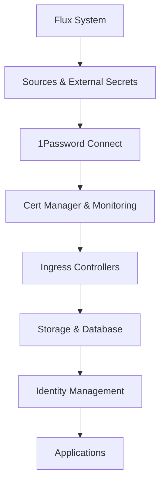

# Architecture: Talos GitOps Home-Ops Cluster

## System Architecture Overview

This cluster implements a sophisticated two-phase architecture that separates foundational system components (Bootstrap Phase) from operational services (GitOps Phase), enabling both reliable cluster operations and collaborative development workflows.

## Core Architecture Principles

### Bootstrap vs GitOps Separation

**Bootstrap Phase** - Direct deployment of foundational components:
- Components required for cluster to start
- System-level configurations that need direct hardware/OS access
- Dependencies required for GitOps system to function
- Managed via Taskfile commands and direct kubectl/talosctl operations

**GitOps Phase** - Git-managed operational components:
- Kubernetes-native resources that benefit from version control
- Infrastructure services and applications
- Operational configurations that change over time
- Managed via Flux GitOps with Git commits triggering deployments

## Source Code Structure

### Key Configuration Files
- **[`talconfig.yaml`](../talconfig.yaml)**: Talos OS cluster configuration with all-control-plane setup
- **[`Taskfile.yml`](../Taskfile.yml)**: Bootstrap automation and operational tasks
- **[`bootstrap-config.yaml`](../bootstrap-config.yaml)**: Phased bootstrap configuration
- **[`.env.example`](../.env.example)**: Environment configuration template

### Directory Structure
```
├── clusters/home-ops/           # GitOps cluster configuration
│   ├── flux-system/            # Flux GitOps system
│   └── infrastructure/         # Infrastructure Kustomizations
├── infrastructure/             # Infrastructure service manifests
│   ├── authentik/              # Identity provider
│   ├── cilium/                 # CNI configuration (GitOps part)
│   ├── longhorn/               # Distributed storage
│   ├── onepassword-connect/    # Secret management
│   └── monitoring/             # Observability stack
├── apps/                       # Application deployments
├── talos/                      # Talos OS configuration
│   ├── patches/                # Configuration patches
│   └── manifests/              # System manifests
├── scripts/                    # Bootstrap and utility scripts
├── taskfiles/                  # Modular task definitions
└── docs/                       # Comprehensive documentation
```

## Component Architecture

### Bootstrap Phase Components

#### 1. Talos OS Configuration
- **Location**: [`talconfig.yaml`](../talconfig.yaml), [`talos/patches/`](../talos/patches/)
- **Purpose**: Node operating system configuration
- **Key Features**:
  - All-control-plane setup (3 nodes, all control plane + worker)
  - Smart disk selection with `installDiskSelector: model: "APPLE*"`
  - USB SSD optimization for Samsung Portable SSD T5
  - Dual-stack IPv6 networking
  - LUKS2 encryption for STATE and EPHEMERAL partitions

#### 2. Cluster Networking (Cilium CNI Core)
- **Location**: [`Taskfile.yml:apps:deploy-cilium`](../Taskfile.yml)
- **Purpose**: Container networking foundation
- **Configuration**:
  - Kube-proxy replacement disabled in Talos
  - Dual-stack IPv4/IPv6 support
  - BGP control plane enabled
  - L2 announcements for LoadBalancer IPAM

#### 3. Secret Management Foundation
- **Components**: 1Password Connect + External Secrets Operator
- **Bootstrap Script**: [`scripts/bootstrap-1password-secrets.sh`](../scripts/bootstrap-1password-secrets.sh)
- **Purpose**: Secure credential management for GitOps
- **Features**:
  - Supports both legacy and separate 1Password entries
  - Credential format validation and truncation handling
  - Automatic Kubernetes secret creation

#### 4. Flux GitOps System
- **Location**: [`Taskfile.yml:flux:bootstrap`](../Taskfile.yml)
- **Purpose**: GitOps operator deployment
- **Integration**: GitHub repository with webhook support

### GitOps Phase Components

#### 1. Infrastructure Services
- **Location**: [`infrastructure/`](../infrastructure/) directory
- **Management**: Flux Kustomizations with dependency ordering
- **Key Services**:
  - **cert-manager**: TLS certificate automation
  - **ingress-nginx**: HTTP/HTTPS ingress (multiple instances)
  - **external-dns**: Automatic DNS record management
  - **monitoring**: Prometheus, Grafana, AlertManager stack
  - **longhorn**: Distributed storage system

#### 2. Network Services
- **Cilium BGP**: [`infrastructure/cilium-bgp/`](../infrastructure/cilium-bgp/)
- **Load Balancer Pools**: [`infrastructure/cilium/loadbalancer-pool.yaml`](../infrastructure/cilium/loadbalancer-pool.yaml)
- **External DNS**: Multiple providers (Cloudflare, Unifi, internal)
- **Cloudflare Tunnel**: [`infrastructure/cloudflare-tunnel/`](../infrastructure/cloudflare-tunnel/)

#### 3. Identity Management
- **Authentik**: [`infrastructure/authentik/`](../infrastructure/authentik/) - Complete SSO identity provider
- **PostgreSQL Backend**: [`infrastructure/postgresql-cluster/`](../infrastructure/postgresql-cluster/) - Database for Authentik
- **Outpost Configuration**: [`infrastructure/authentik-outpost-config/`](../infrastructure/authentik-outpost-config/) - Embedded outpost for Kubernetes services
- **Authentication Architecture**: Embedded outpost handles all *.k8s.home.geoffdavis.com services with proper token management

## Key Technical Decisions

### All-Control-Plane Architecture
- **Rationale**: Maximum resource utilization in home lab environment
- **Implementation**: All 3 nodes function as both control plane and worker nodes
- **Benefits**: High availability, simplified management, better resource usage
- **Configuration**: `allowSchedulingOnMasters: true` in talconfig.yaml

### USB SSD Storage Strategy
- **Hardware**: 3x Samsung Portable SSD T5 (1TB each)
- **Total Capacity**: 3TB raw, ~1.35TB effective with 2-replica factor
- **Optimization**: Custom udev rules and sysctls for SSD performance
- **Detection**: Automatic disk selection via `match: disk.model == "Portable SSD T5"`

### Dual-Stack IPv6 Networking
- **IPv4 Networks**:
  - Pods: 10.244.0.0/16
  - Services: 10.96.0.0/12
  - LoadBalancer Pool: 172.29.51.100-199
- **IPv6 Networks**:
  - Pods: fd47:25e1:2f96:51:2000::/64
  - Services: fd47:25e1:2f96:51:1000::/108
  - LoadBalancer Pool: fd47:25e1:2f96:51:100::/120

### DNS Architecture
- **Internal Domain**: k8s.home.geoffdavis.com (fits existing home domain structure)
- **External Domain**: geoffdavis.com (via Cloudflare tunnel)
- **Certificate Strategy**: Let's Encrypt for internal, Cloudflare for external
- **Integration**: BGP-advertised ingress IP (172.29.51.200)
- **DNS Management**: Cilium peers with Ubiquiti UDM-Pro and updates DNS records for *.k8s.home.geoffdavis.com domain

### Authentication Architecture
- **Identity Provider**: Authentik provides centralized SSO for all cluster services
- **Outpost Model**: Embedded outpost architecture (not RADIUS) for Kubernetes service integration
- **Ingress Integration**: All services use nginx-internal ingress class with Authentik authentication
- **Token Management**: API tokens properly managed with regeneration procedures for outpost connectivity
- **Service Coverage**: All *.k8s.home.geoffdavis.com services redirect to Authentik for authentication
- **SSL/TLS**: Proper certificate validation and secure communication between outpost and Authentik server

## Critical Implementation Paths

### Bootstrap Sequence
1. **Environment Setup**: Tool installation via mise
2. **Talos Configuration**: Generate and apply node configs
3. **Cluster Initialization**: Bootstrap first control plane node
4. **Core Networking**: Deploy Cilium CNI
5. **Secret Management**: Bootstrap 1Password Connect secrets
6. **GitOps Foundation**: Deploy Flux system
7. **Infrastructure Deployment**: Flux takes over via Git

### GitOps Dependency Chain


### Safety and Recovery Architecture
- **Safe Reset**: `task cluster:safe-reset` preserves OS, wipes only STATE/EPHEMERAL
- **Emergency Recovery**: `task cluster:emergency-recovery` for systematic troubleshooting
- **LLDPD Stability**: Integrated configuration prevents periodic reboot issues
- **Phased Bootstrap**: Resumable process with clear failure points

## Component Relationships

### Hybrid Components (Span Both Phases)
- **Cilium**: Core CNI (Bootstrap) + BGP/LoadBalancer config (GitOps)
- **Secret Management**: Initial K8s secrets (Bootstrap) + ExternalSecrets (GitOps)
- **Monitoring**: Basic health checks (Bootstrap) + Full observability stack (GitOps)

### Critical Dependencies
- **Talos → Kubernetes**: OS configuration before cluster initialization
- **Kubernetes → Cilium**: API server before CNI deployment
- **Cilium → Pods**: Networking before any pod can start
- **Pods → 1Password Connect**: Secret management requires pod networking
- **Secrets → Flux**: GitOps needs credentials for Git repository access
- **Flux → Everything Else**: GitOps manages all subsequent deployments

## Operational Patterns

### Decision Framework
- **Bootstrap Phase**: Node configuration, cluster networking, system-level changes
- **GitOps Phase**: Applications, infrastructure services, operational configuration
- **Emergency Override**: Direct kubectl/talosctl when GitOps is broken

### Change Management
- **Bootstrap Changes**: Update configuration files → regenerate → apply via tasks
- **GitOps Changes**: Update manifests → commit to Git → Flux deploys automatically
- **Rollback Procedures**: Git revert for GitOps, configuration restore for Bootstrap

This architecture enables both robust cluster operations and collaborative development workflows while maintaining clear operational boundaries and comprehensive safety procedures.