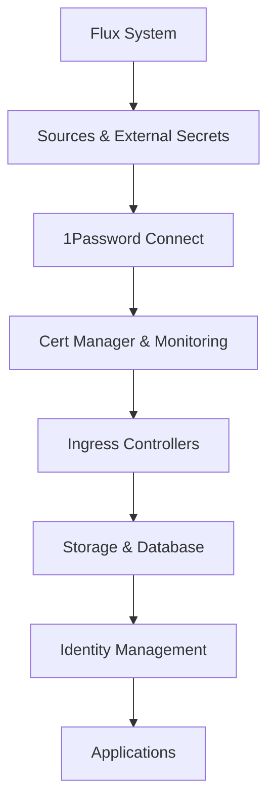

# Architecture: Talos GitOps Home-Ops Cluster

## System Architecture Overview

This cluster implements a sophisticated two-phase architecture that separates foundational system components (Bootstrap Phase) from operational services (GitOps Phase), enabling both reliable cluster operations and collaborative development workflows.

## Core Architecture Principles

### Bootstrap vs GitOps Separation

**Bootstrap Phase** - Direct deployment of foundational components:

- Components required for cluster to start
- System-level configurations that need direct hardware/OS access
- Dependencies required for GitOps system to function
- Managed via Taskfile commands and direct kubectl/talosctl operations

**GitOps Phase** - Git-managed operational components:

- Kubernetes-native resources that benefit from version control
- Infrastructure services and applications
- Operational configurations that change over time
- Managed via Flux GitOps with Git commits triggering deployments

## Source Code Structure

### Key Configuration Files

- **[`talconfig.yaml`](../talconfig.yaml)**: Talos OS cluster configuration with all-control-plane setup
- **[`Taskfile.yml`](../Taskfile.yml)**: Bootstrap automation and operational tasks
- **[`bootstrap-config.yaml`](../bootstrap-config.yaml)**: Phased bootstrap configuration
- **[`.env.example`](../.env.example)**: Environment configuration template

### Directory Structure

```text
├── clusters/home-ops/           # GitOps cluster configuration
│   ├── flux-system/            # Flux GitOps system
│   └── infrastructure/         # Infrastructure Kustomizations
├── infrastructure/             # Infrastructure service manifests
│   ├── authentik/              # Identity provider
│   ├── authentik-proxy/        # External outpost for authentication
│   ├── authentik-outpost-config/ # Outpost configuration jobs
│   ├── cilium/                 # CNI configuration (GitOps part)
│   ├── cilium-pools/           # LoadBalancer IP pool definitions
│   ├── cilium-bgp/             # BGP peering configuration
│   ├── longhorn/               # Distributed storage
│   ├── onepassword-connect/    # Secret management
│   ├── postgresql-cluster/     # PostgreSQL database clusters
│   └── monitoring/             # Observability stack
├── apps/                       # Application deployments
│   ├── dashboard/              # Kubernetes Dashboard
│   ├── home-automation/        # Home Assistant stack
│   └── monitoring/             # Monitoring applications
├── charts/                     # Helm charts
│   └── authentik-proxy-config/ # Authentik proxy configuration chart
├── scripts/                    # Bootstrap and utility scripts
│   ├── authentik-proxy-config/ # Authentik configuration scripts
│   └── token-management/       # Token management utilities
├── tests/                      # Test suites
│   ├── authentik-proxy-config/ # Authentik proxy tests
│   └── token-management/       # Token management tests
├── talos/                      # Talos OS configuration
│   ├── patches/                # Configuration patches
│   └── manifests/              # System manifests
├── taskfiles/                  # Modular task definitions
└── docs/                       # Comprehensive documentation
```

## Component Architecture

### Bootstrap Phase Components

#### 1. Talos OS Configuration

- **Location**: [`talconfig.yaml`](../talconfig.yaml), [`talos/patches/`](../talos/patches/)
- **Purpose**: Node operating system configuration
- **Key Features**:
  - All-control-plane setup (3 nodes, all control plane + worker)
  - Smart disk selection with `installDiskSelector: model: "APPLE*"`
  - USB SSD optimization for Samsung Portable SSD T5
  - Dual-stack IPv6 networking
  - LUKS2 encryption for STATE and EPHEMERAL partitions

#### 2. Cluster Networking (Cilium CNI Core)

- **Location**: [`Taskfile.yml:apps:deploy-cilium`](../Taskfile.yml)
- **Purpose**: Container networking foundation
- **Configuration**:
  - Kube-proxy replacement disabled in Talos
  - Dual-stack IPv4/IPv6 support
  - BGP control plane enabled
  - LoadBalancer IPAM enabled (Cilium v1.17.6)
  - XDP disabled for Mac mini compatibility

#### 3. Secret Management Foundation

- **Components**: 1Password Connect + External Secrets Operator
- **Bootstrap Script**: [`scripts/bootstrap-1password-secrets.sh`](../scripts/bootstrap-1password-secrets.sh)
- **Purpose**: Secure credential management for GitOps
- **Features**:
  - Supports both legacy and separate 1Password entries
  - Credential format validation and truncation handling
  - Automatic Kubernetes secret creation

#### 4. Flux GitOps System

- **Location**: [`Taskfile.yml:flux:bootstrap`](../Taskfile.yml)
- **Purpose**: GitOps operator deployment
- **Integration**: GitHub repository with webhook support

### GitOps Phase Components

#### 1. Infrastructure Services

- **Location**: [`infrastructure/`](../infrastructure/) directory
- **Management**: Flux Kustomizations with dependency ordering
- **Key Services**:
  - **cert-manager**: TLS certificate automation
  - **ingress-nginx**: HTTP/HTTPS ingress (multiple instances)
  - **external-dns**: Automatic DNS record management
  - **monitoring**: Prometheus, Grafana, AlertManager stack
  - **longhorn**: Distributed storage system

#### 2. Network Services

- **Cilium BGP**: [`infrastructure/cilium-bgp/`](../infrastructure/cilium-bgp/)
  - CiliumBGPPeeringPolicy: Legacy BGP configuration for Cilium v1.17.6 compatibility
  - Multiple virtual routers for different IP pools (bgp-default, bgp-ingress, bgp-reserved)
  - BGP peering with UDM Pro (ASN 64513) with graceful restart enabled
- **Load Balancer Pools**: [`infrastructure/cilium-pools/loadbalancer-pools.yaml`](../infrastructure/cilium-pools/loadbalancer-pools.yaml)
  - bgp-default: 172.29.52.100-199 (default services)
  - bgp-ingress: 172.29.52.200-220 (ingress controllers)
  - bgp-reserved: 172.29.52.50-99 (reserved for future use)
  - bgp-default-ipv6: fd47:25e1:2f96:52:100::/120 (IPv6 pool)
- **External DNS**: Multiple providers (Cloudflare, Unifi, internal)
- **Cloudflare Tunnel**: [`infrastructure/cloudflare-tunnel/`](../infrastructure/cloudflare-tunnel/)

#### 3. Identity Management

- **Authentik**: [`infrastructure/authentik/`](../infrastructure/authentik/) - Complete SSO identity provider
- **PostgreSQL Backend**: [`infrastructure/postgresql-cluster/`](../infrastructure/postgresql-cluster/) - Database for Authentik and applications
- **External Authentik-Proxy**: [`infrastructure/authentik-proxy/`](../infrastructure/authentik-proxy/) - External outpost for Kubernetes services with hybrid URL architecture
- **Authentik Configuration Scripts**: [`scripts/authentik-proxy-config/`](../scripts/authentik-proxy-config/) - Comprehensive configuration automation and troubleshooting scripts
- **Authentik Helm Chart**: [`charts/authentik-proxy-config/`](../charts/authentik-proxy-config/) - Helm chart for proxy provider configuration
- **Authentication Architecture**: External outpost handles all \*.k8s.home.geoffdavis.com services with dedicated deployment, Redis session storage, and hybrid URL configuration for DNS resolution
- **Testing Infrastructure**: [`tests/authentik-proxy-config/`](../tests/authentik-proxy-config/) - Comprehensive test suites for authentication system validation

#### 4. Application Services

- **Home Assistant Stack**: [`apps/home-automation/`](../apps/home-automation/) - **PRODUCTION-READY** comprehensive home automation platform
  - **Home Assistant Core v2025.7**: Main automation platform with web interface and comprehensive troubleshooting recovery completed
  - **PostgreSQL Database**: CloudNativePG cluster for persistent storage with automatic certificate management and schema compatibility fixes
  - **Mosquitto MQTT**: IoT device communication broker with resolved port binding conflicts and simplified listener configuration
  - **Redis Cache**: Session storage and performance optimization
  - **Authentication Integration**: Full SSO via external Authentik outpost at <https://homeassistant.k8s.home.geoffdavis.com>
  - **Deployment Recovery**: Successfully recovered from complete non-functional state through systematic troubleshooting of schema validation, credentials, certificates, security policies, and MQTT configuration
- **Kubernetes Dashboard**: [`apps/dashboard/`](../apps/dashboard/) - Cluster management interface with SSO integration
- **Monitoring Applications**: [`apps/monitoring/`](../apps/monitoring/) - Application-level monitoring components

## Key Technical Decisions

### All-Control-Plane Architecture

- **Rationale**: Maximum resource utilization in home lab environment
- **Implementation**: All 3 nodes function as both control plane and worker nodes
- **Benefits**: High availability, simplified management, better resource usage
- **Configuration**: `allowSchedulingOnMasters: true` in talconfig.yaml

### USB SSD Storage Strategy

- **Hardware**: 3x Samsung Portable SSD T5 (1TB each)
- **Total Capacity**: 3TB raw, ~1.35TB effective with 2-replica factor
- **Optimization**: Custom udev rules and sysctls for SSD performance
- **Detection**: Automatic disk selection via `match: disk.model == "Portable SSD T5"`

### Dual-Stack IPv6 Networking

- **IPv4 Networks**:
  - Pods: 10.244.0.0/16
  - Services: 10.96.0.0/12
  - Management: 172.29.51.0/24 (VLAN 51)
  - LoadBalancer Pool: 172.29.52.0/24 (VLAN 52, BGP-advertised)
- **IPv6 Networks**:
  - Pods: fd47:25e1:2f96:51:2000::/64
  - Services: fd47:25e1:2f96:51:1000::/108
  - LoadBalancer Pool: fd47:25e1:2f96:51:100::/120

### BGP LoadBalancer Architecture

- **Architecture Model**: Hybrid L2/BGP (L2 for control plane, BGP for LoadBalancer services)
- **BGP Configuration**:
  - Cluster ASN: 64512 (all nodes participate in BGP)
  - UDM Pro ASN: 64513 (BGP peer and route acceptor)
  - Peering Status: ✅ Established and stable
  - Route Advertisement: ✅ Working with legacy CiliumBGPPeeringPolicy
  - Multiple Virtual Routers: Dedicated routers for each IP pool with explicit service selectors
- **Network Separation**:
  - Management Traffic: VLAN 51 (172.29.51.x) - L2 announcements
  - LoadBalancer IPs: VLAN 52 (172.29.52.x) - BGP advertisements
- **IP Pool Management**:
  - Pool selectors match service annotations (io.cilium/lb-ipam-pool)
  - Automatic IP assignment from appropriate pools based on service type
  - IPAM conflicts resolved by removing duplicate pools

### DNS Architecture

- **Internal Domain**: k8s.home.geoffdavis.com (fits existing home domain structure)
- **External Domain**: geoffdavis.com (via Cloudflare tunnel)
- **Certificate Strategy**: Let's Encrypt for internal, Cloudflare for external
- **Integration**: BGP-advertised ingress IP (172.29.52.200 - new BGP pool)
- **DNS Management**: External DNS updates records for \*.k8s.home.geoffdavis.com domain
- **Network Integration**: UDM Pro accepts BGP routes and provides DNS resolution

### Authentication Architecture

- **Identity Provider**: Authentik provides centralized SSO for all cluster services
- **External Outpost Model**: External outpost architecture with dedicated deployment for Kubernetes service integration
- **Ingress Architecture**: **CRITICAL** - Only external outpost ingress handles \*.k8s.home.geoffdavis.com domains
- **Service Integration**: Individual services must NOT have their own ingresses for authenticated domains
- **Token Management**: External outpost API tokens properly managed with 1Password integration
- **Service Coverage**: All \*.k8s.home.geoffdavis.com services redirect to Authentik for authentication via external outpost (7 services total)
- **Session Storage**: Dedicated Redis instance in authentik-proxy namespace for session management
- **SSL/TLS**: Proper certificate validation and secure communication between external outpost and Authentik server
- **Network Connectivity**: Verified clear network path between authentik-proxy namespace and service namespaces

### External Outpost Architecture Details

- **Deployment Model**: Standalone external outpost deployment separate from Authentik server
- **Components**:
  - **authentik-proxy deployment**: External outpost pods running proxy functionality with hybrid URL architecture
  - **Redis instance**: Dedicated Redis for session storage and caching
  - **Ingress controller**: BGP load balancer integration for \*.k8s.home.geoffdavis.com domains
  - **Secret management**: ExternalSecret integration with 1Password for API tokens
- **Outpost Registration**: External outpost `3f0970c5-d6a3-43b2-9a36-d74665c6b24e` registered with Authentik server
- **Configuration Management**: Hybrid URL architecture with internal service URLs for outpost connections and external URLs for user redirects
- **URL Architecture**:
  - **Internal Connections**: `http://authentik-server.authentik.svc.cluster.local:80` for outpost-to-Authentik communication
  - **External Redirects**: `https://authentik.k8s.home.geoffdavis.com` for user browser redirects
  - **DNS Resolution**: Resolves cluster DNS conflicts by separating internal and external URL usage
- **Scalability**: Independent scaling of authentication proxy separate from identity provider
- **Reliability**: Improved fault isolation between authentication proxy and identity provider with robust DNS resolution

### Dashboard Authentication Integration

- **Bearer Token Elimination**: **COMPLETED** - Manual bearer token requirement successfully eliminated through comprehensive authentication integration
- **Kong Configuration Resolution**: Resolved conflicting Kong configuration jobs that were overriding proper Dashboard authentication settings
- **RBAC Enhancement**: Updated Dashboard service account with proper cluster-admin permissions for full administrative access
- **SSO Integration**: Dashboard authentication fully integrated with existing external Authentik outpost architecture
- **Seamless Access**: Dashboard now provides seamless SSO access via <https://dashboard.k8s.home.geoffdavis.com> without manual token entry
- **Administrative Capabilities**: Full cluster administrative functionality available through authenticated Dashboard access
- **Production Status**: All configuration changes committed to Git and deployed via GitOps for production use

### Development Quality and Testing Architecture

- **Pre-commit Framework**: **IMPLEMENTED** - Comprehensive code quality validation with balanced enforcement approach
- **Security-First Validation**: Secret detection, shell script security, and file validation enforced to prevent security incidents
- **Syntax Validation**: YAML, Python, Kubernetes manifest, and shell script syntax validation prevents broken deployments
- **Code Quality Standards**: Consistent formatting and style guidelines across all file types with warning-based suggestions
- **Testing Infrastructure**: Comprehensive test suites for critical authentication and token management components
- **Automated Validation**: Pre-commit hooks provide fast local feedback before CI/CD pipeline execution
- **Developer Experience**: Balanced approach prioritizes security without blocking development workflow for formatting issues

### Home Assistant Stack Architecture

- **Home Automation Platform**: **PRODUCTION-READY** - Comprehensive home automation infrastructure with full cluster integration and complete troubleshooting recovery
- **Database Backend**: PostgreSQL cluster with CloudNativePG operator providing high availability, automated backups, and automatic certificate management
- **MQTT Communication**: Mosquitto broker for IoT device integration with resolved port binding conflicts and simplified listener configuration
- **Caching Layer**: Redis instance for session storage and performance optimization
- **Authentication Integration**: Seamless SSO via external Authentik outpost with proper proxy configuration at <https://homeassistant.k8s.home.geoffdavis.com>
- **Resource Management**: Production-ready resource limits, health checks, and monitoring integration with proper security contexts for s6-overlay
- **Network Integration**: Full integration with cluster networking, DNS, and load balancer systems
- **Deployment Recovery**: Successfully recovered from complete non-functional state through systematic troubleshooting of CloudNativePG schema validation, 1Password credentials, TLS certificates, security policies, and MQTT configuration
- **Schema Compatibility**: Resolved CloudNativePG v1.26.1 compatibility issues by removing invalid backup resource fields
- **Security Configuration**: Updated namespace PodSecurity policy from "restricted" to "privileged" for s6-overlay container init system compatibility

### Monitoring Stack Architecture

- **Monitoring Platform**: **PRODUCTION-READY** - Comprehensive observability infrastructure with full external access and complete recovery from Renovate-induced failures
- **Core Components**: Prometheus v2.54.1, Grafana v11.1.0, AlertManager v0.27.0 deployed via kube-prometheus-stack v75.15.0
- **External Access**: All monitoring services accessible via BGP-advertised LoadBalancer IPs (Grafana: 172.29.52.101, Prometheus: 172.29.52.102, AlertManager: 172.29.52.103)
- **Metric Collection**: 29 healthy monitoring targets providing comprehensive cluster observability
- **Configuration Management**: Single source of truth deployment from `infrastructure/monitoring/` with duplicate configuration elimination
- **LoadBalancer Integration**: Full integration with Cilium LoadBalancer IPAM and BGP route advertisement
- **Deployment Recovery**: Successfully recovered from complete failure caused by duplicate HelmRelease conflicts and LoadBalancer IPAM dysfunction
- **Renovate Compatibility**: Resolved major version upgrade (v61.3.2 → v75.15.0) with proper dependency management
- **Service Selector Fix**: Implemented required service labels for LoadBalancer IPAM pool selection (`io.cilium/lb-ipam-pool: "bgp-default"`)

## Critical Implementation Paths

### Bootstrap Sequence

1. **Environment Setup**: Tool installation via mise
2. **Talos Configuration**: Generate and apply node configs
3. **Cluster Initialization**: Bootstrap first control plane node
4. **Core Networking**: Deploy Cilium CNI
5. **Secret Management**: Bootstrap 1Password Connect secrets
6. **GitOps Foundation**: Deploy Flux system
7. **Infrastructure Deployment**: Flux takes over via Git

### GitOps Dependency Chain



### Safety and Recovery Architecture

- **Safe Reset**: `task cluster:safe-reset` preserves OS, wipes only STATE/EPHEMERAL
- **Emergency Recovery**: `task cluster:emergency-recovery` for systematic troubleshooting
- **LLDPD Stability**: Integrated configuration prevents periodic reboot issues
- **Phased Bootstrap**: Resumable process with clear failure points

## Component Relationships

### Hybrid Components (Span Both Phases)

- **Cilium**: Core CNI (Bootstrap) + BGP/LoadBalancer config (GitOps)
- **Secret Management**: Initial K8s secrets (Bootstrap) + ExternalSecrets (GitOps)
- **Monitoring**: Basic health checks (Bootstrap) + Full observability stack (GitOps)

### Critical Dependencies

- **Talos → Kubernetes**: OS configuration before cluster initialization
- **Kubernetes → Cilium**: API server before CNI deployment
- **Cilium → Pods**: Networking before any pod can start
- **Pods → 1Password Connect**: Secret management requires pod networking
- **Secrets → Flux**: GitOps needs credentials for Git repository access
- **Flux → Everything Else**: GitOps manages all subsequent deployments

## Operational Patterns

### Decision Framework

- **Bootstrap Phase**: Node configuration, cluster networking, system-level changes
- **GitOps Phase**: Applications, infrastructure services, operational configuration
- **Emergency Override**: Direct kubectl/talosctl when GitOps is broken

### Change Management

- **Bootstrap Changes**: Update configuration files → regenerate → apply via tasks
- **GitOps Changes**: Update manifests → commit to Git → Flux deploys automatically
- **Rollback Procedures**: Git revert for GitOps, configuration restore for Bootstrap

This architecture enables both robust cluster operations and collaborative development workflows while maintaining clear operational boundaries and comprehensive safety procedures.
