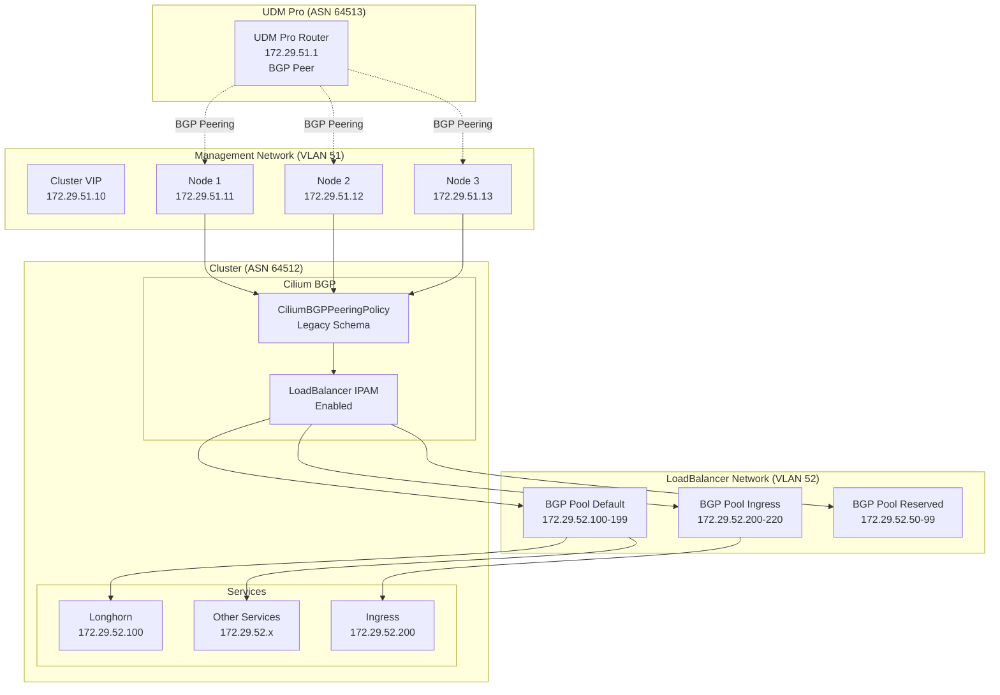

# BGP LoadBalancer Operational Guide

## Overview

This guide documents the successful BGP LoadBalancer migration and provides comprehensive operational procedures for the Talos GitOps home-ops cluster. The cluster has successfully migrated from L2 announcements to a BGP-only load balancer architecture.

## Migration Success Summary

**Status**: ✅ **COMPLETED** - BGP LoadBalancer migration successful
**Date**: January 2025
**Architecture**: BGP-only load balancer with route advertisement working
**Services**: All services accessible via BGP-advertised IPs

### Key Achievements

1. **Root Cause Resolution**: Schema compatibility issues between newer CiliumBGPClusterConfig/CiliumBGPAdvertisement and Cilium v1.17.6 resolved by switching to legacy [`CiliumBGPPeeringPolicy`](../infrastructure/cilium-bgp/bgp-policy-legacy.yaml)
2. **BGP Peering Established**: Stable BGP peering between cluster (ASN 64512) and UDM Pro (ASN 64513)
3. **Route Advertisement Working**: BGP routes successfully advertised and services accessible
4. **Network Separation**: Clean separation between management (VLAN 51) and LoadBalancer IPs (VLAN 52)
5. **Service Accessibility**: All services accessible via BGP IPs (Longhorn: 172.29.52.100, Ingress: 172.29.52.200)

## Architecture Overview

### Network Architecture



### BGP Configuration Components

#### 1. Working BGP Configuration
- **File**: [`infrastructure/cilium-bgp/bgp-policy-legacy.yaml`](../infrastructure/cilium-bgp/bgp-policy-legacy.yaml)
- **Schema**: CiliumBGPPeeringPolicy (legacy, compatible with Cilium v1.17.6)
- **Status**: ✅ Working and stable

#### 2. LoadBalancer IP Pools
- **File**: [`infrastructure/cilium/loadbalancer-pool-bgp.yaml`](../infrastructure/cilium/loadbalancer-pool-bgp.yaml)
- **Pools**:
  - `bgp-default`: 172.29.52.100-199 (100 IPs for general services)
  - `bgp-ingress`: 172.29.52.200-220 (21 IPs for ingress controllers)
  - `bgp-reserved`: 172.29.52.50-99 (50 IPs reserved for future use)
  - `bgp-default-ipv6`: fd47:25e1:2f96:52:100::/120 (IPv6 support)

#### 3. Cilium Configuration
- **File**: [`infrastructure/cilium/helmrelease-bgp-only.yaml`](../infrastructure/cilium/helmrelease-bgp-only.yaml)
- **Version**: Cilium v1.17.6
- **Key Settings**:
  - `bgpControlPlane.enabled: true`
  - `loadBalancer.l2.enabled: false` (BGP-only)
  - `loadBalancer.acceleration: disabled` (Mac mini compatibility)
  - `enable-lb-ipam: true`

#### 4. UDM Pro Configuration
- **File**: [`udm-pro-bgp-no-auth.conf`](../udm-pro-bgp-no-auth.conf)
- **Upload Method**: Network > Settings > Routing > BGP > Upload Configuration
- **Peering**: ASN 64513 ↔ ASN 64512
- **Route Acceptance**: 172.29.52.0/24 and 10.244.0.0/16 prefixes

## Operational Procedures

### Daily Operations

#### Check BGP Status
```bash
# Overall BGP status
task bgp-loadbalancer:status

# BGP peering verification
task bgp-loadbalancer:verify-bgp-peering

# Service IP allocation
task bgp-loadbalancer:show-service-ips
```

#### Monitor Service Health
```bash
# Test connectivity to BGP services
task bgp-loadbalancer:test-connectivity

# Check IP pool utilization
task bgp-loadbalancer:check-pools

# Generate comprehensive report
task bgp-loadbalancer:generate-report
```

### Service Management

#### Assign Service to Specific IP Pool
```bash
# Assign service to ingress pool
task bgp-loadbalancer:update-service-pools \
  SERVICE=nginx-internal-ingress-nginx-controller \
  NAMESPACE=ingress-nginx-internal \
  POOL=bgp-ingress

# Assign service to default pool
task bgp-loadbalancer:update-service-pools \
  SERVICE=longhorn-frontend \
  NAMESPACE=longhorn-system \
  POOL=bgp-default
```

#### Available IP Pools
- **`bgp-default`**: 172.29.52.100-199 (general services)
- **`bgp-ingress`**: 172.29.52.200-220 (ingress controllers)
- **`bgp-reserved`**: 172.29.52.50-99 (reserved for future use)
- **`bgp-default-ipv6`**: fd47:25e1:2f96:52:100::/120 (IPv6 services)

### Troubleshooting

#### BGP Troubleshooting Workflow
```bash
# Run comprehensive troubleshooting
task bgp-loadbalancer:troubleshoot

# Check Cilium BGP logs
kubectl logs -n kube-system -l k8s-app=cilium --tail=50 | grep -i bgp

# Verify BGP peering on UDM Pro
ssh unifi-admin@udm-pro "vtysh -c 'show bgp summary'"

# Check route advertisement
ssh unifi-admin@udm-pro "vtysh -c 'show bgp ipv4 unicast' | grep 172.29.52"
```

#### Common Issues and Solutions

##### 1. BGP Peering Down
**Symptoms**: Services get IPs but are not accessible
**Diagnosis**:
```bash
kubectl get ciliumbgppeeringpolicy -o yaml
kubectl logs -n kube-system -l k8s-app=cilium | grep -i "bgp\|peer"
```
**Solution**: Check UDM Pro BGP configuration and network connectivity

##### 2. Services Not Getting IPs
**Symptoms**: LoadBalancer services stuck in "Pending"
**Diagnosis**:
```bash
kubectl get ciliumloadbalancerippool -o yaml
kubectl get svc --all-namespaces | grep LoadBalancer
```
**Solution**: Verify service has correct pool annotation and IPAM is enabled

##### 3. Schema Compatibility Issues
**Symptoms**: CiliumBGPClusterConfig/CiliumBGPAdvertisement not working
**Root Cause**: Newer BGP CRDs incompatible with Cilium v1.17.6
**Solution**: Use legacy [`CiliumBGPPeeringPolicy`](../infrastructure/cilium-bgp/bgp-policy-legacy.yaml) schema

### Maintenance Procedures

#### Update BGP Configuration
1. **Modify Configuration**: Edit [`infrastructure/cilium-bgp/bgp-policy-legacy.yaml`](../infrastructure/cilium-bgp/bgp-policy-legacy.yaml)
2. **Apply Changes**: `kubectl apply -f infrastructure/cilium-bgp/bgp-policy-legacy.yaml`
3. **Verify Peering**: `task bgp-loadbalancer:verify-bgp-peering`
4. **Test Connectivity**: `task bgp-loadbalancer:test-connectivity`

#### Add New IP Pool
1. **Edit Pool Configuration**: [`infrastructure/cilium/loadbalancer-pool-bgp.yaml`](../infrastructure/cilium/loadbalancer-pool-bgp.yaml)
2. **Apply Changes**: `kubectl apply -f infrastructure/cilium/loadbalancer-pool-bgp.yaml`
3. **Update UDM Pro**: Add new prefix to route acceptance policy
4. **Verify Pool**: `task bgp-loadbalancer:check-pools`

#### Cilium Upgrade Considerations
- **Schema Compatibility**: Verify BGP CRD compatibility with new Cilium version
- **XDP Settings**: Maintain `loadBalancer.acceleration: disabled` for Mac mini compatibility
- **IPAM Settings**: Ensure `enable-lb-ipam: true` is preserved
- **Testing**: Thoroughly test BGP functionality after upgrade

## Monitoring and Alerting

### Key Metrics to Monitor
1. **BGP Peering Status**: All 3 nodes should have established BGP sessions
2. **Route Advertisement**: LoadBalancer IPs should be advertised to UDM Pro
3. **Service Accessibility**: All LoadBalancer services should be reachable
4. **IP Pool Utilization**: Monitor available IPs in each pool

### Health Checks
```bash
# Daily health check script
#!/bin/bash
echo "=== BGP LoadBalancer Health Check ==="
echo "Date: $(date)"
echo

# Check BGP peering
echo "BGP Peering Status:"
kubectl get ciliumbgppeeringpolicy -o wide

# Check service IPs
echo "LoadBalancer Services:"
kubectl get svc --all-namespaces | grep LoadBalancer

# Test connectivity
echo "Connectivity Test:"
curl -s --connect-timeout 5 http://172.29.52.200 > /dev/null && echo "✓ Ingress accessible" || echo "⚠ Ingress not accessible"
curl -s --connect-timeout 5 http://172.29.52.100 > /dev/null && echo "✓ Longhorn accessible" || echo "⚠ Longhorn not accessible"

echo "Health check completed"
```

## Configuration Files Reference

### Core BGP Configuration
- **BGP Policy**: [`infrastructure/cilium-bgp/bgp-policy-legacy.yaml`](../infrastructure/cilium-bgp/bgp-policy-legacy.yaml)
- **IP Pools**: [`infrastructure/cilium/loadbalancer-pool-bgp.yaml`](../infrastructure/cilium/loadbalancer-pool-bgp.yaml)
- **Cilium Config**: [`infrastructure/cilium/helmrelease-bgp-only.yaml`](../infrastructure/cilium/helmrelease-bgp-only.yaml)
- **UDM Pro Config**: [`udm-pro-bgp-no-auth.conf`](../udm-pro-bgp-no-auth.conf)

### Operational Tasks
- **BGP Tasks**: [`taskfiles/bgp-loadbalancer.yml`](../taskfiles/bgp-loadbalancer.yml)
- **Networking Tasks**: [`taskfiles/networking.yml`](../taskfiles/networking.yml)
- **Main Taskfile**: [`Taskfile.yml`](../Taskfile.yml) (BGP commands: `task bgp:*`)

### Bootstrap Integration
- **Cilium Deployment**: [`Taskfile.yml:apps:deploy-cilium`](../Taskfile.yml) (lines 309-356)
- **BGP Configuration**: Deployed via GitOps after cluster bootstrap
- **UDM Pro Setup**: Manual configuration upload required

## Success Criteria

The BGP LoadBalancer migration is considered successful when:

- ✅ **BGP Peering Established**: All 3 cluster nodes have stable BGP sessions with UDM Pro
- ✅ **Route Advertisement Working**: LoadBalancer IPs (172.29.52.x) are advertised and visible in UDM Pro routing table
- ✅ **Service Accessibility**: All LoadBalancer services are accessible from client machines
- ✅ **IP Pool Management**: Services correctly assigned IPs from appropriate BGP pools
- ✅ **Network Separation**: Management traffic on VLAN 51, LoadBalancer IPs on VLAN 52
- ✅ **Schema Compatibility**: BGP configuration stable with Cilium v1.17.6

## Migration History

### Root Cause Analysis
**Problem**: Initial migration attempts failed due to schema compatibility issues between newer CiliumBGPClusterConfig/CiliumBGPAdvertisement CRDs and Cilium v1.17.6.

**Solution**: Switched to legacy [`CiliumBGPPeeringPolicy`](../infrastructure/cilium-bgp/bgp-policy-legacy.yaml) schema which provides full compatibility with Cilium v1.17.6 and enables successful BGP route advertisement.

### Migration Timeline
1. **BGP Peering Established**: Successfully configured BGP peering between cluster (ASN 64512) and UDM Pro (ASN 64513)
2. **Cilium v1.17.6 Deployed**: Upgraded with XDP disabled for Mac mini compatibility and LoadBalancer IPAM enabled
3. **Schema Issue Identified**: CiliumBGPClusterConfig/CiliumBGPAdvertisement incompatible with Cilium v1.17.6
4. **Legacy Schema Adopted**: Switched to CiliumBGPPeeringPolicy for full compatibility
5. **Route Advertisement Working**: BGP routes successfully advertised and services accessible
6. **Migration Complete**: L2 announcements to BGP-only architecture migration successful

The BGP LoadBalancer system is now **production-ready** and the migration from L2 announcements is **complete**.