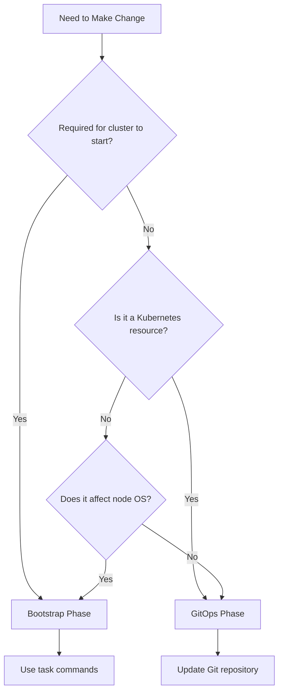

# Bootstrap vs GitOps: Executive Summary

## Overview

This document provides a high-level summary of the Bootstrap vs GitOps architectural separation in the Talos Kubernetes cluster, designed for quick reference and decision-making.

## Quick Reference

### Bootstrap Phase (Direct Deployment)
**Tools**: [`Taskfile.yml`](../Taskfile.yml), shell scripts, `talosctl`, `kubectl`
**When**: Cluster initialization and foundational components
**Management**: Direct commands, version-controlled scripts

| Component | Purpose | Why Bootstrap |
|-----------|---------|---------------|
| Talos OS Configuration | Node operating system setup | Must exist before Kubernetes |
| Kubernetes Cluster | Control plane initialization | No API exists yet |
| LLDPD Configuration | Node stability fix | System-level configuration |
| Cilium CNI Core | Pod networking | Required for any pods to start |
| 1Password Connect | Secret management foundation | Required for GitOps authentication |
| External Secrets Operator | Secret synchronization | Required for GitOps secrets |
| Flux GitOps System | GitOps operator | Must exist to manage GitOps phase |

### GitOps Phase (Git-Managed)
**Tools**: Flux, Git, Kustomize, Helm
**When**: Operational components and applications
**Management**: Git commits, pull requests, automated deployment

| Component | Purpose | Why GitOps |
|-----------|---------|------------|
| Infrastructure Services | cert-manager, ingress, monitoring | Operational configuration |
| Cilium BGP Configuration | Load balancer IP advertisement | Benefits from change tracking |
| Application Deployments | User applications and services | Standard deployment pattern |
| Storage Configuration | Longhorn settings, storage classes | Operational management |
| Certificate Issuers | TLS certificate management | Configuration changes over time |
| Monitoring Dashboards | Grafana, Prometheus configuration | Collaborative development |

## Decision Matrix

### "Should I use Bootstrap or GitOps?"



### Quick Decision Rules

**Use Bootstrap when**:
- ✅ Component required for cluster startup
- ✅ Node-level or OS configuration
- ✅ System dependencies for GitOps
- ✅ Direct hardware/network access needed

**Use GitOps when**:
- ✅ Kubernetes-native resources
- ✅ Application deployments
- ✅ Configuration that changes over time
- ✅ Benefits from collaborative development

## Architectural Benefits

### Bootstrap Phase Benefits
- **Reliability**: Foundational components are stable and tested
- **Simplicity**: Direct deployment without complex dependencies
- **Control**: Full system access for low-level configuration
- **Speed**: Fast deployment without GitOps overhead

### GitOps Phase Benefits
- **Collaboration**: Version control enables team development
- **Auditability**: All changes tracked in Git history
- **Rollback**: Easy reversion to previous configurations
- **Automation**: Continuous deployment and reconciliation

### Hybrid Approach Benefits
- **Best of Both**: Combines reliability with flexibility
- **Clear Boundaries**: Well-defined responsibilities
- **Scalability**: Template can be adapted for different environments
- **Maintainability**: Each phase optimized for its purpose

## Common Workflows

### Adding New Application
```bash
# GitOps Phase
mkdir apps/my-app
# Create manifests
git add apps/my-app/
git commit -m "Add my-app"
git push
# Flux deploys automatically
```

### Changing Node Configuration
```bash
# Bootstrap Phase
vim talconfig.yaml
task talos:generate-config
task talos:apply-config
```

### Updating Infrastructure Service
```bash
# GitOps Phase
vim infrastructure/service/helmrelease.yaml
git commit -m "Update service config"
git push
# Flux applies changes
```

## Cilium: Hybrid Component Example

Cilium demonstrates how complex components can span both phases:

**Bootstrap**: Core CNI functionality
- Required for pod networking
- Deployed via [`task apps:deploy-cilium`](../Taskfile.yml#L410)

**GitOps**: Operational features
- BGP configuration for load balancing
- Managed via [`infrastructure/cilium/`](../infrastructure/cilium/)

**Why This Works**:
- Clear separation of concerns
- Respects dependency requirements
- Operational features benefit from Git tracking

## Template Cluster Guidance

### For New Environments

1. **Network Configuration**: Update IP ranges and BGP settings
2. **Secret Management**: Configure 1Password vaults and credentials
3. **DNS Configuration**: Adapt domain names and DNS providers
4. **Storage Settings**: Configure storage classes and backup destinations

### Component Placement Guidelines

**Move to Bootstrap if**:
- Component becomes foundational
- Required for GitOps to function
- Needs system-level access

**Move to GitOps if**:
- No longer required for bootstrap
- Benefits from version control
- Can be deployed after cluster is operational

## Troubleshooting Quick Guide

### Bootstrap Issues
**Symptoms**: Cluster won't start, nodes unreachable
**Check**: 
- Talos logs: `talosctl logs --nodes <ip>`
- Network connectivity
- Bootstrap task output

### GitOps Issues
**Symptoms**: Applications not deploying, Flux errors
**Check**:
- Flux status: `flux get kustomizations`
- Git repository access
- Resource dependencies

### Hybrid Component Issues
**Example - Cilium**:
- CNI problems → Check bootstrap deployment
- BGP problems → Check GitOps configuration
- Both required for full functionality

## Key Commands

### Bootstrap Operations
```bash
# Full cluster bootstrap
task bootstrap:cluster

# Individual components
task talos:apply-config
task apps:deploy-cilium
task bootstrap:1password-secrets

# Verification
task test:extensions
task cluster:status
task apps:verify-core-idempotency
```

### GitOps Operations
```bash
# Force reconciliation
flux reconcile source git flux-system
flux reconcile kustomization flux-system

# Monitor deployments
flux get kustomizations --watch
kubectl get pods -A

# Check status
flux get all
```

## Safety Considerations

### Bootstrap Phase Safety
- Always backup before system changes
- Test in development environment
- Understand dependency chain
- Use safe reset procedures: [`task cluster:safe-reset`](../Taskfile.yml#L874)

### GitOps Phase Safety
- Use feature branches for changes
- Monitor Flux during deployments
- Verify health checks pass
- Keep rollback procedures ready

### Critical Safety Rules
- ❌ **Never** use `talosctl reset` without partition specifications
- ✅ **Always** use [`task cluster:verify-safety`](../Taskfile.yml#L958) before operations
- ✅ **Always** test changes in development first
- ✅ **Always** have rollback procedures ready

## Documentation Structure

This architectural separation is documented across several guides:

1. **[Bootstrap vs GitOps Architecture](./BOOTSTRAP_VS_GITOPS_ARCHITECTURE.md)** - Comprehensive architectural guide
2. **[Operational Workflows](./OPERATIONAL_WORKFLOWS.md)** - Step-by-step procedures for common tasks
3. **[Component Migration Guide](./COMPONENT_MIGRATION_GUIDE.md)** - Moving components between phases
4. **[Core Idempotency Verification](./CORE_IDEMPOTENCY_VERIFICATION.md)** - Verify core deployment safety
5. **[LLDPD Configuration Fix](./LLDPD_CONFIGURATION_FIX.md)** - Node stability improvements
6. **This Summary** - Quick reference and decision-making guide

## Success Metrics

### Operational Excellence
- ✅ Clear understanding of component placement rationale
- ✅ Consistent deployment procedures across environments
- ✅ Reliable cluster bootstrap and recovery procedures
- ✅ Efficient application deployment and updates

### Template Effectiveness
- ✅ Easy adaptation for new environments
- ✅ Clear guidance for component placement decisions
- ✅ Comprehensive troubleshooting procedures
- ✅ Knowledge transfer to new team members

### Architectural Integrity
- ✅ Maintained separation between Bootstrap and GitOps phases
- ✅ Respected dependency chains and requirements
- ✅ Optimized each phase for its specific purpose
- ✅ Enabled both reliability and flexibility

## Conclusion

The Bootstrap vs GitOps architectural separation provides:

- **Foundation**: Reliable cluster bootstrap with essential components
- **Operations**: Flexible, collaborative management of applications and infrastructure
- **Clarity**: Clear boundaries and decision-making frameworks
- **Scalability**: Template approach for multiple environments
- **Maintainability**: Each phase optimized for its specific requirements

This architecture enables both robust cluster operations and modern DevOps practices while maintaining clear operational boundaries and responsibilities.

## Next Steps

1. **Review** the comprehensive guides for detailed procedures
2. **Practice** common workflows in development environment
3. **Adapt** configuration for your specific environment
4. **Document** any customizations or lessons learned
5. **Share** knowledge with team members and stakeholders

The architectural foundation is solid and ready for production use while serving as an effective template for additional cluster deployments.