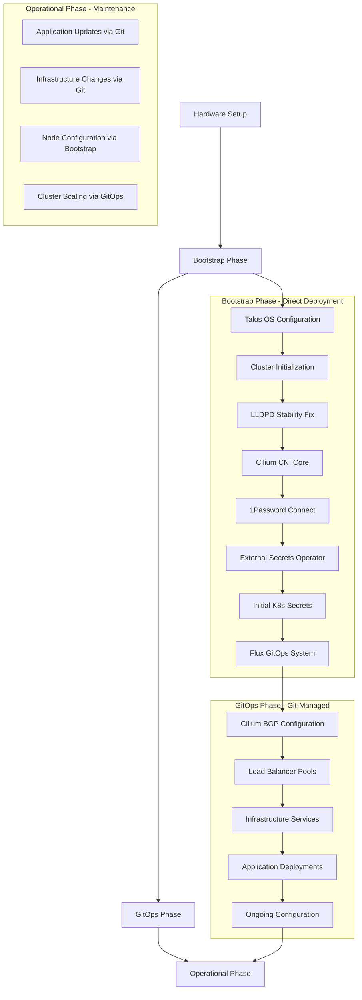
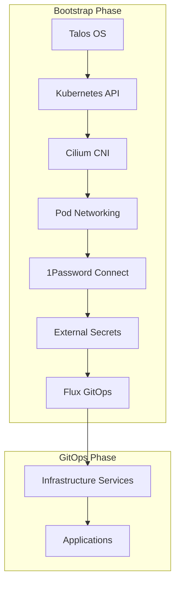
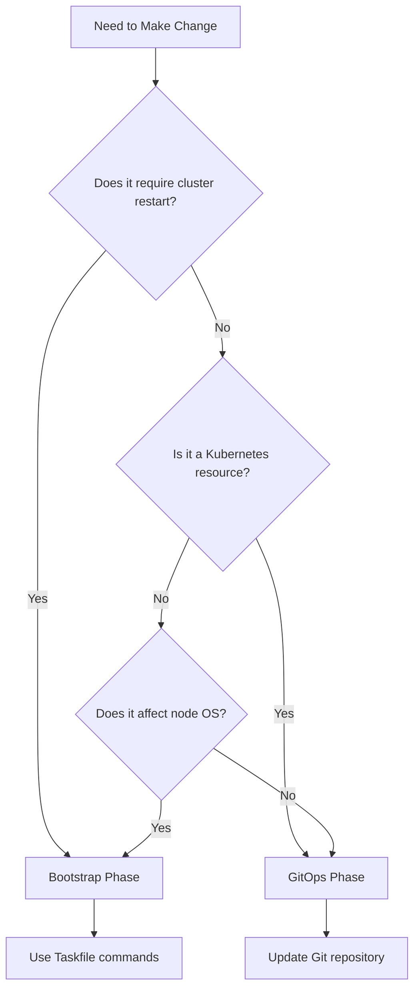

# Bootstrap vs GitOps Architecture Guide

## Overview

This document provides a comprehensive explanation of the architectural separation between **Bootstrap Script Deployment** and **Flux GitOps Deployment** phases in the Talos Kubernetes cluster. This separation is critical for operational understanding and serves as a template for other cluster deployments.

## Target Audience

This guide is designed for technically proficient users with server and networking experience who may be new to Kubernetes, CNIs, Talos, Longhorn, Cilium, and how these components integrate together.

## Table of Contents

1. [Architectural Overview](#architectural-overview)
2. [Bootstrap Phase Components](#bootstrap-phase-components)
3. [GitOps Phase Components](#gitops-phase-components)
4. [Hybrid Components](#hybrid-components)
5. [Dependency Chain](#dependency-chain)
6. [Operational Decision Matrix](#operational-decision-matrix)
7. [Common Workflows](#common-workflows)
8. [Template Cluster Guidance](#template-cluster-guidance)
9. [Troubleshooting](#troubleshooting)

## Architectural Overview

The cluster deployment is divided into two distinct phases with different management approaches:



### Why This Separation Exists

**Bootstrap Phase** handles foundational components that:

- Must exist before Kubernetes API is available
- Are required for GitOps to function
- Need direct system-level access
- Establish the foundation for cluster operations

**GitOps Phase** manages operational components that:

- Can be deployed through Kubernetes APIs
- Benefit from Git-based change management
- Support declarative configuration
- Enable collaborative operations

## Bootstrap Phase Components

### 1. Talos Node Configuration

**What**: Operating system configuration for each cluster node
**Why Bootstrap**: Must be applied before Kubernetes exists
**Files**: [`talconfig.yaml`](../talconfig.yaml), [`talos/patches/`](../talos/patches/)
**Deployment**: [`task talos:apply-config`](../Taskfile.yml#L175)

```yaml
# Example: Node network configuration
machine:
  network:
    interfaces:
      - interface: eth0
        dhcp: true
        vip:
          ip: 172.29.51.10 # Cluster VIP
```

### 2. Kubernetes Cluster Initialization

**What**: Creates the Kubernetes control plane and API server
**Why Bootstrap**: No Kubernetes API exists yet to manage this
**Deployment**: [`task talos:bootstrap`](../Taskfile.yml#L271)

### 3. LLDPD Stability Configuration

**What**: Prevents periodic node reboots caused by LLDPD service failures
**Why Bootstrap**: System-level configuration applied via Talos machine config
**Files**: [`talos/manifests/lldpd-extension-config.yaml`](../talos/manifests/lldpd-extension-config.yaml)
**Deployment**: [`task talos:apply-lldpd-config`](../Taskfile.yml#L248)

```yaml
# LLDPD ExtensionServiceConfig
apiVersion: v1alpha1
kind: ExtensionServiceConfig
name: lldpd
configFiles:
  - content: |
      configure lldp portidsubtype ifname
      unconfigure lldp management-addresses-advertisements
    mountPath: /usr/local/etc/lldpd/lldpd.conf
```

### 4. Core Networking (Cilium CNI)

**What**: Container Network Interface - enables pod-to-pod communication
**Why Bootstrap**: Pods cannot start without networking
**Deployment**: [`task apps:deploy-cilium`](../Taskfile.yml#L410)

**Key Configuration**:

- Replaces kube-proxy functionality
- Enables dual-stack IPv4/IPv6
- Configured for Talos-specific requirements

### 5. Secret Management Foundation

**What**: 1Password Connect and External Secrets Operator
**Why Bootstrap**: Required for GitOps to access secrets
**Components**:

- 1Password Connect deployment
- External Secrets Operator
- Initial Kubernetes secrets for GitOps authentication

**Deployment Sequence**:

1. [`task bootstrap:1password-secrets`](../Taskfile.yml#L38) - Create K8s secrets
2. [`task apps:deploy-external-secrets`](../Taskfile.yml#L446) - Deploy operator
3. [`task apps:deploy-onepassword-connect`](../Taskfile.yml#L459) - Deploy 1Password Connect

### 6. Flux GitOps System

**What**: The GitOps operator that manages the GitOps phase
**Why Bootstrap**: Must be installed before it can manage other components
**Deployment**: [`task flux:bootstrap`](../Taskfile.yml#L379)

## GitOps Phase Components

### 1. Infrastructure Services

**What**: Core cluster services managed declaratively
**Why GitOps**: Benefits from version control, review processes, and automated deployment
**Location**: [`infrastructure/`](../infrastructure/) directory

**Components Include**:

- **cert-manager**: TLS certificate management
- **ingress-nginx**: HTTP/HTTPS ingress controller
- **external-dns**: Automatic DNS record management
- **monitoring**: Prometheus, Grafana, AlertManager
- **longhorn**: Distributed storage system

### 2. Cilium BGP Configuration

**What**: BGP peering configuration for load balancer IP advertisement
**Why GitOps**: Operational configuration that benefits from change tracking
**Files**:

- [`infrastructure/cilium-bgp/bgp-policy.yaml`](../infrastructure/cilium-bgp/bgp-policy.yaml)
- [`infrastructure/cilium/loadbalancer-pool.yaml`](../infrastructure/cilium/loadbalancer-pool.yaml)

### 3. Application Deployments

**What**: User applications and services
**Why GitOps**: Standard application deployment pattern
**Location**: [`apps/`](../apps/) directory

### 4. Certificate Issuers

**What**: Let's Encrypt and other certificate issuers
**Why GitOps**: Configuration that changes over time
**Files**: [`infrastructure/cert-manager-issuers/`](../infrastructure/cert-manager-issuers/)

## Hybrid Components

### Cilium: A Case Study in Hybrid Architecture

Cilium demonstrates why some components span both phases:

**Bootstrap Phase - Core CNI**:

- **File**: [`Taskfile.yml:410-444`](../Taskfile.yml#L410-L444)
- **Purpose**: Install basic networking so pods can start
- **Configuration**: Minimal, focused on core functionality

**GitOps Phase - BGP and Load Balancer Pools**:

- **Files**: [`infrastructure/cilium/`](../infrastructure/cilium/)
- **Purpose**: Advanced networking features and operational configuration
- **Configuration**: BGP policies, load balancer IP pools, monitoring

**Why This Split**:

1. **Dependency**: Pods need networking before GitOps can deploy anything
2. **Operational**: BGP configuration changes over time and benefits from Git tracking
3. **Separation of Concerns**: Core functionality vs operational enhancements

## Dependency Chain

Understanding the dependency chain is crucial for troubleshooting and modifications:



### Critical Dependencies

1. **Talos → Kubernetes**: OS must be configured before cluster can start
2. **Kubernetes → Cilium**: API must exist before CNI can be deployed
3. **Cilium → Pods**: Networking must work before any pods can start
4. **Pods → 1Password Connect**: Secret management requires pod networking
5. **Secrets → Flux**: GitOps needs credentials to access Git repository
6. **Flux → Everything Else**: GitOps manages all subsequent deployments

## Operational Decision Matrix

Use this matrix to determine whether a change should be made via Bootstrap or GitOps:

| Change Type               | Bootstrap | GitOps | Reasoning                              |
| ------------------------- | --------- | ------ | -------------------------------------- |
| Add new application       | ❌        | ✅     | Applications are managed declaratively |
| Change node networking    | ✅        | ❌     | Requires Talos machine config          |
| Update Cilium BGP config  | ❌        | ✅     | Operational configuration              |
| Add storage class         | ❌        | ✅     | Kubernetes resource                    |
| Change cluster CIDR       | ✅        | ❌     | Fundamental cluster configuration      |
| Update ingress controller | ❌        | ✅     | Application-level component            |
| Add node labels           | ✅        | ❌     | Node-level configuration               |
| Configure monitoring      | ❌        | ✅     | Operational service                    |
| Change DNS settings       | ✅        | ❌     | System-level configuration             |
| Update certificates       | ❌        | ✅     | Managed by cert-manager                |

### Decision Tree



## Common Workflows

### Adding a New Application

**Process**: GitOps Phase
**Steps**:

1. Create application manifests in [`apps/`](../apps/) directory
2. Add Kustomization to [`clusters/home-ops/infrastructure/apps.yaml`](../clusters/home-ops/infrastructure/apps.yaml)
3. Commit and push to Git
4. Flux automatically deploys the application

**Example**:

```bash
# Create new application directory
mkdir apps/my-app

# Create manifests
cat > apps/my-app/deployment.yaml << EOF
apiVersion: apps/v1
kind: Deployment
metadata:
  name: my-app
  namespace: my-app
spec:
  # ... deployment spec
EOF

# Add to GitOps
git add apps/my-app/
git commit -m "Add my-app application"
git push
```

### Changing Cluster Networking

**Process**: Bootstrap Phase
**Steps**:

1. Update [`talconfig.yaml`](../talconfig.yaml) or [`talos/patches/cluster.yaml`](../talos/patches/cluster.yaml)
2. Regenerate Talos configuration: `task talos:generate-config`
3. Apply to nodes: `task talos:apply-config`
4. May require cluster restart

**Example**:

```bash
# Edit cluster configuration
vim talconfig.yaml

# Regenerate and apply
task talos:generate-config
task talos:apply-config
```

### Updating Cilium Configuration

**Hybrid Process**:

**For Core CNI Updates**:

1. Update [`Taskfile.yml`](../Taskfile.yml) Cilium deployment task
2. Run `task apps:deploy-cilium`

**For BGP/LoadBalancer Updates**:

1. Update files in [`infrastructure/cilium/`](../infrastructure/cilium/)
2. Commit to Git - Flux handles deployment

### Scaling Infrastructure

**Process**: GitOps Phase
**Steps**:

1. Update resource requests/limits in infrastructure manifests
2. Commit changes to Git
3. Flux applies changes automatically

### Node Maintenance

**Process**: Bootstrap Phase
**Steps**:

1. Drain node: `kubectl drain <node>`
2. Perform maintenance via Talos: `talosctl reboot --nodes <ip>`
3. Uncordon node: `kubectl uncordon <node>`

## Template Cluster Guidance

### Adapting for New Environments

When using this cluster as a template:

1. **Update Network Configuration**:
   - Modify IP ranges in [`talconfig.yaml`](../talconfig.yaml)
   - Update BGP ASN numbers in [`infrastructure/cilium-bgp/`](../infrastructure/cilium-bgp/)
   - Adjust load balancer pools in [`infrastructure/cilium/`](../infrastructure/cilium/)

2. **Customize Secret Management**:
   - Update 1Password vault references in scripts
   - Modify secret store configurations

3. **Adapt DNS Configuration**:
   - Update domain names in ingress configurations
   - Modify external-dns settings

### Safe Component Migration

**Moving from Bootstrap to GitOps**:

- Ensure component is not required for cluster bootstrap
- Create GitOps manifests
- Test deployment via GitOps
- Remove from bootstrap tasks
- Verify idempotency

**Moving from GitOps to Bootstrap**:

- Usually not recommended
- Only for components that become foundational
- Requires careful dependency analysis

### Idempotency Verification

To ensure [`task apps:deploy-core`](../Taskfile.yml#L402) is idempotent:

```bash
# Run multiple times and verify no errors
task apps:deploy-core
task apps:deploy-core
task apps:deploy-core

# Check for resource conflicts
kubectl get events --sort-by='.lastTimestamp' | grep -i error
```

## Troubleshooting

### Bootstrap Phase Issues

**Symptoms**: Cluster won't start, nodes unreachable, networking broken
**Approach**:

1. Check Talos logs: `talosctl logs --nodes <ip>`
2. Verify configuration: `talosctl validate --config <config-file>`
3. Check network connectivity
4. Review bootstrap task output

**Common Issues**:

- DHCP configuration problems
- Disk selection issues
- Network interface naming
- LLDPD service failures

### GitOps Phase Issues

**Symptoms**: Applications not deploying, Flux errors, resource conflicts
**Approach**:

1. Check Flux status: `flux get kustomizations`
2. Review Flux logs: `kubectl logs -n flux-system -l app=source-controller`
3. Verify Git repository access
4. Check resource dependencies

**Common Issues**:

- Git authentication failures
- Resource dependency violations
- Namespace conflicts
- Secret access problems

### Hybrid Component Issues

**Cilium Example**:

- **CNI Problems**: Check bootstrap deployment logs
- **BGP Problems**: Check GitOps Cilium configuration
- **Load Balancer Issues**: Verify both CNI and BGP are working

## Best Practices

### Bootstrap Phase

1. **Keep Minimal**: Only include components required for GitOps
2. **Document Dependencies**: Clear understanding of what depends on what
3. **Test Idempotency**: Ensure tasks can be run multiple times safely
4. **Version Control**: Track bootstrap scripts in Git

### GitOps Phase

1. **Use Kustomizations**: Leverage Flux's dependency management
2. **Health Checks**: Define health checks for all components
3. **Gradual Rollout**: Use Flux's progressive delivery features
4. **Monitor Drift**: Regular reconciliation and drift detection

### General

1. **Clear Boundaries**: Maintain clear separation between phases
2. **Document Decisions**: Explain why components are in each phase
3. **Regular Review**: Periodically review component placement
4. **Test Recovery**: Regularly test disaster recovery procedures

## Conclusion

The Bootstrap vs GitOps separation provides:

- **Reliability**: Foundational components are stable and tested
- **Flexibility**: Operational components can be updated via Git
- **Clarity**: Clear understanding of what manages what
- **Scalability**: Template can be adapted for different environments

This architecture enables both robust cluster operations and collaborative development workflows while maintaining clear operational boundaries.

## Related Documentation

- [Day-to-Day Operations Guide](./BOOTSTRAP_VS_GITOPS_PHASES.md) - Primary operational reference
- [Operational Workflows](./OPERATIONAL_WORKFLOWS.md) - Step-by-step deployment procedures
- [LLDPD Configuration Fix](./LLDPD_CONFIGURATION_FIX.md) - Node stability improvements
- [BGP Configuration](./BGP_CONFIGURATION.md) - Network architecture details
- [Cluster Reset Safety](./CLUSTER_RESET_SAFETY.md) - Safe operational procedures
