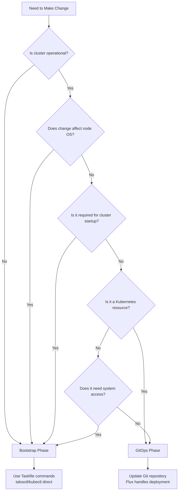
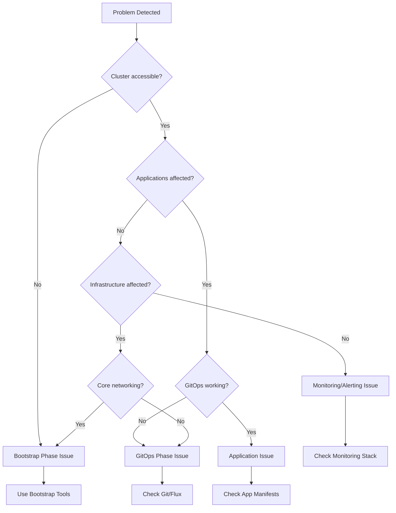

# Bootstrap vs GitOps Phases: Day-to-Day Operations Guide

## Overview

This is the **definitive operational guide** for the Bootstrap vs GitOps architectural separation in the Talos Kubernetes cluster. Use this guide for daily operations, troubleshooting, and decision-making.

## Quick Navigation

- [🚀 5-Second Decision Rules](#5-second-decision-rules)
- [🎯 Decision Framework](#decision-framework)
- [📋 Component Ownership Matrix](#component-ownership-matrix)
- [⚡ Common Scenarios](#common-scenarios)
- [🔧 Day-to-Day Workflows](#day-to-day-workflows)
- [🚨 Troubleshooting Guide](#troubleshooting-guide)
- [🔄 Change Management](#change-management)
- [📞 Emergency Procedures](#emergency-procedures)

## 5-Second Decision Rules

### When to Use Bootstrap Phase

```
✅ Node configuration changes     → task talos:*
✅ Cluster won't start           → task bootstrap:*
✅ Network/CNI issues            → task apps:deploy-cilium
✅ Secret management broken      → task bootstrap:1password-secrets
✅ System-level problems         → talosctl commands
```

### When to Use GitOps Phase

```
✅ Application deployments       → Git commit to apps/
✅ Infrastructure services       → Git commit to infrastructure/
✅ Configuration updates         → Git commit + Flux reconcile
✅ Scaling operations           → Update manifests + Git commit
✅ Certificate management       → Git commit to cert-manager-issuers/
```

### Emergency Override

```
🚨 Cluster completely broken    → Bootstrap phase only
🚨 GitOps system down          → kubectl apply directly, then fix GitOps
🚨 Network completely broken   → task talos:* and task apps:deploy-cilium
```

## Decision Framework

### Primary Decision Tree



### Secondary Considerations

**Choose Bootstrap if**:

- Component required for cluster to start
- Needs direct hardware/OS access
- Required for GitOps system to function
- Emergency situation requiring immediate action

**Choose GitOps if**:

- Kubernetes-native resource
- Benefits from version control
- Part of application or infrastructure layer
- Can be deployed after cluster is operational

## Component Ownership Matrix

### Bootstrap Phase Components

| Component                     | Files                                                                                                                                                                     | Commands                                                                      | Dependencies       | Why Bootstrap                  |
| ----------------------------- | ------------------------------------------------------------------------------------------------------------------------------------------------------------------------- | ----------------------------------------------------------------------------- | ------------------ | ------------------------------ |
| **Talos OS Configuration**    | [`talconfig.yaml`](../talconfig.yaml)<br/>[`talos/patches/`](../talos/patches/)                                                                                           | `task talos:generate-config`<br/>`task talos:apply-config`                    | None               | Must exist before Kubernetes   |
| **LLDPD Stability Fix**       | [`talos/manifests/lldpd-extension-config.yaml`](../talos/manifests/lldpd-extension-config.yaml)                                                                           | `task talos:apply-lldpd-config`                                               | Talos OS           | System-level configuration     |
| **Kubernetes Cluster**        | Generated configs                                                                                                                                                         | `task talos:bootstrap`                                                        | Talos OS           | No API exists yet              |
| **Cilium CNI Core**           | [`Taskfile.yml:410-444`](../Taskfile.yml#L410-L444)                                                                                                                       | `task apps:deploy-cilium`                                                     | Kubernetes API     | Required for pod networking    |
| **1Password Connect**         | [`scripts/bootstrap-1password-secrets.sh`](../scripts/bootstrap-1password-secrets.sh)<br/>[`infrastructure/onepassword-connect/`](../infrastructure/onepassword-connect/) | `task bootstrap:1password-secrets`<br/>`task apps:deploy-onepassword-connect` | Pod networking     | Required for GitOps secrets    |
| **External Secrets Operator** | [`Taskfile.yml:446-457`](../Taskfile.yml#L446-L457)                                                                                                                       | `task apps:deploy-external-secrets`                                           | Pod networking     | Required for secret management |
| **Flux GitOps System**        | [`Taskfile.yml:379-393`](../Taskfile.yml#L379-L393)                                                                                                                       | `task flux:bootstrap`                                                         | Secrets management | Must exist to manage GitOps    |

### GitOps Phase Components

| Component                    | Files                                                                                                                                                                                                             | Management        | Dependencies            | Why GitOps                 |
| ---------------------------- | ----------------------------------------------------------------------------------------------------------------------------------------------------------------------------------------------------------------- | ----------------- | ----------------------- | -------------------------- |
| **Cilium BGP Configuration** | [`infrastructure/cilium-bgp/bgp-policy.yaml`](../infrastructure/cilium-bgp/bgp-policy.yaml)                                                                                                                       | Git commit → Flux | Cilium CNI              | Operational configuration  |
| **Load Balancer Pools**      | [`infrastructure/cilium/loadbalancer-pool.yaml`](../infrastructure/cilium/loadbalancer-pool.yaml)<br/>[`infrastructure/cilium/loadbalancer-pool-ipv6.yaml`](../infrastructure/cilium/loadbalancer-pool-ipv6.yaml) | Git commit → Flux | Cilium CNI              | Network operations         |
| **Cert-Manager**             | [`infrastructure/cert-manager/helmrelease.yaml`](../infrastructure/cert-manager/helmrelease.yaml)                                                                                                                 | Git commit → Flux | External Secrets        | TLS certificate management |
| **Ingress-Nginx**            | [`infrastructure/ingress-nginx/helmrelease.yaml`](../infrastructure/ingress-nginx/helmrelease.yaml)                                                                                                               | Git commit → Flux | Cert-Manager            | HTTP/HTTPS ingress         |
| **Longhorn Storage**         | [`infrastructure/longhorn/helmrelease.yaml`](../infrastructure/longhorn/helmrelease.yaml)                                                                                                                         | Git commit → Flux | Kubernetes API          | Distributed storage        |
| **External-DNS**             | [`infrastructure/external-dns/helmrelease.yaml`](../infrastructure/external-dns/helmrelease.yaml)                                                                                                                 | Git commit → Flux | 1Password secrets       | DNS automation             |
| **Monitoring Stack**         | [`infrastructure/monitoring/`](../infrastructure/monitoring/)                                                                                                                                                     | Git commit → Flux | Storage, Ingress        | Observability              |
| **Applications**             | [`apps/`](../apps/)                                                                                                                                                                                               | Git commit → Flux | Infrastructure services | User workloads             |

### Hybrid Components

| Component             | Bootstrap Part        | GitOps Part                   | Rationale                                   |
| --------------------- | --------------------- | ----------------------------- | ------------------------------------------- |
| **Cilium**            | Core CNI installation | BGP policies, LB pools        | CNI required first, BGP is operational      |
| **Secret Management** | Initial K8s secrets   | ExternalSecrets, SecretStores | Bootstrap needs secrets, ongoing via GitOps |

## Common Scenarios

### Application Management

#### ✅ Adding a New Application

**Phase**: GitOps
**Time**: 5-10 minutes

```bash
# 1. Create application structure
mkdir -p apps/my-new-app

# 2. Create manifests
cat > apps/my-new-app/namespace.yaml << EOF
apiVersion: v1
kind: Namespace
metadata:
  name: my-new-app
EOF

cat > apps/my-new-app/deployment.yaml << EOF
apiVersion: apps/v1
kind: Deployment
metadata:
  name: my-new-app
  namespace: my-new-app
spec:
  replicas: 2
  selector:
    matchLabels:
      app: my-new-app
  template:
    metadata:
      labels:
        app: my-new-app
    spec:
      containers:
      - name: my-new-app
        image: nginx:1.21
        ports:
        - containerPort: 80
EOF

cat > apps/my-new-app/kustomization.yaml << EOF
apiVersion: kustomize.config.k8s.io/v1beta1
kind: Kustomization
resources:
  - namespace.yaml
  - deployment.yaml
EOF

# 3. Add to GitOps management
cat >> clusters/home-ops/infrastructure/apps.yaml << EOF
---
apiVersion: kustomize.toolkit.fluxcd.io/v1
kind: Kustomization
metadata:
  name: apps-my-new-app
  namespace: flux-system
spec:
  interval: 10m0s
  path: ./apps/my-new-app
  prune: true
  sourceRef:
    kind: GitRepository
    name: flux-system
EOF

# 4. Deploy via GitOps
git add apps/my-new-app/ clusters/home-ops/infrastructure/apps.yaml
git commit -m "Add my-new-app application"
git push

# 5. Monitor deployment
flux get kustomizations --watch
kubectl get pods -n my-new-app
```

#### ✅ Updating an Application

**Phase**: GitOps
**Time**: 2-3 minutes

```bash
# 1. Update manifest
vim apps/my-app/deployment.yaml
# Change image version, resources, etc.

# 2. Deploy via GitOps
git add apps/my-app/
git commit -m "Update my-app to version 2.0"
git push

# 3. Monitor rollout
kubectl rollout status deployment/my-app -n my-app
```

### Infrastructure Changes

#### ✅ Adding Infrastructure Service

**Phase**: GitOps
**Example**: Adding Redis

```bash
# 1. Create infrastructure directory
mkdir -p infrastructure/redis

# 2. Create HelmRelease
cat > infrastructure/redis/helmrelease.yaml << EOF
apiVersion: helm.toolkit.fluxcd.io/v2beta1
kind: HelmRelease
metadata:
  name: redis
  namespace: redis-system
spec:
  interval: 30m
  chart:
    spec:
      chart: redis
      version: "17.3.7"
      sourceRef:
        kind: HelmRepository
        name: bitnami
        namespace: flux-system
  install:
    createNamespace: true
  values:
    auth:
      enabled: false
EOF

# 3. Add to infrastructure management
# Edit appropriate infrastructure file in clusters/home-ops/infrastructure/

# 4. Deploy via GitOps
git add infrastructure/redis/
git commit -m "Add Redis infrastructure service"
git push
```

#### ✅ Scaling Infrastructure

**Phase**: GitOps

```bash
# 1. Update resource specifications
vim infrastructure/longhorn/helmrelease.yaml
# Modify replica counts, resource limits

# 2. Deploy via GitOps
git add infrastructure/longhorn/
git commit -m "Scale Longhorn for increased capacity"
git push

# 3. Monitor scaling
flux get helmreleases -n longhorn-system
kubectl get pods -n longhorn-system
```

### Network Configuration

#### ✅ Changing Cluster Network Settings

**Phase**: Bootstrap
**Example**: Updating pod CIDR

```bash
# 1. Update cluster configuration
vim talconfig.yaml
# Modify clusterPodNets and clusterSvcNets

# 2. Regenerate Talos configuration
task talos:generate-config

# 3. Apply to nodes (may require restart)
task talos:apply-config

# 4. Verify cluster networking
kubectl get nodes -o wide
kubectl get pods -n kube-system
```

#### ✅ Adding BGP Peering

**Phase**: GitOps

```bash
# 1. Update BGP policy
vim infrastructure/cilium-bgp/bgp-policy.yaml
# Add new peer configurations

# 2. Update load balancer pools if needed
vim infrastructure/cilium/loadbalancer-pool.yaml

# 3. Deploy via GitOps
git add infrastructure/cilium-bgp/ infrastructure/cilium/
git commit -m "Add new BGP peer for additional network"
git push

# 4. Verify BGP peering
kubectl get ciliumbgpclusterconfig
```

### Node Management

#### ✅ Adding Node Labels

**Phase**: Bootstrap

```bash
# 1. Update node configuration
vim talconfig.yaml
# Add to nodeLabels section

# 2. Apply configuration
task talos:generate-config
task talos:apply-config

# 3. Verify labels
kubectl get nodes --show-labels
```

#### ✅ Node Maintenance

**Phase**: Bootstrap

```bash
# 1. Drain node safely
kubectl drain <node-name> --ignore-daemonsets --delete-emptydir-data

# 2. Perform maintenance
task talos:reboot NODES=<node-ip>

# 3. Uncordon node
kubectl uncordon <node-name>
```

## Day-to-Day Workflows

### Morning Cluster Health Check

```bash
# 1. Check overall cluster status
task cluster:status

# 2. Check GitOps health
flux get kustomizations
flux get helmreleases

# 3. Check for any issues
kubectl get events --sort-by='.lastTimestamp' | tail -20
kubectl get pods --all-namespaces | grep -v Running | grep -v Completed

# 4. Check node health
kubectl get nodes
talosctl health --nodes 172.29.51.11,172.29.51.12,172.29.51.13
```

### Weekly Maintenance Tasks

```bash
# 1. Update dependencies (if needed)
task renovate:dry-run

# 2. Verify core idempotency
task apps:verify-core-idempotency

# 3. Check storage health
kubectl get pv
kubectl get pvc --all-namespaces

# 4. Backup verification
task maintenance:backup
```

### Monthly Operations

```bash
# 1. Review and update documentation
# 2. Test disaster recovery procedures
task test:recovery

# 3. Review security configurations
kubectl get certificates --all-namespaces
kubectl get secrets --all-namespaces | grep tls

# 4. Capacity planning review
kubectl top nodes
kubectl top pods --all-namespaces
```

## Troubleshooting Guide

### Problem Classification



### Bootstrap Phase Issues

#### Cluster Won't Start

```bash
# 1. Check node status
talosctl health --nodes 172.29.51.11,172.29.51.12,172.29.51.13

# 2. Check Talos logs
talosctl logs --nodes 172.29.51.11

# 3. Verify configuration
talosctl validate --config clusterconfig/home-ops-mini01.yaml

# 4. Recovery procedures
task cluster:emergency-recovery
```

#### Network Issues

```bash
# 1. Check Cilium status
kubectl get pods -n kube-system -l k8s-app=cilium
cilium status

# 2. Redeploy Cilium if needed
task apps:deploy-cilium

# 3. Check LLDPD configuration
task network:verify-lldpd-config

# 4. Verify node networking
task network:check-ipv6
```

#### Secret Management Issues

```bash
# 1. Check 1Password Connect
kubectl get pods -n onepassword-connect
kubectl logs -n onepassword-connect -l app=onepassword-connect

# 2. Recreate secrets if needed
task bootstrap:1password-secrets

# 3. Validate secrets
task bootstrap:validate-1password-secrets

# 4. Redeploy External Secrets
task apps:deploy-external-secrets
```

### GitOps Phase Issues

#### Applications Not Deploying

```bash
# 1. Check Flux status
flux get kustomizations
flux get helmreleases

# 2. Check Flux logs
kubectl logs -n flux-system -l app=source-controller
kubectl logs -n flux-system -l app=kustomize-controller

# 3. Force reconciliation
flux reconcile source git flux-system
flux reconcile kustomization flux-system

# 4. Check application resources
kubectl get all -n <app-namespace>
kubectl describe pod <pod-name> -n <app-namespace>
```

#### Infrastructure Service Issues

```bash
# 1. Check HelmRelease status
flux get helmreleases -n <namespace>

# 2. Check Helm deployment
helm list -n <namespace>
helm status <release-name> -n <namespace>

# 3. Check dependencies
kubectl get secrets -n <namespace>
kubectl get configmaps -n <namespace>

# 4. Review manifest changes
git log --oneline infrastructure/<service>/
```

### Hybrid Component Issues

#### Cilium Problems

```bash
# Core CNI Issues (Bootstrap)
kubectl get pods -n kube-system -l k8s-app=cilium
task apps:deploy-cilium

# BGP Issues (GitOps)
kubectl get ciliumbgpclusterconfig
git log --oneline infrastructure/cilium-bgp/

# Load Balancer Issues (GitOps)
kubectl get ippools
kubectl get svc --all-namespaces | grep LoadBalancer
```

## Change Management

### Emergency Changes

**When GitOps is Down**:

```bash
# 1. Apply critical fixes directly
kubectl apply -f critical-fix.yaml

# 2. Document the change
echo "Emergency fix applied: $(date)" >> emergency-changes.log

# 3. Update Git repository when possible
# 4. Reconcile GitOps
flux reconcile source git flux-system
```

**When Bootstrap is Needed**:

```bash
# 1. Use emergency recovery
task cluster:emergency-recovery

# 2. Apply bootstrap fixes
task talos:apply-config
task apps:deploy-core

# 3. Verify GitOps resumes
flux get kustomizations
```

### Planned Maintenance

#### Coordinated Changes

```bash
# 1. Plan the change
# - Identify affected components
# - Determine phase (Bootstrap vs GitOps)
# - Plan rollback procedures

# 2. Execute in order
# Bootstrap changes first (if any)
task talos:apply-config

# Then GitOps changes
git add infrastructure/
git commit -m "Planned maintenance: update infrastructure"
git push

# 3. Verify and monitor
flux get kustomizations --watch
kubectl get pods --all-namespaces
```

### Rollback Procedures

#### Bootstrap Rollback

```bash
# 1. Revert configuration files
git checkout HEAD~1 talconfig.yaml

# 2. Regenerate and apply
task talos:generate-config
task talos:apply-config

# 3. Verify cluster health
task cluster:status
```

#### GitOps Rollback

```bash
# 1. Revert Git changes
git revert <commit-hash>
git push

# 2. Force reconciliation
flux reconcile source git flux-system
flux reconcile kustomization flux-system

# 3. Monitor rollback
flux get kustomizations --watch
```

## Emergency Procedures

### Complete Cluster Failure

```bash
# 1. Assess the situation
task cluster:verify-safety

# 2. Attempt recovery
task cluster:emergency-recovery

# 3. If recovery fails, safe reset
task cluster:safe-reset

# 4. Full rebuild
task bootstrap:cluster
```

### GitOps System Failure

```bash
# 1. Check Flux system
kubectl get pods -n flux-system

# 2. Restart Flux if needed
kubectl rollout restart deployment -n flux-system

# 3. Re-bootstrap if necessary
task flux:bootstrap

# 4. Force reconciliation
flux reconcile source git flux-system
```

### Network Complete Failure

```bash
# 1. Check node connectivity
ping 172.29.51.11

# 2. Verify Talos networking
talosctl get addresses --nodes 172.29.51.11

# 3. Redeploy core networking
task apps:deploy-cilium

# 4. Check BGP configuration
kubectl get ciliumbgpclusterconfig
```

## Best Practices

### Daily Operations

1. **Always check cluster health** before making changes
2. **Use the decision framework** for every operational decision
3. **Monitor both phases** - Bootstrap and GitOps health
4. **Document emergency changes** for later GitOps integration

### Change Management

1. **Test in development** before production changes
2. **Use feature branches** for complex GitOps changes
3. **Have rollback procedures** ready before making changes
4. **Coordinate between phases** for complex operations

### Troubleshooting

1. **Identify the correct phase** before starting troubleshooting
2. **Use phase-appropriate tools** (talosctl vs kubectl vs flux)
3. **Check dependencies** in the correct order
4. **Document solutions** for future reference

## Quick Reference Commands

### Bootstrap Phase

```bash
# Cluster operations
task cluster:status
task cluster:emergency-recovery
task cluster:safe-reset

# Node operations
task talos:apply-config
task talos:apply-lldpd-config
task talos:bootstrap

# Core services
task apps:deploy-core
task apps:deploy-cilium
task bootstrap:1password-secrets
```

### GitOps Phase

```bash
# Flux operations
flux get kustomizations
flux get helmreleases
flux reconcile source git flux-system

# Monitoring
kubectl get pods --all-namespaces
kubectl get events --sort-by='.lastTimestamp'
kubectl top nodes
```

### Emergency Commands

```bash
# Immediate cluster access
task talos:recover-kubeconfig

# Force GitOps reconciliation
flux reconcile kustomization flux-system

# Check critical services
kubectl get pods -n kube-system
kubectl get pods -n flux-system
```

## Related Documentation

- **[Bootstrap vs GitOps Architecture](./BOOTSTRAP_VS_GITOPS_ARCHITECTURE.md)** - Comprehensive architectural guide
- **[Operational Workflows](./OPERATIONAL_WORKFLOWS.md)** - Detailed step-by-step procedures
- **[Component Migration Guide](./COMPONENT_MIGRATION_GUIDE.md)** - Moving components between phases
- **[Cluster Reset Safety](./CLUSTER_RESET_SAFETY.md)** - Safe operational procedures
- **[LLDPD Configuration Fix](./LLDPD_CONFIGURATION_FIX.md)** - Node stability improvements

---

**This guide is your single source of truth for Bootstrap vs GitOps operational decisions. When in doubt, use the 5-second decision rules and decision framework to determine the correct approach.**
