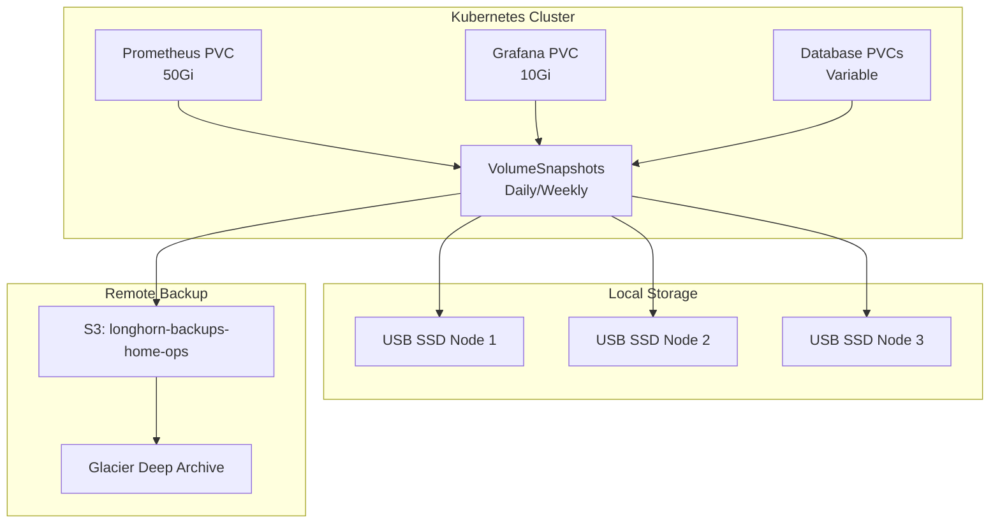

# Comprehensive Backup Strategy for Talos GitOps Cluster

## Overview

This document outlines the comprehensive backup strategy implemented for the homelab Talos GitOps cluster. The strategy provides automated, reliable backups with a 24-hour Recovery Point Objective (RPO) and includes support for both current monitoring workloads and future database deployments.

## Architecture Summary

### Data Classification Tiers

| Tier            | Description                     | RPO | RTO | Backup Frequency              | Retention                  |
| --------------- | ------------------------------- | --- | --- | ----------------------------- | -------------------------- |
| **Critical**    | Prometheus, Grafana, Databases  | 24h | 1h  | Daily snapshots + Weekly S3   | 7 days local, 4 weeks S3   |
| **Important**   | Kubernetes secrets, GitOps repo | 24h | 4h  | Weekly snapshots + Monthly S3 | 4 weeks local, 3 months S3 |
| **Replaceable** | Logs, container images          | N/A | 8h  | No automated backups          | Rebuild from source        |

### Backup Infrastructure



## Implementation Components

### 1. Longhorn RecurringJobs

**File**: [`infrastructure/longhorn/recurring-jobs.yaml`](../infrastructure/longhorn/recurring-jobs.yaml)

Automated backup jobs configured for different data tiers:

- **monitoring-daily-snapshot**: Daily snapshots for Prometheus/Grafana at 2 AM
- **monitoring-weekly-backup**: Weekly S3 backups on Sunday at 3 AM
- **database-daily-snapshot**: Daily database snapshots at 1 AM
- **database-weekly-backup**: Weekly database S3 backups at 4 AM
- **application-weekly-snapshot**: Weekly snapshots for other applications
- **cleanup-old-snapshots**: Automated cleanup on Sunday at 7 AM

### 2. Volume Snapshot Schedules

**File**: [`infrastructure/longhorn/volume-snapshots-critical.yaml`](../infrastructure/longhorn/volume-snapshots-critical.yaml)

- Manual snapshot templates for immediate backups
- Automated CronJob for daily critical workload snapshots
- RBAC configuration for snapshot creation
- Cleanup automation for old snapshots

### 3. Backup Monitoring & Verification

**File**: [`infrastructure/longhorn/backup-monitoring.yaml`](../infrastructure/longhorn/backup-monitoring.yaml)

- Automated backup verification scripts
- Prometheus metrics integration
- Alert rules for backup failures
- Health checks for backup targets

### 4. Restore Procedures

**File**: [`infrastructure/longhorn/backup-restore-procedures.yaml`](../infrastructure/longhorn/backup-restore-procedures.yaml)

- Restore from snapshot scripts
- Restore from S3 backup scripts
- Automated restore testing framework
- Weekly restore validation

### 5. Database Backup Examples

**File**: [`infrastructure/longhorn/database-backup-examples.yaml`](../infrastructure/longhorn/database-backup-examples.yaml)

- PostgreSQL deployment with backup integration
- MariaDB deployment with backup hooks
- Application-consistent backup procedures
- Pre/post backup scripts for data consistency

## Operational Procedures

### Daily Operations

1. **Automated Backups** (No manual intervention required)

   - 1:00 AM: Database snapshots created
   - 2:00 AM: Monitoring snapshots created
   - Backup verification runs at 8:00 AM

2. **Monitoring**
   - Check Grafana dashboard for backup metrics
   - Review Prometheus alerts for any backup failures
   - Verify S3 bucket usage and costs

### Weekly Operations

1. **Sunday Backup Schedule**

   - 3:00 AM: Monitoring S3 backups
   - 4:00 AM: Database S3 backups
   - 5:00 AM: Application snapshots
   - 7:00 AM: Cleanup old snapshots
   - 10:00 AM: Automated restore testing

2. **Manual Verification**
   - Review backup verification job logs
   - Check restore test results
   - Validate S3 backup integrity

### Monthly Operations

1. **Backup Strategy Review**

   - Analyze backup success rates
   - Review storage usage trends
   - Update retention policies if needed

2. **Disaster Recovery Testing**
   - Perform full restore test in isolated environment
   - Document any issues or improvements
   - Update procedures based on findings

## Backup Configuration by Application

### Current Applications

#### Prometheus (50Gi)

- **Backup Group**: `monitoring`
- **Tier**: Critical
- **Schedule**: Daily snapshots, weekly S3 backups
- **Retention**: 7 days local, 4 weeks S3

#### Grafana (10Gi)

- **Backup Group**: `monitoring`
- **Tier**: Critical
- **Schedule**: Daily snapshots, weekly S3 backups
- **Retention**: 7 days local, 4 weeks S3

### Future Database Applications

#### PostgreSQL

- **Backup Group**: `database`
- **Tier**: Critical
- **Schedule**: Daily consistent snapshots, weekly S3 backups
- **Pre-backup**: `pg_dump` for consistency
- **Retention**: 7 days local, 8 weeks S3

#### MariaDB/MySQL

- **Backup Group**: `database`
- **Tier**: Critical
- **Schedule**: Daily consistent snapshots, weekly S3 backups
- **Pre-backup**: `mysqldump` for consistency
- **Retention**: 7 days local, 8 weeks S3

## Monitoring and Alerting

### Prometheus Metrics

The backup system exposes the following metrics:

- `longhorn_backup_target_healthy`: Backup target health status
- `longhorn_recent_backup_success_count`: Recent successful backups (24h)
- `longhorn_snapshots_ready_count`: Ready snapshots by tier
- `longhorn_storage_available_bytes`: Available storage space

### Alert Rules

- **LonghornBackupTargetDown**: Critical alert when S3 backup target is unhealthy
- **LonghornNoRecentBackups**: Warning when no backups completed in 25 hours
- **LonghornSnapshotCreationFailed**: Warning when scheduled snapshots fail
- **LonghornStorageLow**: Warning when available storage < 10GB

## Disaster Recovery Scenarios

### Scenario 1: Single Volume Corruption

**Recovery Steps**:

1. Identify the affected PVC
2. Find the latest healthy snapshot
3. Create new PVC from snapshot
4. Update application to use new PVC
5. Verify data integrity

**Estimated RTO**: 30 minutes

### Scenario 2: Complete Node Failure

**Recovery Steps**:

1. Replace failed node
2. Longhorn automatically rebuilds replicas
3. Verify all volumes are healthy
4. No data loss expected due to replication

**Estimated RTO**: 2-4 hours (hardware dependent)

### Scenario 3: Complete Cluster Loss

**Recovery Steps**:

1. Rebuild Talos cluster from GitOps repository
2. Restore Longhorn from S3 backups
3. Restore critical volumes from latest S3 backups
4. Verify application functionality
5. Resume normal operations

**Estimated RTO**: 4-8 hours

### Scenario 4: S3 Backup Corruption

**Recovery Steps**:

1. Use local snapshots for recent data
2. Restore from older S3 backup if available
3. Accept data loss to last known good backup
4. Investigate and fix S3 backup issues

**Estimated RPO**: Up to 7 days (local snapshot retention)

## Cost Optimization

### S3 Storage Lifecycle

1. **Standard Storage**: First 30 days
2. **Infrequent Access**: 30-90 days
3. **Glacier**: 90+ days for long-term retention

### Storage Usage Monitoring

- Monitor S3 costs monthly
- Adjust retention policies based on usage patterns
- Consider compression for database backups

## Security Considerations

### Access Control

- S3 credentials stored in 1Password
- RBAC configured for backup operations
- Separate service accounts for different backup functions

### Encryption

- S3 backups encrypted at rest
- Longhorn volumes encrypted with cluster keys
- Network traffic encrypted in transit

## Maintenance and Updates

### Quarterly Reviews

1. **Backup Strategy Assessment**

   - Review RPO/RTO requirements
   - Analyze backup success rates
   - Update procedures based on lessons learned

2. **Technology Updates**

   - Update Longhorn version
   - Review new backup features
   - Test compatibility with cluster updates

3. **Capacity Planning**
   - Analyze storage growth trends
   - Plan for additional storage needs
   - Optimize backup retention policies

## Troubleshooting Guide

### Common Issues

#### Backup Job Failures

```bash
# Check RecurringJob status
kubectl get recurringjobs -n longhorn-system

# Check backup logs
kubectl logs -n longhorn-system -l app=longhorn-manager

# Verify S3 connectivity
kubectl exec -n longhorn-system deployment/longhorn-manager -- curl -I https://s3.us-west-2.amazonaws.com
```

#### Snapshot Creation Failures

```bash
# Check VolumeSnapshot status
kubectl get volumesnapshots --all-namespaces

# Check snapshot controller logs
kubectl logs -n volume-snapshot-system deployment/snapshot-controller

# Verify storage class configuration
kubectl get volumesnapshotclass
```

#### Restore Failures

```bash
# Check PVC status during restore
kubectl get pvc -n <namespace> -w

# Check Longhorn volume status
kubectl get volumes -n longhorn-system

# Verify snapshot readiness
kubectl get volumesnapshot <snapshot-name> -n <namespace> -o yaml
```

## Contact and Support

For backup-related issues:

1. Check this documentation first
2. Review Longhorn logs and status
3. Consult Longhorn documentation
4. Create GitHub issue with detailed logs

## Changelog

- **2025-01-18**: Initial comprehensive backup strategy implementation
- **Future**: Updates will be documented here

---

This backup strategy provides a robust, automated solution for protecting critical data in your homelab environment while maintaining cost-effectiveness and operational simplicity.
