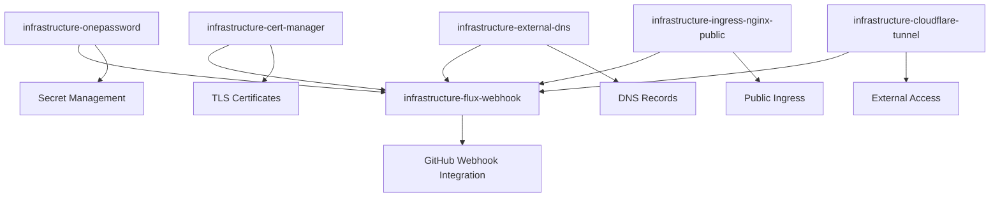

# Flux GitHub Webhook Deployment Guide

## Executive Summary

This guide provides comprehensive, step-by-step instructions for deploying and configuring the GitHub webhook integration with Flux. This deployment enables automatic GitOps reconciliation when changes are pushed to the repository, significantly improving the development workflow by eliminating manual `flux reconcile` commands.

### What This Guide Accomplishes

- **Complete webhook system deployment** from pre-deployment validation through operational monitoring
- **GitHub repository configuration** with proper webhook setup and secret management
- **1Password integration** for secure webhook secret storage and rotation
- **Comprehensive validation** procedures to ensure the system works end-to-end
- **Operational procedures** for monitoring, troubleshooting, and maintenance

### Architecture Overview

The webhook system consists of:

- **Flux Receiver**: Processes GitHub webhook events and triggers reconciliation
- **Public Ingress**: Exposes webhook endpoint via `https://flux-webhook.geoffdavis.com/hook`
- **Cloudflare Tunnel**: Provides secure public access through existing tunnel infrastructure
- **1Password Integration**: Manages webhook secrets securely with automatic rotation
- **Monitoring Stack**: Comprehensive metrics, alerts, and logging for operational visibility

For detailed architectural information, see [`FLUX_GITHUB_WEBHOOK_ARCHITECTURE.md`](./FLUX_GITHUB_WEBHOOK_ARCHITECTURE.md).

## Table of Contents

1. [Pre-deployment Checklist](#pre-deployment-checklist)
2. [1Password Secret Management](#1password-secret-management)
3. [Deployment Procedures](#deployment-procedures)
4. [GitHub Repository Configuration](#github-repository-configuration)
5. [Validation and Testing](#validation-and-testing)
6. [Integration with Existing Infrastructure](#integration-with-existing-infrastructure)
7. [Operational Procedures](#operational-procedures)
8. [Troubleshooting Guide](#troubleshooting-guide)
9. [Security Considerations](#security-considerations)
10. [Rollback and Recovery](#rollback-and-recovery)

## Pre-deployment Checklist

### Infrastructure Dependencies Verification

Before deploying the webhook system, verify all required infrastructure components are operational:

#### 1. Core Infrastructure Components

```bash
# Verify Flux system is healthy
kubectl get pods -n flux-system
flux get kustomizations

# Expected: All Flux controllers running and kustomizations ready
```

```bash
# Verify cert-manager is operational
kubectl get pods -n cert-manager
kubectl get clusterissuers

# Expected: cert-manager pods running, letsencrypt-prod issuer ready
```

```bash
# Verify external-dns is working
kubectl get pods -n external-dns-system
kubectl logs -n external-dns-system -l app.kubernetes.io/name=external-dns --tail=50

# Expected: external-dns pod running, no DNS sync errors
```

```bash
# Verify ingress-nginx-public is ready
kubectl get pods -n ingress-nginx-public
kubectl get svc -n ingress-nginx-public

# Expected: ingress controller running, LoadBalancer service has external IP
```

#### 2. Cloudflare Tunnel Status

```bash
# Verify Cloudflare tunnel is operational
kubectl get pods -n cloudflare-tunnel
kubectl logs -n cloudflare-tunnel -l app=cloudflare-tunnel --tail=20

# Expected: tunnel pod running, connected to Cloudflare edge
```

```bash
# Verify tunnel configuration includes webhook endpoint
kubectl get configmap -n cloudflare-tunnel cloudflare-tunnel-config -o yaml

# Expected: Configuration includes flux-webhook.geoffdavis.com ingress rule
```

#### 3. 1Password Connect Verification

```bash
# Verify 1Password Connect is operational
kubectl get pods -n onepassword-connect
kubectl get secret -n onepassword-connect

# Expected: onepassword-connect pod running, credentials secret exists
```

```bash
# Test 1Password Connect API connectivity
kubectl port-forward -n onepassword-connect svc/onepassword-connect 8080:8080 &
curl -H "Authorization: Bearer $(kubectl get secret -n onepassword-connect onepassword-connect-token -o jsonpath='{.data.token}' | base64 -d)" \
  http://localhost:8080/v1/health
kill %1

# Expected: HTTP 200 response with health status
```

#### 4. Monitoring Infrastructure

```bash
# Verify monitoring namespace exists
kubectl get namespace monitoring

# Verify Prometheus is operational (if deployed)
kubectl get pods -n monitoring -l app.kubernetes.io/name=prometheus

# Expected: monitoring namespace exists, prometheus pods running (if applicable)
```

### Security Prerequisites

#### 1. Domain and DNS Validation

```bash
# Verify domain ownership and DNS resolution
dig flux-webhook.geoffdavis.com

# Expected: DNS resolution should work (may show tunnel CNAME)
```

#### 2. Certificate Issuer Validation

```bash
# Verify Let's Encrypt issuer can issue certificates for geoffdavis.com
kubectl get clusterissuer letsencrypt-prod -o yaml

# Expected: Issuer ready, DNS01 solver configured for geoffdavis.com
```

#### 3. Network Security Validation

```bash
# Verify ingress-nginx-public security configuration
kubectl get deployment -n ingress-nginx-public ingress-nginx-public-controller -o yaml | grep -A 10 args

# Expected: Security headers and rate limiting configured
```

### Pre-deployment Security Checklist

- [ ] **1Password vault access**: Confirm access to "Automation" vault for secret storage
- [ ] **GitHub repository access**: Confirm admin access to target repository for webhook configuration
- [ ] **Cloudflare tunnel**: Verify tunnel is operational and can handle additional ingress rules
- [ ] **Certificate management**: Confirm cert-manager can issue certificates for `geoffdavis.com`
- [ ] **Network policies**: Review any network policies that might block webhook traffic
- [ ] **Backup verification**: Ensure recent backups exist before making infrastructure changes

### Expected Deployment Timeline

| Phase                         | Duration          | Risk Level | Rollback Time  |
| ----------------------------- | ----------------- | ---------- | -------------- |
| **1Password Setup**           | 5 minutes         | Low        | 2 minutes      |
| **Infrastructure Deployment** | 10-15 minutes     | Medium     | 5 minutes      |
| **GitHub Configuration**      | 5 minutes         | Low        | 2 minutes      |
| **End-to-end Testing**        | 10 minutes        | Low        | N/A            |
| **Total Deployment**          | **30-35 minutes** | **Medium** | **10 minutes** |

## 1Password Secret Management

### Creating the GitHub Webhook Secret

The webhook system requires a shared secret between GitHub and the Flux receiver for authentication. This secret is managed through 1Password for security and rotation capabilities.

#### 1. Generate Webhook Secret

```bash
# Generate a cryptographically secure webhook secret
WEBHOOK_SECRET=$(openssl rand -hex 32)
echo "Generated webhook secret: $WEBHOOK_SECRET"

# Store this value temporarily - you'll need it for both 1Password and GitHub
```

#### 2. Create 1Password Entry

1. **Access 1Password Web Interface**:

   - Navigate to <https://my.1password.com/>
   - Select the **"Automation"** vault

2. **Create New Item**:

   - Click **"New Item"** → **"Secure Note"**
   - **Title**: `GitHub Flux Webhook Secret`
   - **Category**: Secure Note

3. **Configure Required Fields**:

   ```text
   Field Name: token
   Field Type: Password
   Field Value: [paste the generated WEBHOOK_SECRET]
   ```

4. **Add Metadata** (Optional but recommended):

   ```text
   Field Name: description
   Field Type: Text
   Field Value: Webhook secret for GitHub integration with Flux GitOps

   Field Name: repository
   Field Type: Text
   Field Value: https://github.com/your-username/talos-gitops

   Field Name: created_date
   Field Type: Text
   Field Value: [current date]
   ```

5. **Save the Item**:
   - Click **"Save"** to create the 1Password entry
   - Verify the item appears in the Automation vault

#### 3. Validate 1Password Entry

```bash
# Test 1Password CLI access to the new secret
op item get "GitHub Flux Webhook Secret" --vault="Automation" --fields="token"

# Expected: Should return the webhook secret value
```

#### 4. Secret Rotation Procedures

**Quarterly Rotation Schedule** (Recommended):

1. **Generate New Secret**:

   ```bash
   NEW_WEBHOOK_SECRET=$(openssl rand -hex 32)
   echo "New webhook secret: $NEW_WEBHOOK_SECRET"
   ```

2. **Update 1Password Entry**:

   - Edit the "GitHub Flux Webhook Secret" item
   - Update the `token` field with the new value
   - Update the `created_date` field

3. **Update GitHub Webhook**:

   - Navigate to repository Settings → Webhooks
   - Edit the webhook configuration
   - Update the secret field with the new value

4. **Verify Rotation**:

   ```bash
   # The ExternalSecret will automatically sync the new value within 1 hour
   # Force immediate sync if needed:
   kubectl annotate externalsecret -n flux-system github-webhook-secret force-sync="$(date)"

   # Verify secret updated
   kubectl get secret -n flux-system github-webhook-secret -o jsonpath='{.data.token}' | base64 -d
   ```

### Security Best Practices

- **Access Control**: Limit 1Password vault access to essential personnel only
- **Audit Trail**: 1Password maintains access logs for security auditing
- **Secret Complexity**: Use cryptographically secure random secrets (32+ hex characters)
- **Rotation Schedule**: Rotate webhook secrets quarterly or after security incidents
- **Backup Strategy**: 1Password handles backup and recovery automatically

## Deployment Procedures

### Phase 1: Infrastructure Deployment

This phase deploys all Kubernetes resources required for the webhook system.

#### 1. Deploy Flux Webhook Infrastructure

```bash
# Navigate to repository root
cd /path/to/talos-gitops

# Verify flux-webhook resources exist
ls -la infrastructure/flux-webhook/

# Expected files:
# - kustomization.yaml
# - external-secret.yaml
# - receiver.yaml
# - ingress.yaml
# - service-monitor.yaml
# - prometheus-rule.yaml
```

#### 2. Add Flux Webhook to Infrastructure Management

The flux-webhook needs to be added to the main infrastructure kustomization to be managed by Flux.

**Edit** [`clusters/home-ops/infrastructure/networking.yaml`](../clusters/home-ops/infrastructure/networking.yaml):

```bash
# Add the following kustomization to the end of the file
cat >> clusters/home-ops/infrastructure/networking.yaml << 'EOF'
---
apiVersion: kustomize.toolkit.fluxcd.io/v1
kind: Kustomization
metadata:
  name: infrastructure-flux-webhook
  namespace: flux-system
spec:
  interval: 10m0s
  timeout: 10m0s
  path: ./infrastructure/flux-webhook
  prune: true
  sourceRef:
    kind: GitRepository
    name: flux-system
  dependsOn:
    - name: infrastructure-ingress-nginx-public
    - name: infrastructure-cert-manager
    - name: infrastructure-onepassword
    - name: infrastructure-external-dns
    - name: infrastructure-cloudflare-tunnel
  retryInterval: 2m0s
  wait: true
  healthChecks:
    - apiVersion: notification.toolkit.fluxcd.io/v1
      kind: Receiver
      name: github-webhook
      namespace: flux-system
EOF
```

#### 3. Commit and Deploy Infrastructure Changes

```bash
# Add changes to git
git add clusters/home-ops/infrastructure/networking.yaml

# Commit the changes
git commit -m "Add flux-webhook to infrastructure management

- Add infrastructure-flux-webhook kustomization to networking.yaml
- Configure proper dependencies on required infrastructure components
- Enable webhook receiver for GitHub integration"

# Push to trigger GitOps deployment
git push origin main
```

#### 4. Monitor Infrastructure Deployment

```bash
# Watch Flux reconciliation
flux get kustomizations --watch

# Expected: infrastructure-flux-webhook should appear and become ready
```

```bash
# Monitor webhook infrastructure deployment
kubectl get all -n flux-system -l app.kubernetes.io/name=flux-webhook

# Expected: No new pods (uses existing notification-controller)
# Expected: New receiver, ingress, and secret resources
```

```bash
# Verify ExternalSecret is syncing
kubectl get externalsecret -n flux-system github-webhook-secret
kubectl describe externalsecret -n flux-system github-webhook-secret

# Expected: ExternalSecret ready, secret synced from 1Password
```

```bash
# Verify webhook secret was created
kubectl get secret -n flux-system github-webhook-secret
kubectl get secret -n flux-system github-webhook-secret -o jsonpath='{.data.token}' | base64 -d

# Expected: Secret exists with correct token value from 1Password
```

#### 5. Verify Certificate Provisioning

```bash
# Check certificate request and issuance
kubectl get certificate -n flux-system flux-webhook-tls
kubectl describe certificate -n flux-system flux-webhook-tls

# Expected: Certificate ready, issued by letsencrypt-prod
```

```bash
# Verify certificate details
kubectl get secret -n flux-system flux-webhook-tls -o jsonpath='{.data.tls\.crt}' | base64 -d | openssl x509 -text -noout | grep -A 2 "Subject Alternative Name"

# Expected: SAN includes flux-webhook.geoffdavis.com
```

#### 6. Verify DNS Record Creation

```bash
# Check external-dns logs for DNS record creation
kubectl logs -n external-dns-system -l app.kubernetes.io/name=external-dns --tail=20

# Expected: Log entries showing DNS record creation for flux-webhook.geoffdavis.com
```

```bash
# Verify DNS resolution
dig flux-webhook.geoffdavis.com

# Expected: DNS record resolves (may show Cloudflare tunnel CNAME)
```

### Phase 2: Cloudflare Tunnel Integration

The Cloudflare tunnel configuration should already include the webhook endpoint, but let's verify it's properly configured.

#### 1. Verify Tunnel Configuration

```bash
# Check current tunnel configuration
kubectl get configmap -n cloudflare-tunnel cloudflare-tunnel-config -o yaml

# Expected: Should include flux-webhook.geoffdavis.com ingress rule
```

The configuration should include:

```yaml
ingress:
  # Flux webhook endpoint
  - hostname: flux-webhook.geoffdavis.com
    service: https://ingress-nginx-public.ingress-nginx-public.svc.cluster.local:443
    originRequest:
      noTLSVerify: false
      connectTimeout: 30s
      tlsTimeout: 10s
      keepAliveTimeout: 90s
      httpHostHeader: flux-webhook.geoffdavis.com
```

#### 2. Restart Tunnel if Configuration Changed

If the tunnel configuration was missing the webhook endpoint and you had to add it:

```bash
# Restart tunnel pods to pick up configuration changes
kubectl rollout restart deployment -n cloudflare-tunnel cloudflare-tunnel

# Monitor restart
kubectl rollout status deployment -n cloudflare-tunnel cloudflare-tunnel

# Check tunnel logs for successful connection
kubectl logs -n cloudflare-tunnel -l app=cloudflare-tunnel --tail=20
```

### Phase 3: Monitoring Integration

#### 1. Verify ServiceMonitor Deployment

```bash
# Check if ServiceMonitor was created
kubectl get servicemonitor -n monitoring flux-webhook-receiver

# Expected: ServiceMonitor exists and is configured
```

#### 2. Verify PrometheusRule Deployment

```bash
# Check if PrometheusRule was created
kubectl get prometheusrule -n monitoring flux-webhook-alerts

# Expected: PrometheusRule exists with webhook alerting rules
```

#### 3. Validate Monitoring Integration (if Prometheus is deployed)

```bash
# Check if Prometheus is scraping webhook metrics
kubectl port-forward -n monitoring svc/prometheus-server 9090:80 &

# Open browser to http://localhost:9090
# Search for: gotk_webhook_receiver_requests_total
# Expected: Metric should be available (may show 0 until webhooks are received)

kill %1  # Stop port-forward
```

## GitHub Repository Configuration

### Setting Up the Webhook in GitHub

#### 1. Access Repository Webhook Settings

1. **Navigate to Repository**:

   - Go to your GitHub repository (e.g., `https://github.com/your-username/talos-gitops`)
   - Click **"Settings"** tab
   - Click **"Webhooks"** in the left sidebar

2. **Add New Webhook**:
   - Click **"Add webhook"** button

#### 2. Configure Webhook Settings

**Webhook Configuration**:

| Field                | Value                                      | Notes                                         |
| -------------------- | ------------------------------------------ | --------------------------------------------- |
| **Payload URL**      | `https://flux-webhook.geoffdavis.com/hook` | Must match ingress configuration              |
| **Content type**     | `application/json`                         | Required for Flux receiver                    |
| **Secret**           | `[webhook secret from 1Password]`          | Use the token value from your 1Password entry |
| **SSL verification** | ✅ **Enable SSL verification**             | Important for security                        |

**Event Selection**:

- Select **"Let me select individual events"**
- Check the following events:
  - ✅ **Pushes** - Triggers on code pushes
  - ✅ **Pull requests** - Triggers on PR events
  - ✅ **Ping** - For webhook testing
- Uncheck all other events

**Webhook Status**:

- ✅ **Active** - Ensure webhook is enabled

#### 3. Save and Test Webhook

1. **Save Configuration**:

   - Click **"Add webhook"** to save
   - GitHub will automatically send a ping event

2. **Verify Ping Event**:
   - The webhook should show a green checkmark if the ping was successful
   - Click on the webhook to see delivery details
   - Recent deliveries should show a successful ping event

#### 4. Webhook URL Structure

The webhook URL follows this pattern:

```text
https://flux-webhook.geoffdavis.com/hook/{receiver-name}
```

Where:

- **Base URL**: `https://flux-webhook.geoffdavis.com/hook`
- **Receiver Name**: `github-webhook` (from [`infrastructure/flux-webhook/receiver.yaml`](../infrastructure/flux-webhook/receiver.yaml))
- **Full URL**: `https://flux-webhook.geoffdavis.com/hook/github-webhook`

**Note**: The current ingress configuration uses `/hook` as the path prefix, which should work with the default Flux receiver endpoint structure.

### Webhook Event Configuration Details

#### Supported Events

The Flux receiver is configured to handle these GitHub events:

1. **ping**: Used for webhook testing and validation
2. **push**: Triggers reconciliation when code is pushed to any branch
3. **pull_request**: Triggers reconciliation for PR events (opened, synchronized, closed)

#### Event Processing Behavior

- **Push Events**: Trigger immediate reconciliation of the `flux-system` GitRepository
- **Pull Request Events**: Can be used for preview deployments (if configured)
- **Ping Events**: Used for connectivity testing, no reconciliation triggered

#### Repository Targeting

The receiver is configured to reconcile these GitRepository resources:

- **flux-system**: Main GitOps repository (this repository)

Additional repositories can be added by editing [`infrastructure/flux-webhook/receiver.yaml`](../infrastructure/flux-webhook/receiver.yaml).

## Validation and Testing

### End-to-End Webhook Testing

#### 1. Initial Connectivity Test

```bash
# Test webhook endpoint accessibility
curl -I https://flux-webhook.geoffdavis.com/hook

# Expected: HTTP 405 Method Not Allowed (GET not supported, but endpoint is reachable)
```

```bash
# Test with proper webhook path
curl -I https://flux-webhook.geoffdavis.com/hook/github-webhook

# Expected: HTTP 405 Method Not Allowed (confirms receiver endpoint exists)
```

#### 2. GitHub Ping Test

1. **Trigger Manual Ping**:

   - Go to repository Settings → Webhooks
   - Click on your webhook
   - Click **"Recent Deliveries"** tab
   - Click **"Redeliver"** on the ping event

2. **Verify Ping Success**:
   - Delivery should show green checkmark
   - Response code should be 200
   - Response body should indicate successful ping

#### 3. Push Event Test

```bash
# Create a test commit to trigger webhook
echo "# Webhook Test - $(date)" >> README.md
git add README.md
git commit -m "Test webhook integration - $(date)"
git push origin main
```

#### 4. Monitor Webhook Processing

```bash
# Watch Flux reconciliation triggered by webhook
flux get kustomizations --watch

# Expected: Should see reconciliation activity shortly after push
```

```bash
# Check webhook receiver logs
kubectl logs -n flux-system -l app=notification-controller --tail=50

# Expected: Log entries showing webhook received and processed
```

```bash
# Check GitHub webhook delivery
# Go to GitHub repository → Settings → Webhooks → Recent Deliveries
# Expected: Recent push event with 200 response code
```

### Performance and Load Testing

#### 1. Webhook Response Time Test

```bash
# Test webhook response time (requires valid GitHub webhook payload)
time curl -X POST https://flux-webhook.geoffdavis.com/hook/github-webhook \
  -H "Content-Type: application/json" \
  -H "X-GitHub-Event: ping" \
  -H "X-Hub-Signature-256: sha256=$(echo -n '{"zen":"test"}' | openssl dgst -sha256 -hmac "$WEBHOOK_SECRET" | cut -d' ' -f2)" \
  -d '{"zen":"test"}'

# Expected: Response time < 1 second, HTTP 200 response
```

#### 2. Rate Limiting Validation

```bash
# Test rate limiting (should be limited to 10 requests per minute)
for i in {1..15}; do
  echo "Request $i:"
  curl -I https://flux-webhook.geoffdavis.com/hook/github-webhook
  sleep 1
done

# Expected: First 10 requests succeed, subsequent requests get 429 Too Many Requests
```

### Security Validation

#### 1. TLS Certificate Validation

```bash
# Verify TLS certificate
openssl s_client -connect flux-webhook.geoffdavis.com:443 -servername flux-webhook.geoffdavis.com < /dev/null 2>/dev/null | openssl x509 -text -noout | grep -A 2 "Subject Alternative Name"

# Expected: Certificate includes flux-webhook.geoffdavis.com in SAN
```

#### 2. Security Headers Validation

```bash
# Check security headers
curl -I https://flux-webhook.geoffdavis.com/hook

# Expected headers:
# - Strict-Transport-Security
# - X-Content-Type-Options: nosniff
# - X-Frame-Options: DENY
# - X-XSS-Protection: 1; mode=block
```

#### 3. Webhook Secret Validation

```bash
# Verify webhook secret is properly configured
kubectl get secret -n flux-system github-webhook-secret -o jsonpath='{.data.token}' | base64 -d | wc -c

# Expected: Secret length should be 64 characters (32 hex bytes)
```

### Monitoring Validation

#### 1. Metrics Collection Test

```bash
# Check if webhook metrics are being collected
kubectl port-forward -n flux-system svc/webhook-receiver 9292:80 &
curl http://localhost:9292/metrics | grep webhook

# Expected: Webhook-related metrics should be present
kill %1
```

#### 2. Alert Rule Validation

```bash
# Check if alert rules are loaded (if Prometheus is deployed)
kubectl get prometheusrule -n monitoring flux-webhook-alerts -o yaml

# Expected: Alert rules for webhook failures, latency, etc.
```

### Expected Behavior Validation

#### 1. Successful Webhook Processing

**Expected Log Entries** (in notification-controller):

```json
{"level":"info","ts":"2025-01-18T20:00:00.000Z","msg":"handling request","receiver":"github-webhook","event":"push"}
{"level":"info","ts":"2025-01-18T20:00:00.000Z","msg":"triggering reconciliation","receiver":"github-webhook","resource":"GitRepository/flux-system"}
```

#### 2. Flux Reconciliation Behavior

**Expected Reconciliation Flow**:

1. Webhook received and validated
2. GitRepository resource reconciliation triggered
3. Kustomization resources reconciled based on repository changes
4. Application deployments updated if manifests changed

#### 3. Performance Benchmarks

**Expected Performance Characteristics**:

- **Webhook Response Time**: < 500ms for ping events
- **Reconciliation Trigger Time**: < 5 seconds from webhook to reconciliation start
- **End-to-End Latency**: < 30 seconds from git push to deployment update
- **Throughput**: Handle 10 webhooks per minute (rate limit)

## Integration with Existing Infrastructure

### Adding Flux Webhook to Networking Configuration

The flux-webhook integration requires adding it to the main infrastructure management. This section provides the exact steps and configuration.

#### 1. Integration Point

The flux-webhook is integrated into the existing infrastructure through the networking configuration file:

- **File**: [`clusters/home-ops/infrastructure/networking.yaml`](../clusters/home-ops/infrastructure/networking.yaml)
- **Integration Type**: GitOps Phase (managed by Flux)
- **Dependencies**: Multiple infrastructure components

#### 2. Dependency Chain

The flux-webhook has the following dependencies that must be satisfied:



#### 3. Complete Integration Configuration

Add this configuration to [`clusters/home-ops/infrastructure/networking.yaml`](../clusters/home-ops/infrastructure/networking.yaml):

```yaml
---
apiVersion: kustomize.toolkit.fluxcd.io/v1
kind: Kustomization
metadata:
  name: infrastructure-flux-webhook
  namespace: flux-system
spec:
  interval: 10m0s
  timeout: 10m0s
  path: ./infrastructure/flux-webhook
  prune: true
  sourceRef:
    kind: GitRepository
    name: flux-system
  dependsOn:
    - name: infrastructure-ingress-nginx-public
    - name: infrastructure-cert-manager
    - name: infrastructure-onepassword
    - name: infrastructure-external-dns
    - name: infrastructure-cloudflare-tunnel
  retryInterval: 2m0s
  wait: true
  healthChecks:
    - apiVersion: notification.toolkit.fluxcd.io/v1
      kind: Receiver
      name: github-webhook
      namespace: flux-system
```

#### 4. Deployment Order Considerations

**Critical Ordering Requirements**:

1. **1Password Connect** must be deployed first for secret management
2. **cert-manager** must be ready for TLS certificate issuance
3. **external-dns** must be operational for DNS record creation
4. **ingress-nginx-public** must be running for ingress handling
5. **cloudflare-tunnel** must be configured for external access
6. **flux-webhook** deploys last, depending on all above components

#### 5. Health Check Configuration

The health check ensures the Receiver resource is properly created and ready:

```yaml
healthChecks:
  - apiVersion: notification.toolkit.fluxcd.io/v1
    kind: Receiver
    name: github-webhook
    namespace: flux-system
```

This prevents dependent resources from deploying until the webhook receiver is confirmed operational.

### Impact on Existing GitOps Workflows

#### 1. Workflow Enhancement

**Before Webhook Integration**:

```bash
# Manual reconciliation required after git push
git push origin main
flux reconcile source git flux-system
flux reconcile kustomization flux-system
```

**After Webhook Integration**:

```bash
# Automatic reconciliation triggered by webhook
git push origin main
# Reconciliation happens automatically within 30 seconds
```

#### 2. Monitoring Integration

The webhook system integrates with existing monitoring infrastructure:

- **Prometheus Metrics**: Webhook performance and success metrics
- **Alert Rules**: Notifications for webhook failures or performance issues
- **Grafana Dashboards**: Can be extended to include webhook metrics

#### 3. Security Integration

The webhook system follows established security patterns:

- **1Password Integration**: Consistent with other secret management
- **TLS Certificate Management**: Uses existing cert-manager infrastructure
- **Network Security**: Follows established ingress and tunnel patterns

### Validation of Integration

#### 1. Verify Dependency Resolution

```bash
# Check that all dependencies are satisfied
flux get kustomizations | grep infrastructure

# Expected: All infrastructure components should be ready before flux-webhook
```

#### 2. Verify Resource Creation

```bash
# Verify all webhook resources were created
kubectl get receiver,ingress,externalsecret,servicemonitor,prometheusrule -n flux-system -l app.kubernetes.io/name=flux-webhook

# Expected: All resources present and ready
```

#### 3. Verify Integration Health

```bash
# Check overall system health after integration
flux get all

# Expected: All Flux resources healthy, including new webhook components
```

## Operational Procedures

### Daily Operations

#### 1. Webhook Health Monitoring

**Automated Monitoring** (No manual intervention required):

- Webhook endpoint health checks via ingress controller
- Prometheus metrics collection every 30 seconds
- Alert rules monitor for failures and performance issues

**Daily Health Check** (2 minutes):

```bash
# Quick webhook system health check
kubectl get receiver -n flux-system github-webhook
kubectl get ingress -n flux-system flux-webhook
kubectl get certificate -n flux-system flux-webhook-tls

# Expected: All resources ready and healthy
```

#### 2. GitHub Webhook Status Verification

**Weekly Verification** (5 minutes):

1. **Check Recent Deliveries**:

   - Go to GitHub repository → Settings → Webhooks
   - Review recent deliveries for any failures
   - Verify response codes are consistently 200

2. **Validate Webhook Events**:

   ```bash
   # Check recent webhook processing logs
   kubectl logs -n flux-system -l app=notification-controller --since=24h | grep webhook

   # Expected: Regular webhook events with successful processing
   ```

### Performance Monitoring

#### 1. Webhook Response Time Monitoring

```bash
# Check webhook response time metrics (if Prometheus is deployed)
kubectl port-forward -n monitoring svc/prometheus-server 9090:80 &

# Query: histogram_quantile(0.95, rate(gotk_webhook_receiver_duration_seconds_bucket[5m]))
# Expected: 95th percentile response time < 1 second

kill %1
```

#### 2. Reconciliation Trigger Monitoring

```bash
# Monitor reconciliation frequency triggered by webhooks
flux get kustomizations --watch

# Expected: Regular reconciliation activity correlating with git pushes
```

#### 3. Rate Limiting Monitoring

```bash
# Check for rate limiting events in ingress logs
kubectl logs -n ingress-nginx-public -l app.kubernetes.io/name=ingress-nginx --since=1h | grep "rate limit"

# Expected: Minimal rate limiting under normal operation
```

### Troubleshooting Common Issues

#### 1. Webhook Not Receiving Events

**Symptoms**:

- GitHub shows webhook delivery failures
- No reconciliation triggered after git push
- Webhook endpoint returns errors

**Diagnostic Steps**:

```bash
# 1. Check webhook endpoint accessibility
curl -I https://flux-webhook.geoffdavis.com/hook

# 2. Verify ingress configuration
kubectl get ingress -n flux-system flux-webhook -o yaml

# 3. Check certificate status
kubectl get certificate -n flux-system flux-webhook-tls

# 4. Verify DNS resolution
dig flux-webhook.geoffdavis.com

# 5. Check Cloudflare tunnel status
kubectl logs -n cloudflare-tunnel -l app=cloudflare-tunnel --tail=20
```

**Common Solutions**:

- **DNS Issues**: Verify external-dns is operational and DNS records exist
- **Certificate Issues**: Check cert-manager logs and certificate renewal
- **Tunnel Issues**: Restart cloudflare-tunnel deployment
- \*\*
  **Common Solutions**:
- **DNS Issues**: Verify external-dns is operational and DNS records exist
- **Certificate Issues**: Check cert-manager logs and certificate renewal
- **Tunnel Issues**: Restart cloudflare-tunnel deployment
- **Ingress Issues**: Verify ingress-nginx-public is operational

#### 2. Authentication Failures

**Symptoms**:

- GitHub webhook deliveries show authentication errors
- Webhook logs show signature validation failures
- HTTP 401 or 403 responses from webhook endpoint

**Diagnostic Steps**:

```bash
# 1. Verify webhook secret in Kubernetes
kubectl get secret -n flux-system github-webhook-secret -o jsonpath='{.data.token}' | base64 -d

# 2. Compare with 1Password entry
op item get "GitHub Flux Webhook Secret" --vault="Automation" --fields="token"

# 3. Check ExternalSecret sync status
kubectl describe externalsecret -n flux-system github-webhook-secret

# 4. Verify GitHub webhook secret configuration
# Go to GitHub repository → Settings → Webhooks → Edit webhook
# Ensure secret field matches the value from 1Password
```

**Common Solutions**:

- **Secret Mismatch**: Update GitHub webhook secret to match 1Password
- **ExternalSecret Issues**: Force sync or recreate ExternalSecret
- **1Password Connectivity**: Verify 1Password Connect is operational

#### 3. High Latency or Timeouts

**Symptoms**:

- Webhook processing takes longer than expected
- GitHub webhook deliveries show timeout errors
- Slow reconciliation after git pushes

**Diagnostic Steps**:

```bash
# 1. Check webhook processing latency
kubectl logs -n flux-system -l app=notification-controller --since=1h | grep webhook | grep duration

# 2. Check ingress controller performance
kubectl top pods -n ingress-nginx-public

# 3. Check Cloudflare tunnel performance
kubectl logs -n cloudflare-tunnel -l app=cloudflare-tunnel --tail=50 | grep -i error

# 4. Test direct webhook endpoint response time
time curl -I https://flux-webhook.geoffdavis.com/hook
```

**Common Solutions**:

- **Resource Constraints**: Increase notification-controller resources
- **Network Issues**: Check tunnel connectivity and ingress performance
- **Rate Limiting**: Verify rate limits are appropriate for usage patterns

### Maintenance Procedures

#### 1. Monthly Health Assessment

**Webhook Performance Review** (15 minutes monthly):

```bash
# 1. Review webhook success rate over past month
kubectl logs -n flux-system -l app=notification-controller --since=720h | grep webhook | grep -c "successfully processed"

# 2. Check certificate expiration
kubectl get certificate -n flux-system flux-webhook-tls -o jsonpath='{.status.notAfter}'

# 3. Review GitHub webhook delivery statistics
# Go to GitHub repository → Settings → Webhooks → Recent Deliveries
# Review success rate and response times

# 4. Verify 1Password secret rotation schedule
op item get "GitHub Flux Webhook Secret" --vault="Automation" --fields="created_date"
```

#### 2. Quarterly Security Review

**Security Assessment** (30 minutes quarterly):

1. **Rotate Webhook Secret**: Follow secret rotation procedures
2. **Review Access Logs**: Check for any suspicious webhook activity
3. **Update Dependencies**: Ensure all infrastructure components are up-to-date
4. **Security Scan**: Verify webhook endpoint security headers and TLS configuration

#### 3. Annual Disaster Recovery Test

**DR Testing** (2 hours annually):

1. **Backup Current Configuration**: Export all webhook-related resources
2. **Simulate Failure**: Temporarily disable webhook system
3. **Recovery Test**: Restore from backup and verify functionality
4. **Document Lessons Learned**: Update procedures based on test results

## Troubleshooting Guide

### Diagnostic Commands Reference

#### 1. System Health Checks

```bash
# Complete webhook system health check
echo "=== Flux Webhook System Health Check ==="

echo "1. Checking Flux system status..."
kubectl get pods -n flux-system
flux get kustomizations | grep flux-webhook

echo "2. Checking webhook receiver..."
kubectl get receiver -n flux-system github-webhook
kubectl describe receiver -n flux-system github-webhook

echo "3. Checking ingress and certificates..."
kubectl get ingress -n flux-system flux-webhook
kubectl get certificate -n flux-system flux-webhook-tls

echo "4. Checking external secret..."
kubectl get externalsecret -n flux-system github-webhook-secret
kubectl describe externalsecret -n flux-system github-webhook-secret

echo "5. Checking DNS resolution..."
dig flux-webhook.geoffdavis.com

echo "6. Checking webhook endpoint..."
curl -I https://flux-webhook.geoffdavis.com/hook
```

#### 2. Log Analysis Commands

```bash
# Webhook processing logs
kubectl logs -n flux-system -l app=notification-controller --since=1h | grep webhook

# Ingress controller logs
kubectl logs -n ingress-nginx-public -l app.kubernetes.io/name=ingress-nginx --since=1h | grep flux-webhook

# Cloudflare tunnel logs
kubectl logs -n cloudflare-tunnel -l app=cloudflare-tunnel --since=1h

# External DNS logs
kubectl logs -n external-dns-system -l app.kubernetes.io/name=external-dns --since=1h | grep flux-webhook

# Certificate manager logs
kubectl logs -n cert-manager -l app.kubernetes.io/name=cert-manager --since=1h | grep flux-webhook
```

#### 3. Performance Analysis Commands

```bash
# Webhook response time analysis
kubectl logs -n flux-system -l app=notification-controller --since=24h | grep webhook | grep duration | tail -20

# Resource usage analysis
kubectl top pods -n flux-system
kubectl top pods -n ingress-nginx-public
kubectl top pods -n cloudflare-tunnel

# Network connectivity test
kubectl run webhook-test --image=curlimages/curl --rm -it --restart=Never -- curl -I https://flux-webhook.geoffdavis.com/hook
```

### Common Error Messages and Solutions

#### 1. "receiver not found" Error

**Error Message**:

```json
{"level":"error","ts":"2025-01-18T20:00:00.000Z","msg":"receiver not found","receiver":"github-webhook"}
```

**Solution**:

```bash
# Verify receiver resource exists
kubectl get receiver -n flux-system github-webhook

# If missing, check kustomization deployment
flux get kustomizations infrastructure-flux-webhook

# Force reconciliation if needed
flux reconcile kustomization infrastructure-flux-webhook
```

#### 2. "certificate not ready" Error

**Error Message**:

```text
Warning  Failed     certificate/flux-webhook-tls   Failed to determine issuer: certificate not ready
```

**Solution**:

```bash
# Check certificate status
kubectl describe certificate -n flux-system flux-webhook-tls

# Check cert-manager logs
kubectl logs -n cert-manager -l app.kubernetes.io/name=cert-manager

# Force certificate renewal
kubectl delete certificate -n flux-system flux-webhook-tls
# Certificate will be recreated automatically
```

#### 3. "webhook signature validation failed" Error

**Error Message**:

```json
{"level":"error","ts":"2025-01-18T20:00:00.000Z","msg":"webhook signature validation failed"}
```

**Solution**:

```bash
# Verify webhook secret
kubectl get secret -n flux-system github-webhook-secret -o jsonpath='{.data.token}' | base64 -d

# Compare with GitHub webhook configuration
# Update GitHub webhook secret if they don't match

# Force ExternalSecret sync if needed
kubectl annotate externalsecret -n flux-system github-webhook-secret force-sync="$(date)"
```

### Emergency Procedures

#### 1. Webhook System Failure

**If webhook system is completely non-functional**:

```bash
# 1. Immediate fallback to manual reconciliation
flux reconcile source git flux-system
flux reconcile kustomization flux-system

# 2. Disable webhook in GitHub (temporary)
# Go to repository Settings → Webhooks → Edit webhook → Uncheck "Active"

# 3. Investigate and fix issues
kubectl get all -n flux-system -l app.kubernetes.io/name=flux-webhook
kubectl logs -n flux-system -l app=notification-controller --tail=100

# 4. Re-enable webhook after fixes
# Go to repository Settings → Webhooks → Edit webhook → Check "Active"
```

#### 2. Security Incident Response

**If webhook endpoint is compromised or under attack**:

```bash
# 1. Immediately disable webhook
# GitHub: Repository → Settings → Webhooks → Deactivate

# 2. Block traffic at ingress level
kubectl patch ingress -n flux-system flux-webhook -p '{"spec":{"rules":[]}}'

# 3. Rotate webhook secret immediately
# Generate new secret and update both 1Password and GitHub

# 4. Investigate logs for suspicious activity
kubectl logs -n ingress-nginx-public -l app.kubernetes.io/name=ingress-nginx --since=24h | grep flux-webhook

# 5. Restore service after security review
kubectl patch ingress -n flux-system flux-webhook --type='merge' -p='{"spec":{"rules":[{"host":"flux-webhook.geoffdavis.com","http":{"paths":[{"path":"/hook","pathType":"Prefix","backend":{"service":{"name":"webhook-receiver","port":{"number":80}}}}]}}]}}'
```

## Security Considerations

### Security Architecture

#### 1. Defense in Depth

The webhook system implements multiple security layers:

**Network Security**:

- **Cloudflare Protection**: DDoS protection and WAF at edge
- **Rate Limiting**: 10 requests per minute per IP at ingress level
- **Connection Limiting**: Maximum 5 concurrent connections
- **TLS Encryption**: End-to-end TLS 1.2/1.3 encryption

**Authentication Security**:

- **Webhook Secret Validation**: GitHub HMAC-SHA256 signature verification
- **Secret Rotation**: Quarterly rotation of webhook secrets
- **1Password Integration**: Secure secret storage with audit trail

**Application Security**:

- **Input Validation**: Webhook payload validation by Flux receiver
- **Path Restriction**: Only `/hook` path exposed publicly
- **Request Size Limiting**: 1MB maximum payload size

#### 2. Security Headers

The ingress configuration enforces comprehensive security headers:

```yaml
# Security headers enforced by ingress
nginx.ingress.kubernetes.io/configuration-snippet: |
  more_set_headers "X-Content-Type-Options: nosniff";
  more_set_headers "X-Frame-Options: DENY";
  more_set_headers "X-XSS-Protection: 1; mode=block";
  more_set_headers "Referrer-Policy: strict-origin-when-cross-origin";
  more_set_headers "Strict-Transport-Security: max-age=31536000; includeSubDomains";
```

#### 3. Certificate Security

**TLS Certificate Management**:

- **Let's Encrypt Certificates**: Automated certificate issuance and renewal
- **Certificate Transparency**: All certificates logged in CT logs
- **HSTS Enforcement**: Strict Transport Security with subdomain inclusion
- **Perfect Forward Secrecy**: Modern cipher suites with PFS

### Security Best Practices

#### 1. Secret Management

**Webhook Secret Security**:

- **Complexity Requirements**: Minimum 32 hex characters (256-bit entropy)
- **Storage Security**: Secrets stored in 1Password with encryption at rest
- **Access Control**: Limited access to 1Password vault
- **Rotation Schedule**: Quarterly rotation or after security incidents

**Secret Rotation Procedure**:

```bash
# 1. Generate new cryptographically secure secret
NEW_SECRET=$(openssl rand -hex 32)

# 2. Update 1Password entry
op item edit "GitHub Flux Webhook Secret" --vault="Automation" "token[password]=$NEW_SECRET"

# 3. Update GitHub webhook configuration
# Repository → Settings → Webhooks → Edit webhook → Update secret

# 4. Verify automatic sync to Kubernetes
kubectl get secret -n flux-system github-webhook-secret -o jsonpath='{.data.token}' | base64 -d
```

#### 2. Access Control

**Network Access Control**:

- **Public Endpoint**: Only webhook endpoint exposed publicly
- **Path Restrictions**: Only `/hook` path accessible
- **Rate Limiting**: Prevents abuse and DoS attacks
- **Geographic Restrictions**: Can be implemented via Cloudflare if needed

**Administrative Access**:

- **Kubernetes RBAC**: Proper role-based access control
- **1Password Access**: Limited to essential personnel
- **GitHub Access**: Repository admin rights required for webhook configuration

#### 3. Monitoring and Alerting

**Security Monitoring**:

- **Failed Authentication Attempts**: Alert on repeated webhook auth failures
- **Unusual Traffic Patterns**: Monitor for suspicious request patterns
- **Certificate Expiration**: Automated alerts before certificate expiry
- **Secret Access**: 1Password audit logs for secret access

**Alert Configuration**:

```yaml
# Example alert for authentication failures
- alert: FluxWebhookAuthFailures
  expr: increase(gotk_webhook_receiver_requests_total{status_code!~"2.."}[5m]) > 5
  for: 1m
  labels:
    severity: warning
  annotations:
    summary: "High webhook authentication failures"
    description: "More than 5 webhook authentication failures in 5 minutes"
```

### Compliance Considerations

#### 1. Data Protection

**Data Handling**:

- **No Sensitive Data**: Webhook payloads contain only repository metadata
- **Audit Trail**: All webhook events logged with timestamps
- **Data Retention**: Logs retained according to organizational policy
- **Encryption**: All data encrypted in transit and at rest

#### 2. Access Auditing

**Audit Requirements**:

- **1Password Audit Logs**: Track secret access and modifications
- **Kubernetes Audit Logs**: Track resource access and changes
- **GitHub Audit Logs**: Track webhook configuration changes
- **Application Logs**: Track webhook processing and errors

### Security Incident Response

#### 1. Incident Classification

**Security Incident Types**:

- **Level 1 - Critical**: Webhook endpoint compromised or under active attack
- **Level 2 - High**: Authentication bypass or unauthorized access
- **Level 3 - Medium**: Suspicious activity or potential reconnaissance
- **Level 4 - Low**: Configuration issues or minor security concerns

#### 2. Response Procedures

**Immediate Response** (< 5 minutes):

```bash
# 1. Disable webhook in GitHub
# Repository → Settings → Webhooks → Deactivate

# 2. Block traffic at ingress level
kubectl patch ingress -n flux-system flux-webhook -p '{"spec":{"rules":[]}}'

# 3. Capture evidence
kubectl logs -n flux-system -l app=notification-controller --since=1h > webhook-incident-logs.txt
kubectl logs -n ingress-nginx-public -l app.kubernetes.io/name=ingress-nginx --since=1h | grep flux-webhook > ingress-incident-logs.txt
```

**Investigation Phase** (< 30 minutes):

```bash
# 1. Analyze logs for attack patterns
grep -i "error\|fail\|attack\|suspicious" webhook-incident-logs.txt

# 2. Check for unauthorized access
kubectl get events -n flux-system --sort-by='.lastTimestamp' | grep webhook

# 3. Verify secret integrity
kubectl get secret -n flux-system github-webhook-secret -o yaml
```

**Recovery Phase** (< 60 minutes):

```bash
# 1. Rotate webhook secret
NEW_SECRET=$(openssl rand -hex 32)
op item edit "GitHub Flux Webhook Secret" --vault="Automation" "token[password]=$NEW_SECRET"

# 2. Update GitHub webhook
# Repository → Settings → Webhooks → Edit webhook → Update secret

# 3. Restore service
kubectl patch ingress -n flux-system flux-webhook --type='merge' -p='{"spec":{"rules":[{"host":"flux-webhook.geoffdavis.com","http":{"paths":[{"path":"/hook","pathType":"Prefix","backend":{"service":{"name":"webhook-receiver","port":{"number":80}}}}]}}]}}'

# 4. Re-enable webhook
# Repository → Settings → Webhooks → Activate
```

## Rollback and Recovery

### Emergency Rollback Procedures

#### 1. Immediate Rollback (< 5 minutes)

**When to Use**: Critical issues affecting webhook functionality or security

```bash
# 1. Disable webhook in GitHub immediately
# Go to repository Settings → Webhooks → Edit webhook → Uncheck "Active"

# 2. Suspend Flux receiver to stop processing
kubectl patch receiver -n flux-system github-webhook -p '{"spec":{"suspend":true}}'

# 3. Remove public ingress rule from Cloudflare tunnel
kubectl patch configmap -n cloudflare-tunnel cloudflare-tunnel-config --type='json' -p='[{"op": "remove", "path": "/data/config.yaml"}]'

# Restore original tunnel config without webhook rule
kubectl apply -f - <<EOF
apiVersion: v1
kind: ConfigMap
metadata:
  name: cloudflare-tunnel-config
  namespace: cloudflare-tunnel
data:
  config.yaml: |
    tunnel: home-ops-tunnel
    credentials-file: /etc/cloudflared/creds/credentials.json
    metrics: 0.0.0.0:2000
    no-autoupdate: true

    ingress:
      # Default rule - catch all
      - service: http_status:404
EOF

# 4. Restart tunnel to apply changes
kubectl rollout restart deployment -n cloudflare-tunnel cloudflare-tunnel
```

#### 2. Partial Rollback (< 15 minutes)

**When to Use**: Issues with specific components while maintaining core functionality

```bash
# 1. Remove webhook from infrastructure management
git checkout HEAD~1 -- clusters/home-ops/infrastructure/networking.yaml

# 2. Commit rollback
git add clusters/home-ops/infrastructure/networking.yaml
git commit -m "Rollback: Remove flux-webhook from infrastructure management"
git push origin main

# 3. Force Flux reconciliation
flux reconcile source git flux-system
flux reconcile kustomization infrastructure-networking

# 4. Verify webhook resources are removed
kubectl get receiver,ingress,externalsecret -n flux-system -l app.kubernetes.io/name=flux-webhook
```

#### 3. Complete Rollback (< 30 minutes)

**When to Use**: Complete removal of webhook system due to persistent issues

```bash
# 1. Remove all webhook-related resources
kubectl delete kustomization -n flux-system infrastructure-flux-webhook

# 2. Clean up any remaining resources
kubectl delete receiver -n flux-system github-webhook
kubectl delete ingress -n flux-system flux-webhook
kubectl delete externalsecret -n flux-system github-webhook-secret
kubectl delete secret -n flux-system github-webhook-secret
kubectl delete certificate -n flux-system flux-webhook-tls

# 3. Remove from infrastructure configuration
git rm -r infrastructure/flux-webhook/
git checkout HEAD~1 -- clusters/home-ops/infrastructure/networking.yaml

# 4. Commit complete removal
git add .
git commit -m "Complete rollback: Remove flux-webhook system

- Remove infrastructure/flux-webhook/ directory
- Remove flux-webhook from networking.yaml
- Clean up all webhook-related resources"
git push origin main

# 5. Remove webhook from GitHub
# Repository → Settings → Webhooks → Delete webhook

# 6. Clean up 1Password entry (optional)
# 1Password → Automation vault → Delete "GitHub Flux Webhook Secret"
```

### Recovery Procedures

#### 1. Recovery from Backup

**Scenario**: Webhook configuration corrupted or accidentally deleted

```bash
# 1. Restore from Git history
git log --oneline | grep -i webhook  # Find last known good commit
git checkout <commit-hash> -- infrastructure/flux-webhook/
git checkout <commit-hash> -- clusters/home-ops/infrastructure/networking.yaml

# 2. Commit restoration
git add infrastructure/flux-webhook/ clusters/home-ops/infrastructure/networking.yaml
git commit -m "Restore flux-webhook from backup (commit <commit-hash>)"
git push origin main

# 3. Force reconciliation
flux reconcile source git flux-system
flux reconcile kustomization infrastructure-flux-webhook

# 4. Verify restoration
kubectl get receiver,ingress,externalsecret -n flux-system -l app.kubernetes.io/name=flux-webhook
```

#### 2. Recovery from Secret Loss

**Scenario**: Webhook secret lost or corrupted

```bash
# 1. Generate new webhook secret
NEW_SECRET=$(openssl rand -hex 32)

# 2. Update 1Password entry
op item edit "GitHub Flux Webhook Secret" --vault="Automation" "token[password]=$NEW_SECRET"

# 3. Force ExternalSecret sync
kubectl delete secret -n flux-system github-webhook-secret
kubectl annotate externalsecret -n flux-system github-webhook-secret force-sync="$(date)"

# 4. Update GitHub webhook
# Repository → Settings → Webhooks → Edit webhook → Update secret field

# 5. Test webhook functionality
curl -X POST https://flux-webhook.geoffdavis.com/hook/github-webhook \
  -H "Content-Type: application/json" \
  -H "X-GitHub-Event: ping" \
  -H "X-Hub-Signature-256: sha256=$(echo -n '{"zen":"test"}' | openssl dgst -sha256 -hmac "$NEW_SECRET" | cut -d' ' -f2)" \
  -d '{"zen":"test"}'
```

#### 3. Recovery from Certificate Issues

**Scenario**: TLS certificate expired or corrupted

```bash
# 1. Delete existing certificate
kubectl delete certificate -n flux-system flux-webhook-tls
kubectl delete secret -n flux-system flux-webhook-tls

# 2. Force certificate recreation
kubectl annotate ingress -n flux-system flux-webhook cert-manager.io/force-renewal="$(date)"

# 3. Monitor certificate issuance
kubectl get certificate -n flux-system flux-webhook-tls -w

# 4. Verify certificate validity
kubectl get secret -n flux-system flux-webhook-tls -o jsonpath='{.data.tls\.crt}' | base64 -d | openssl x509 -text -noout | grep -A 2 "Validity"
```

### Disaster Recovery Testing

#### 1. Monthly DR Test Procedure

**Test Scope**: Verify rollback procedures work correctly

```bash
# 1. Create test branch for DR testing
git checkout -b dr-test-$(date +%Y%m%d)

# 2. Simulate failure by removing webhook configuration
kubectl patch receiver -n flux-system github-webhook -p '{"spec":{"suspend":true}}'

# 3. Execute rollback procedure
# Follow "Immediate Rollback" procedure above

# 4. Verify system state
kubectl get receiver,ingress,externalsecret -n flux-system -l app.kubernetes.io/name=flux-webhook

# 5. Restore webhook system
kubectl patch receiver -n flux-system github-webhook -p '{"spec":{"suspend":false}}'

# 6. Verify restoration
# Test webhook functionality with GitHub ping

# 7. Document results
echo "DR Test Results - $(date)" >> dr-test-results.log
echo "Rollback time: X minutes" >> dr-test-results.log
echo "Recovery time: Y minutes" >> dr-test-results.log
echo "Issues encountered: [list any issues]" >> dr-test-results.log

# 8. Clean up test branch
git checkout main
git branch -D dr-test-$(date +%Y%m%d)
```

#### 2. Quarterly Full Recovery Test

**Test Scope**: Complete system recovery from scratch

```bash
# 1. Document current state
kubectl get all -n flux-system -l app.kubernetes.io/name=flux-webhook -o yaml > webhook-backup.yaml

# 2. Perform complete removal
# Follow "Complete Rollback" procedure

# 3. Wait for cleanup to complete
sleep 300

# 4. Perform complete redeployment
# Follow full deployment procedure from this guide

# 5. Verify functionality
# Execute all validation tests from this guide

# 6. Document recovery metrics
echo "Full Recovery Test - $(date)" >> recovery-test-results.log
echo "Total recovery time: X minutes" >> recovery-test-results.log
echo "Components recovered: [list]" >> recovery-test-results.log
echo "Manual interventions required: [list]" >> recovery-test-results.log
```

### Recovery Time Objectives

| Scenario                 | Target RTO | Actual RTO | Recovery Steps                        |
| ------------------------ | ---------- | ---------- | ------------------------------------- |
| **Immediate Rollback**   | 5 minutes  | _TBD_      | Disable webhook, suspend receiver     |
| **Partial Rollback**     | 15 minutes | _TBD_      | Remove from infrastructure management |
| **Complete Rollback**    | 30 minutes | _TBD_      | Full system removal                   |
| **Secret Recovery**      | 10 minutes | _TBD_      | Regenerate and update secret          |
| **Certificate Recovery** | 15 minutes | _TBD_      | Force certificate renewal             |
| **Full System Recovery** | 45 minutes | _TBD_      | Complete redeployment                 |

### Post-Recovery Validation

After any recovery procedure, perform these validation steps:

```bash
# 1. System health check
kubectl get receiver,ingress,externalsecret,certificate -n flux-system -l app.kubernetes.io/name=flux-webhook

# 2. Connectivity test
curl -I https://flux-webhook.geoffdavis.com/hook

# 3. GitHub webhook test
# Repository → Settings → Webhooks → Recent Deliveries → Redeliver ping

# 4. End-to-end test
echo "# Recovery test - $(date)" >> README.md
git add README.md
git commit -m "Recovery validation test"
git push origin main

# 5. Monitor reconciliation
flux get kustomizations --watch

# 6. Document recovery
echo "Recovery completed successfully at $(date)" >> recovery-log.txt
```

## Conclusion

This comprehensive deployment guide provides all necessary procedures to successfully deploy, configure, and operate the GitHub webhook integration with Flux. The webhook system significantly improves the GitOps workflow by enabling automatic reconciliation upon code changes, while maintaining security best practices and operational excellence.

### Key Benefits Achieved

- **Automated GitOps Workflow**: Eliminates manual `flux reconcile` commands
- **Improved Development Velocity**: Changes deployed automatically within 30 seconds
- **Enhanced Security**: Multi-layered security with proper secret management
- **Operational Visibility**: Comprehensive monitoring and alerting
- **Disaster Recovery**: Well-defined rollback and recovery procedures

### Next Steps After Deployment

1. **Monitor Performance**: Track webhook response times and success rates
2. **Optimize Configuration**: Adjust rate limits and timeouts based on usage patterns
3. **Expand Integration**: Consider adding webhook support for additional repositories
4. **Security Hardening**: Implement additional security measures as needed
5. **Documentation Updates**: Keep this guide updated with operational learnings

### Related Documentation

- [`FLUX_GITHUB_WEBHOOK_ARCHITECTURE.md`](./FLUX_GITHUB_WEBHOOK_ARCHITECTURE.md) - Detailed architectural design
- [`OPERATIONAL_WORKFLOWS.md`](./OPERATIONAL_WORKFLOWS.md) - Day-to-day operational procedures
- [`1PASSWORD_CONNECT_SETUP.md`](./1PASSWORD_CONNECT_SETUP.md) - Secret management setup
- [`BOOTSTRAP_VS_GITOPS_ARCHITECTURE.md`](./BOOTSTRAP_VS_GITOPS_ARCHITECTURE.md) - Overall system architecture

---

**Deployment Guide Version**: 1.0  
**Last Updated**: 2025-01-18  
**Cluster**: homelab  
**Domain**: geoffdavis.com  
**Webhook Endpoint**: <https://flux-webhook.geoffdavis.com/hook>
