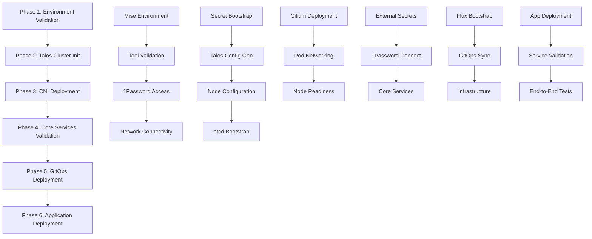

# Phased Bootstrap Guide

## Overview

This guide provides a systematic, phase-by-phase approach to bootstrapping the Talos Kubernetes cluster. The phased approach eliminates the need for repeated cluster resets by providing:

- **Clear validation at each step** with pass/fail criteria
- **Resume capability** from any failed phase
- **Comprehensive error handling** with specific troubleshooting guidance
- **Robust mise environment validation** ensuring tool consistency
- **Detailed logging and reporting** for each phase

## Quick Start

### Fresh Bootstrap

```bash
# Start complete bootstrap process
./scripts/bootstrap-orchestrator.sh start
```

### Resume from Failed Phase

```bash
# Resume from last failed phase
./scripts/bootstrap-orchestrator.sh resume

# Resume from specific phase
./scripts/bootstrap-orchestrator.sh resume 3
```

### Check Status

```bash
# Show current bootstrap status
./scripts/bootstrap-orchestrator.sh status
```

## Phase Architecture



## Phase Details

### Phase 1: Environment Validation

**Purpose**: Validate mise environment, tools, connectivity, and prerequisites

**Key Validations**:

- ✅ Mise installation and configuration
- ✅ All required tools available and correct versions
- ✅ 1Password CLI authentication and access
- ✅ Network connectivity to nodes and internet
- ✅ Repository structure integrity
- ✅ Environment variables properly set

**Script**: [`scripts/phase-1-environment-validation.sh`](../scripts/phase-1-environment-validation.sh)
**Validation**: [`scripts/validate-phase-1-environment.sh`](../scripts/validate-phase-1-environment.sh)

**Common Issues**:

- Missing tools: Run `mise install`
- 1Password not authenticated: Run `op signin`
- Missing OP_ACCOUNT: Set environment variable

### Phase 2: Talos Cluster Initialization

**Purpose**: Generate Talos configuration, configure nodes, and bootstrap etcd

**Key Steps**:

- 🔐 Bootstrap secrets from 1Password
- ⚙️ Generate Talos configuration with talhelper
- 📡 Apply configuration to all nodes
- 🚀 Bootstrap etcd cluster
- ✅ Verify cluster API accessibility

**Script**: [`scripts/phase-2-talos-cluster-init.sh`](../scripts/phase-2-talos-cluster-init.sh)
**Validation**: [`scripts/validate-phase-2-cluster.sh`](../scripts/validate-phase-2-cluster.sh)

**Expected State After Phase 2**:

- All nodes present in cluster
- Control plane pods running
- etcd cluster operational
- Nodes in "NotReady" state (no CNI yet)

### Phase 3: CNI Deployment (Cilium)

**Purpose**: Deploy Cilium CNI and establish pod networking

**Key Steps**:

- 🌐 Deploy Cilium with Talos-specific configuration
- ⏳ Wait for Cilium pods to be ready
- 🔗 Verify pod networking functionality
- ✅ Test DNS resolution and service connectivity

**Script**: [`scripts/phase-3-cni-deployment.sh`](../scripts/phase-3-cni-deployment.sh)
**Validation**: [`scripts/validate-phase-3-networking.sh`](../scripts/validate-phase-3-networking.sh)

**Expected State After Phase 3**:

- All nodes in "Ready" state
- Cilium pods running on all nodes
- Pod networking operational
- DNS resolution working

### Phase 4: Core Services Validation

**Purpose**: Deploy and validate core services required for GitOps

**Key Steps**:

- 🔒 Deploy External Secrets Operator
- 🔑 Deploy 1Password Connect
- 🏪 Deploy Longhorn storage
- ✅ Validate all core services healthy

**Script**: [`scripts/phase-4-core-services-validation.sh`](../scripts/phase-4-core-services-validation.sh)
**Validation**: [`scripts/validate-phase-4-services.sh`](../scripts/validate-phase-4-services.sh)

**Expected State After Phase 4**:

- External Secrets Operator running
- 1Password Connect accessible
- Longhorn storage operational
- Core services ready for GitOps

### Phase 5: GitOps Deployment (Flux)

**Purpose**: Bootstrap Flux GitOps system and sync infrastructure

**Key Steps**:

- 🚀 Bootstrap Flux GitOps system
- 📦 Sync infrastructure components
- 🔄 Verify GitOps reconciliation
- ✅ Validate infrastructure deployment

**Script**: [`scripts/phase-5-gitops-deployment.sh`](../scripts/phase-5-gitops-deployment.sh)
**Validation**: [`scripts/validate-phase-5-gitops.sh`](../scripts/validate-phase-5-gitops.sh)

**Expected State After Phase 5**:

- Flux system operational
- Infrastructure components deployed
- GitOps reconciliation working
- Cluster managed by Git

### Phase 6: Application Deployment

**Purpose**: Deploy applications and perform end-to-end validation

**Key Steps**:

- 📱 Deploy applications via GitOps
- 🌐 Verify ingress and load balancing
- 🔍 Perform end-to-end health checks
- ✅ Validate complete system functionality

**Script**: [`scripts/phase-6-application-deployment.sh`](../scripts/phase-6-application-deployment.sh)
**Validation**: [`scripts/validate-phase-6-applications.sh`](../scripts/validate-phase-6-applications.sh)

**Expected State After Phase 6**:

- All applications deployed and healthy
- Ingress and load balancing working
- Monitoring and observability operational
- Complete system ready for production

## Bootstrap Orchestrator Commands

### Start Fresh Bootstrap

```bash
./scripts/bootstrap-orchestrator.sh start
```

### Resume from Specific Phase

```bash
# Resume from Phase 3 (CNI deployment)
./scripts/bootstrap-orchestrator.sh resume 3
```

### Validate Specific Phase

```bash
# Validate Phase 2 only
./scripts/bootstrap-orchestrator.sh validate 2
```

### Show Current Status

```bash
./scripts/bootstrap-orchestrator.sh status
```

### View Logs

```bash
# Show all available logs
./scripts/bootstrap-orchestrator.sh logs

# Show logs for specific phase
./scripts/bootstrap-orchestrator.sh logs 3
```

### Reset Bootstrap State

```bash
# Start completely over
./scripts/bootstrap-orchestrator.sh reset
```

## Troubleshooting

### Phase 1 Failures

**Mise tool not found**:

```bash
# Install missing tools
mise install

# Verify installation
mise exec -- task --version
```

**1Password authentication failed**:

```bash
# Sign in to 1Password
op signin

# Verify access
op account list
```

**Environment variable missing**:

```bash
# Set OP_ACCOUNT
export OP_ACCOUNT=your-account-name

# Or add to .env file
echo "OP_ACCOUNT=your-account-name" >> .env
```

### Phase 2 Failures

**Node not accessible**:

```bash
# Check node connectivity
ping 172.29.51.11

# Verify Talos configuration
talosctl validate --config clusterconfig/home-ops-mini01.yaml
```

**etcd bootstrap failed**:

```bash
# Check node status
talosctl health --nodes 172.29.51.11

# Retry bootstrap
talosctl bootstrap --nodes 172.29.51.11
```

### Phase 3 Failures

**Cilium pods not ready**:

```bash
# Check Cilium status
kubectl get pods -n kube-system -l k8s-app=cilium

# Check Cilium logs
kubectl logs -n kube-system -l k8s-app=cilium
```

**Nodes not becoming Ready**:

```bash
# Check node conditions
kubectl describe nodes

# Verify CNI configuration
kubectl get ds -n kube-system cilium
```

### Phase 4 Failures

**External Secrets not working**:

```bash
# Check External Secrets pods
kubectl get pods -n external-secrets-system

# Verify 1Password Connect
kubectl get pods -n onepassword-connect
```

### Phase 5 Failures

**Flux bootstrap failed**:

```bash
# Check GitHub token
op read "op://Private/GitHub Personal Access Token/token"

# Retry Flux bootstrap
flux bootstrap github --owner=geoffdavis --repository=talos-gitops
```

### Phase 6 Failures

**Applications not deploying**:

```bash
# Check Flux status
flux get kustomizations

# Check application logs
kubectl logs -n <app-namespace> <pod-name>
```

## State Management

The bootstrap orchestrator maintains state in `.bootstrap-state.json`:

```json
{
  "cluster_name": "home-ops",
  "bootstrap_started": "2024-01-15T10:30:00Z",
  "current_phase": 3,
  "completed_phases": [1, 2],
  "failed_phases": [],
  "last_error": null,
  "environment_validated": true,
  "cluster_initialized": true,
  "cni_deployed": false,
  "core_services_ready": false,
  "gitops_deployed": false,
  "applications_deployed": false
}
```

## Logging

All phases generate detailed logs in `logs/bootstrap/`:

- `orchestrator.log` - Master orchestrator log
- `phase-N.log` - Execution log for phase N
- `validate-phase-N.log` - Validation log for phase N
- `phase-N-*-report.txt` - Detailed reports for each phase

## Integration with Existing Tasks

The phased bootstrap integrates with existing Taskfile tasks:

```bash
# Traditional approach (still available)
task bootstrap:cluster

# New phased approach
./scripts/bootstrap-orchestrator.sh start

# Individual phases can still use existing tasks
task talos:generate-config  # Used in Phase 2
task apps:deploy-cilium     # Used in Phase 3
task flux:bootstrap         # Used in Phase 5
```

## Benefits

### 🚫 No More Cluster Resets

- Resume from any failed phase
- Clear validation prevents cascading failures
- Rollback capabilities for safe recovery

### 🔍 Clear Failure Points

- Know exactly where and why bootstrap failed
- Phase-specific troubleshooting guidance
- Detailed logging and reporting

### 🛠️ Robust Environment

- Comprehensive mise validation
- Tool version consistency
- Environment setup automation

### 📊 Progress Tracking

- Real-time status updates
- Phase completion tracking
- Historical state management

### 🔄 Operational Confidence

- Tested and validated procedures
- Predictable outcomes
- Clear recovery paths

## Next Steps

After successful bootstrap:

1. **Review cluster status**: `./scripts/bootstrap-orchestrator.sh status`
2. **Check application health**: `kubectl get pods --all-namespaces`
3. **Verify GitOps**: `flux get kustomizations`
4. **Access services**: Check ingress endpoints
5. **Monitor cluster**: Use Grafana dashboards

For ongoing operations, refer to:

- [Bootstrap vs GitOps Phases Guide](./BOOTSTRAP_VS_GITOPS_PHASES.md)
- [Operational Workflows](./OPERATIONAL_WORKFLOWS.md)
- [Cluster Reset Safety](./CLUSTER_RESET_SAFETY.md)
