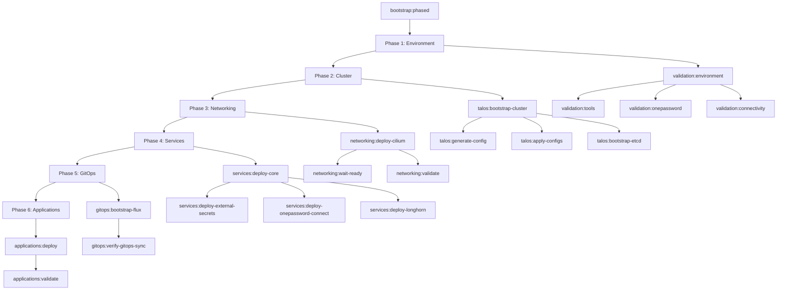

# Taskfile-Native Phased Bootstrap System

## Overview

This document describes the redesigned phased bootstrap system that leverages Taskfile's native capabilities for dependency management, conditional execution, and validation. The new system replaces custom shell script orchestration with pure Taskfile constructs.

## Architecture

### Modular Structure

The bootstrap system is organized into modular Taskfiles for better maintainability:

```
Taskfile.yml                    # Main orchestrator with includes
taskfiles/
├── bootstrap.yml              # Bootstrap orchestration and state management
├── validation.yml             # Environment and phase validation
├── talos.yml                  # Talos cluster management
├── networking.yml             # CNI deployment and networking
├── services.yml               # Core services (External Secrets, 1Password, Longhorn)
├── gitops.yml                 # Flux GitOps deployment
└── applications.yml           # Application deployment and validation
```

### Native Taskfile Features

#### **Dependencies (`deps:`)**
- Automatic phase ordering through task dependencies
- Parallel execution where possible
- Clear dependency visualization

#### **Preconditions (`preconditions:`)**
- Environment validation before task execution
- Clear error messages for failed prerequisites
- Tool availability and connectivity checks

#### **Status Checks (`status:`)**
- Idempotent operations using file and command-based checks
- Prevents re-running completed phases
- Automatic rebuild when dependencies change

#### **Sources and Generates (`sources:`, `generates:`)**
- File-based dependency tracking
- Configuration change detection
- Automatic rebuilds when source files change

## Phase Architecture



## State Management

### File-based State Tracking

Instead of custom JSON state files, the system uses marker files:

```
.bootstrap-state/
├── phase-1-complete           # Phase completion markers
├── phase-2-complete
├── phase-3-complete
├── phase-4-complete
├── phase-5-complete
├── phase-6-complete
├── tools-validated            # Component validation markers
├── mise-validated
├── env-vars-validated
├── onepassword-validated
├── connectivity-validated
├── repository-validated
├── secrets-bootstrapped       # Talos state markers
├── configs-validated
├── configs-applied
├── nodes-ready
├── etcd-bootstrapped
├── cluster-ready
├── health-verified
├── cilium-ready              # Networking state markers
├── nodes-cni-ready
├── pod-networking-tested
├── cilium-status-verified
├── external-secrets-validated # Services state markers
├── onepassword-connect-validated
├── longhorn-validated
├── gitops-prerequisites-validated # GitOps state markers
├── flux-ready
├── gitops-sync-verified
├── infrastructure-ready      # Applications state markers
├── applications-deployed
└── applications-ready
```

### Status Check Examples

#### File-based Status
```yaml
status:
  - test -f .bootstrap-state/phase-1-complete
  - test -f clusterconfig/talosconfig
```

#### Command-based Status
```yaml
status:
  - mise exec -- kubectl get nodes --no-headers | grep -c "Ready" | grep -q "3"
  - mise exec -- kubectl get pods -n kube-system -l k8s-app=cilium | grep -q "Running"
```

#### Combined Status
```yaml
status:
  - test -f .bootstrap-state/phase-3-complete
  - mise exec -- kubectl get nodes --no-headers | grep -c "Ready" | grep -q "3"
  - mise exec -- kubectl get pods -n kube-system -l k8s-app=cilium | grep -q "Running"
```

## Usage

### Basic Commands

#### Start Fresh Bootstrap
```bash
task bootstrap:phased
```

#### Resume from Current State
```bash
task bootstrap:resume
```

#### Check Status
```bash
task bootstrap:status
```

#### Reset State
```bash
task bootstrap:reset
```

#### Validate Phases
```bash
task bootstrap:validate
```

### Individual Phase Execution

```bash
# Execute specific phases
task bootstrap:phase-1
task bootstrap:phase-2
task bootstrap:phase-3
task bootstrap:phase-4
task bootstrap:phase-5
task bootstrap:phase-6

# Force rebuild specific phase
task bootstrap:force-phase PHASE=3

# Validate specific phase
task bootstrap:validate-phase PHASE=2
```

### Component-specific Tasks

#### Validation
```bash
task validation:environment
task validation:tools
task validation:onepassword
task validation:connectivity
```

#### Talos Management
```bash
task talos:bootstrap-cluster
task talos:generate-config
task talos:apply-configs
task talos:status
```

#### Networking
```bash
task networking:deploy-cilium
task networking:validate
task networking:status
```

#### Services
```bash
task services:deploy-core
task services:validate
task services:status
```

#### GitOps
```bash
task gitops:bootstrap-flux
task gitops:validate
task gitops:status
```

#### Applications
```bash
task applications:deploy
task applications:validate
task applications:health
```

## Error Handling and Recovery

### Automatic Recovery
- Tasks automatically determine what needs to be rebuilt
- Status checks prevent unnecessary re-execution
- Dependencies ensure proper ordering

### Manual Recovery
```bash
# Reset specific component state
task validation:reset
task talos:reset-state
task networking:reset-state
task services:reset-state
task gitops:reset-state
task applications:reset-state

# Force redeploy components
task networking:redeploy
task gitops:reconcile
task applications:redeploy
```

### Troubleshooting
```bash
# Show logs
task services:logs
task gitops:logs
task applications:logs

# Debug information
task networking:debug
task gitops:debug
task applications:debug

# Health checks
task applications:health
task validation:cluster-health
```

## Benefits of Taskfile-Native Approach

### 🚀 **Performance**
- No shell script overhead
- Built-in parallel execution
- Native caching and status checks

### 🔍 **Clarity**
- Visual dependency graph
- Explicit prerequisites
- Clear task descriptions

### 🛠️ **Maintainability**
- Modular structure
- Reusable components
- Configuration-driven behavior

### 📊 **Observability**
- Task execution tracing
- Clear success/failure indicators
- Structured output

### 🔄 **Reliability**
- Native error handling
- Robust state management
- Idempotent operations

### 🎯 **Flexibility**
- Granular task execution
- Easy debugging and recovery
- Component-specific operations

## Migration from Script-based System

### Compatibility
- Existing tasks remain available
- Gradual migration path
- Maintains current workflows

### Key Differences
1. **State Management**: File-based markers instead of JSON
2. **Dependencies**: Native Taskfile deps instead of shell logic
3. **Validation**: Preconditions instead of custom validation scripts
4. **Idempotency**: Status checks instead of manual state tracking
5. **Error Handling**: Native Taskfile features instead of custom logic

### Migration Steps
1. Use new `task bootstrap:phased` for fresh deployments
2. Existing clusters can use individual component tasks
3. Gradually adopt new validation and status tasks
4. Legacy script-based tasks remain for compatibility

## Configuration

### Environment Variables
```bash
export OP_ACCOUNT=your-account-name
export CLUSTER_NAME=home-ops
export NODE_1_IP=172.29.51.11
export NODE_2_IP=172.29.51.12
export NODE_3_IP=172.29.51.13
```

### Taskfile Variables
Variables can be overridden at runtime:
```bash
task bootstrap:phased CLUSTER_NAME=production NODE_1_IP=10.0.1.10
```

### Configuration Files
- `bootstrap-config.yaml` - Bootstrap configuration
- `.mise.toml` - Tool management
- `talconfig.yaml` - Talos configuration
- Infrastructure manifests in `infrastructure/` directory

## Advanced Usage

### Custom Validation
Add custom preconditions to any task:
```yaml
preconditions:
  - sh: 'custom-validation-command'
    msg: 'Custom validation failed'
```

### Custom Status Checks
Add custom status checks:
```yaml
status:
  - custom-status-check-command
```

### Environment-specific Behavior
Use `when:` conditions for environment-specific tasks:
```yaml
when: '{{eq .ENVIRONMENT "production"}}'
```

## Troubleshooting Guide

### Common Issues

#### Phase Not Starting
- Check preconditions: `task bootstrap:validate-phase PHASE=X`
- Verify dependencies: `task --list-all | grep phase`
- Check state files: `ls -la .bootstrap-state/`

#### Status Check Failures
- Manual validation: Run status commands manually
- Reset state: `task bootstrap:reset` or component-specific reset
- Check logs: Component-specific log tasks

#### Dependency Issues
- Verify tool availability: `task validation:tools`
- Check connectivity: `task validation:connectivity`
- Validate 1Password: `task validation:onepassword`

### Debug Commands
```bash
# Show all available tasks
task --list-all

# Show task dependencies
task --dry bootstrap:phased

# Verbose execution
task --verbose bootstrap:phase-1

# Force execution (ignore status)
task --force bootstrap:phase-1
```

## Future Enhancements

### Planned Features
1. **Parallel Phase Execution**: Where dependencies allow
2. **Custom Hooks**: Pre/post phase execution hooks
3. **Configuration Validation**: Enhanced bootstrap-config.yaml validation
4. **Metrics Collection**: Bootstrap timing and success metrics
5. **Interactive Mode**: Guided bootstrap with user prompts

### Extension Points
- Custom validation tasks
- Environment-specific configurations
- Additional service integrations
- Custom application deployments

## Conclusion

The Taskfile-native phased bootstrap system provides a robust, maintainable, and efficient approach to cluster bootstrap operations. By leveraging Taskfile's built-in capabilities, the system eliminates custom orchestration logic while providing superior dependency management, validation, and recovery capabilities.

The modular design ensures that components can be developed, tested, and maintained independently while providing a cohesive bootstrap experience. The native Taskfile features provide better observability, error handling, and operational confidence compared to the previous script-based approach.