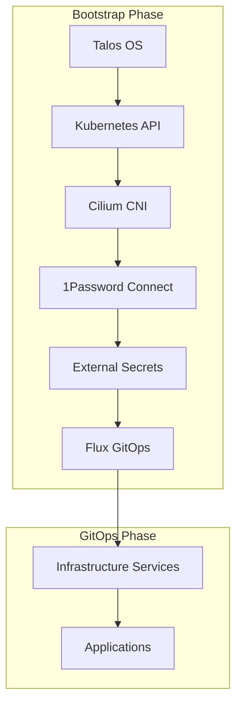
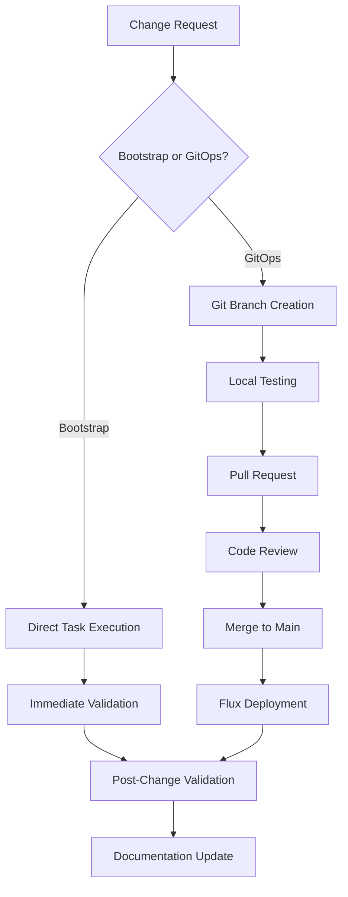
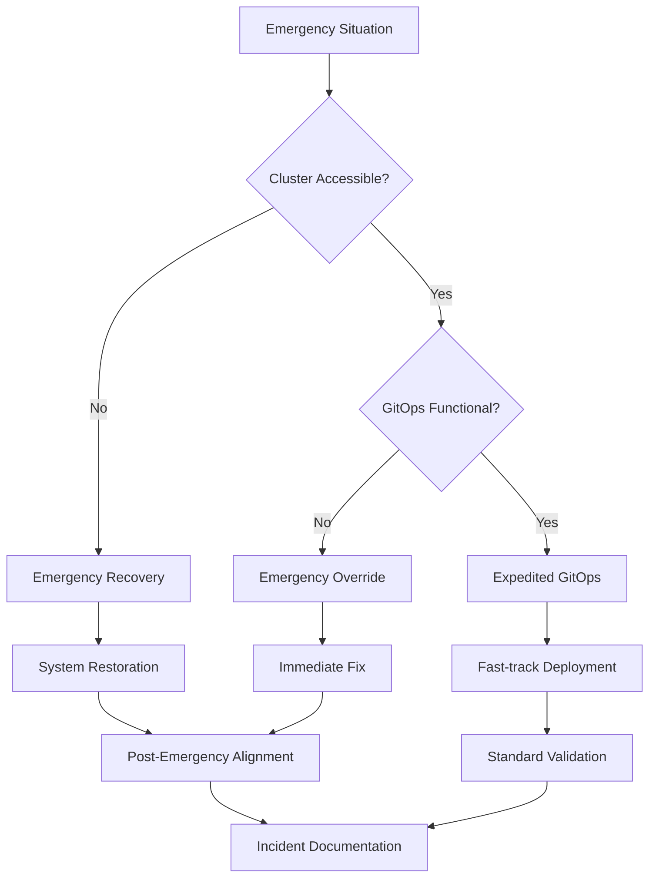

# Bootstrap vs GitOps Decision Framework

This document provides clear criteria for determining when to use Bootstrap phase procedures versus GitOps phase procedures for cluster changes. Understanding this distinction is critical for maintaining cluster stability and operational consistency.

## Table of Contents

- [Architecture Overview](#architecture-overview)
- [Decision Criteria](#decision-criteria)
- [Bootstrap Phase Changes](#bootstrap-phase-changes)
- [GitOps Phase Changes](#gitops-phase-changes)
- [Emergency Override Procedures](#emergency-override-procedures)
- [Change Management Workflows](#change-management-workflows)
- [Risk Assessment Guidelines](#risk-assessment-guidelines)
- [Examples and Use Cases](#examples-and-use-cases)

## Architecture Overview

The Talos GitOps cluster implements a sophisticated two-phase architecture that separates foundational system components from operational services:



### Key Principles

1. **Bootstrap Phase**: Direct deployment of foundational components required for cluster operation
2. **GitOps Phase**: Git-managed operational components that benefit from version control
3. **Clear Boundaries**: Each phase has distinct responsibilities and management approaches
4. **Safety First**: Bootstrap changes affect cluster stability more severely than GitOps changes

## Decision Criteria

Use this decision matrix to determine the appropriate change management approach:

### Use Bootstrap Phase When

- ✅ **System Foundation Required**: Change affects components needed for cluster to start
- ✅ **Hardware/OS Integration**: Change requires direct hardware or OS-level access
- ✅ **Dependency for GitOps**: Change is required for GitOps system to function
- ✅ **Network Foundation**: Change affects core networking (CNI, load balancer core)
- ✅ **Security Foundation**: Change affects cluster security fundamentals
- ✅ **Emergency Recovery**: Cluster is broken and GitOps cannot function

### Use GitOps Phase When

- ✅ **Application Deployment**: Change involves application services or infrastructure services
- ✅ **Configuration Management**: Change benefits from version control and audit trails
- ✅ **Collaborative Changes**: Multiple operators need to coordinate changes
- ✅ **Rollback Capability**: Change may need to be reverted quickly
- ✅ **Standard Operations**: Change follows established operational patterns
- ✅ **Automation Preferred**: Change should be automated and repeatable

### Decision Tree

```text
Is the cluster currently operational?
├─ No → Use Bootstrap Phase (Emergency Recovery)
└─ Yes → Does change affect system foundation?
    ├─ Yes → Does change require direct hardware/OS access?
    │   ├─ Yes → Use Bootstrap Phase
    │   └─ No → Can change be managed via Kubernetes API?
    │       ├─ Yes → Use GitOps Phase
    │       └─ No → Use Bootstrap Phase
    └─ No → Use GitOps Phase
```

## Bootstrap Phase Changes

Bootstrap phase changes are managed via Taskfile commands and direct kubectl/talosctl operations.

### Components Managed via Bootstrap

#### 1. Talos OS Configuration

- **Location**: [`talconfig.yaml`](../../talconfig.yaml), [`talos/patches/`](../../talos/patches/)
- **Management**: `task talos:apply-config`
- **Examples**:
  - Node configuration updates
  - Disk selection changes
  - Network interface configuration
  - Security policy updates

#### 2. Kubernetes Cluster Foundation

- **Location**: Taskfile.yml bootstrap tasks
- **Management**: `task talos:bootstrap`
- **Examples**:
  - Cluster initialization
  - Control plane configuration
  - etcd cluster setup
  - API server certificates

#### 3. Core Networking (Cilium CNI)

- **Location**: [`Taskfile.yml:apps:deploy-cilium`](../../Taskfile.yml)
- **Management**: `task apps:deploy-cilium`
- **Examples**:
  - CNI plugin deployment
  - XDP configuration changes
  - LoadBalancer IPAM core settings
  - Kube-proxy replacement configuration

#### 4. Secret Management Foundation

- **Location**: [`scripts/bootstrap-1password-secrets.sh`](../../scripts/bootstrap-1password-secrets.sh)
- **Management**: `task bootstrap:1password-secrets`
- **Examples**:
  - 1Password Connect initial deployment
  - External Secrets Operator installation
  - Bootstrap credential creation
  - Cluster secret encryption keys

#### 5. GitOps System Deployment

- **Location**: [`Taskfile.yml:flux:bootstrap`](../../Taskfile.yml)
- **Management**: `task flux:bootstrap`
- **Examples**:
  - Flux controller deployment
  - Git repository integration
  - Webhook configuration
  - Initial source definitions

### Bootstrap Change Procedure

1. **Pre-change Validation**:

   ```bash
   # Check cluster health
   task cluster:status

   # Backup current configuration
   git add -A && git commit -m "Pre-change backup: $(date)"

   # Validate proposed changes
   talhelper validate-config  # For Talos changes
   ```

2. **Apply Changes**:

   ```bash
   # Example: Talos configuration update
   task talos:generate-config
   task talos:apply-config

   # Example: Cilium configuration update
   task apps:deploy-cilium
   ```

3. **Validation**:

   ```bash
   # Verify cluster health
   kubectl get nodes
   kubectl get pods -n kube-system

   # Test critical functions
   kubectl run test-pod --image=busybox --rm -it -- /bin/sh
   ```

4. **Documentation**:
   - Update configuration files in Git
   - Document changes in commit messages
   - Update operational documentation if needed

## GitOps Phase Changes

GitOps phase changes are managed through Git commits that trigger automated deployments via Flux.

### Components Managed via GitOps

#### 1. Infrastructure Services

- **Location**: [`infrastructure/`](../../infrastructure/) directory
- **Management**: Flux Kustomizations
- **Examples**:
  - cert-manager configuration
  - ingress-nginx deployments
  - external-dns configuration
  - monitoring stack deployment
  - **cnpg-barman-plugin**: Modern database backup infrastructure (🎉 **MIGRATION COMPLETE**)

#### 2. Network Services (Advanced Configuration)

- **Location**: [`infrastructure/cilium-bgp/`](../../infrastructure/cilium-bgp/), [`infrastructure/cilium-pools/`](../../infrastructure/cilium-pools/)
- **Management**: GitOps deployment
- **Examples**:
  - BGP peering policies
  - LoadBalancer IP pool definitions
  - Network policies
  - Service mesh configuration

#### 3. Security Services

- **Location**: [`infrastructure/authentik/`](../../infrastructure/authentik/), [`infrastructure/authentik-proxy/`](../../infrastructure/authentik-proxy/)
- **Management**: GitOps deployment
- **Examples**:
  - Authentik identity provider configuration
  - External outpost deployment
  - RBAC policy updates
  - Certificate issuer configuration

#### 4. Storage Services

- **Location**: [`infrastructure/longhorn/`](../../infrastructure/longhorn/)
- **Management**: GitOps deployment
- **Examples**:
  - Longhorn storage configuration
  - Backup policy updates
  - Volume snapshot policies
  - Storage class definitions

#### 5. Application Services

- **Location**: [`apps/`](../../apps/) directory
- **Management**: GitOps deployment
- **Examples**:
  - Home Assistant stack deployment with **plugin-based PostgreSQL backup architecture**
  - Kubernetes Dashboard configuration
  - Monitoring applications
  - Custom application deployments

#### 6. Database Backup Services (🎉 **PRODUCTION READY**)

- **Location**: [`infrastructure/cnpg-barman-plugin/`](../../infrastructure/cnpg-barman-plugin/), [`apps/home-automation/postgresql/`](../../apps/home-automation/postgresql/)
- **Management**: GitOps deployment with plugin architecture
- **Examples**:
  - CNPG Barman Plugin v0.5.0 deployment
  - ObjectStore configuration for S3-compatible backup storage
  - ScheduledBackup resources for automated daily backups
  - Plugin-based cluster configurations replacing legacy `barmanObjectStore`
- **Migration Status**: Successfully completed August 2025 with zero downtime

### GitOps Change Procedure

1. **Development and Testing**:

   ```bash
   # Create feature branch
   git checkout -b feature/update-monitoring-config

   # Make changes to manifests
   vim infrastructure/monitoring/helmrelease.yaml

   # Validate changes locally
   kubectl apply --dry-run=client -f infrastructure/monitoring/
   kustomize build infrastructure/monitoring/
   ```

2. **Commit and Push**:

   ```bash
   # Stage changes
   git add infrastructure/monitoring/

   # Commit with descriptive message
   git commit -m "monitoring: update Prometheus retention to 30d"

   # Push to repository
   git push origin feature/update-monitoring-config
   ```

3. **Deployment and Monitoring**:

   ```bash
   # Monitor Flux reconciliation
   flux get kustomizations --watch

   # Check specific deployment
   flux describe kustomization infrastructure-monitoring

   # Verify application status
   kubectl get helmreleases -n monitoring
   ```

4. **Validation and Rollback**:

   ```bash
   # Test functionality
   curl -I https://grafana.k8s.home.geoffdavis.com

   # Rollback if needed
   flux suspend kustomization infrastructure-monitoring
   git revert <commit-hash>
   git push
   flux resume kustomization infrastructure-monitoring
   ```

## GitOps Emergency Override Procedures

Sometimes you need to bypass normal procedures during emergencies.

### When to Use Emergency Overrides

- 🚨 **Cluster Completely Down**: GitOps system is non-functional
- 🚨 **Security Incident**: Immediate action required to prevent further damage
- 🚨 **Data Loss Risk**: Storage system failure requiring immediate intervention
- 🚨 **Service Outage**: Critical service down and GitOps deployment too slow

### Emergency Override Procedures

#### Direct kubectl Access

```bash
# For immediate fixes when GitOps is broken
kubectl apply -f - <<EOF
apiVersion: v1
kind: ConfigMap
metadata:
  name: emergency-fix
  namespace: flux-system
data:
  fix: "emergency configuration"
EOF

# Always document emergency changes
git add -A
git commit -m "EMERGENCY: Direct kubectl fix for <issue>"
```

#### Flux Suspension

```bash
# Suspend GitOps for emergency maintenance
flux suspend kustomization infrastructure-<component>

# Perform emergency changes
kubectl apply -f emergency-fix.yaml

# Resume GitOps when stable
flux resume kustomization infrastructure-<component>

# Align Git state with cluster state
git add emergency-fix.yaml
git commit -m "EMERGENCY: Align Git with cluster state"
```

#### Emergency Recovery

```bash
# When cluster is partially functional but GitOps is broken
task cluster:emergency-recovery

# Follow guided recovery procedure
# This assesses cluster state and provides recovery options
```

### Post-Emergency Procedures

1. **Immediate Documentation**:
   - Document what was changed and why
   - Record the emergency procedure used
   - Note any deviations from standard practices

2. **System Alignment**:
   - Ensure Git repository reflects actual cluster state
   - Test that GitOps can take over management again
   - Validate that emergency changes don't conflict with GitOps

3. **Post-Incident Review**:
   - Analyze root cause of emergency
   - Update procedures to prevent recurrence
   - Improve monitoring and alerting

## Change Management Workflows

### Standard Change Workflow



### Emergency Change Workflow



## Risk Assessment Guidelines

### Change Risk Matrix

| Risk Level   | Bootstrap Impact      | GitOps Impact                 | Approval Required |
| ------------ | --------------------- | ----------------------------- | ----------------- |
| **Low**      | Configuration tuning  | Application updates           | Self-approved     |
| **Medium**   | Network configuration | Infrastructure updates        | Peer review       |
| **High**     | OS-level changes      | Security policy changes       | Lead approval     |
| **Critical** | Cluster rebuild       | Authentication system changes | Team approval     |

### Risk Factors

#### Bootstrap Phase Risk Factors

- **High Risk**: OS configuration, network foundation, security keys
- **Medium Risk**: Resource limits, feature flags, monitoring configuration
- **Low Risk**: Log levels, timeout values, non-critical settings

#### GitOps Phase Risk Factors

- **High Risk**: Authentication systems, database schemas, network policies
- **Medium Risk**: Application configuration, resource quotas, backup policies
- **Low Risk**: Dashboard configuration, monitoring dashboards, documentation

### Change Validation Requirements

#### Pre-Change Validation

- [ ] Configuration syntax validation
- [ ] Resource requirement analysis
- [ ] Dependency impact assessment
- [ ] Rollback plan preparation
- [ ] Monitoring and alerting ready

#### Post-Change Validation

- [ ] System health verification
- [ ] Functionality testing
- [ ] Performance impact assessment
- [ ] Security posture validation
- [ ] Documentation updates

## Examples and Use Cases

### Bootstrap Phase Examples

#### Example 1: Adding New Node to Cluster

**Scenario**: Adding a fourth Mac mini to the cluster

**Why Bootstrap**: Requires Talos OS configuration and cluster membership changes

**Procedure**:

```bash
# 1. Update talconfig.yaml with new node
vim talconfig.yaml

# 2. Generate new configuration
task talos:generate-config

# 3. Apply configuration to new node
talosctl apply-config --insecure --nodes 172.29.51.14 \
  --file clusterconfig/home-ops-mini04.yaml

# 4. Bootstrap new node into cluster
talosctl bootstrap --nodes 172.29.51.14
```

#### Example 2: Updating Cilium CNI Version

**Scenario**: Upgrading Cilium from v1.17.6 to v1.18.0

**Why Bootstrap**: Core networking component that affects cluster foundation

**Procedure**:

```bash
# 1. Update Cilium version in Taskfile.yml
vim Taskfile.yml

# 2. Deploy updated CNI
task apps:deploy-cilium

# 3. Verify network connectivity
cilium connectivity test
```

### GitOps Phase Examples

#### Example 1: Updating Home Assistant Configuration

**Scenario**: Adding new IoT device integration to Home Assistant

**Why GitOps**: Application-level configuration managed through version control

**Procedure**:

```bash
# 1. Update Home Assistant configuration
vim apps/home-automation/home-assistant/configmap.yaml

# 2. Commit changes
git add apps/home-automation/
git commit -m "homeassistant: add Zigbee device integration"

# 3. Push and monitor deployment
git push
flux get kustomizations -w
```

#### Example 2: Scaling Monitoring Stack

**Scenario**: Increasing Prometheus retention and adding new alerting rules

**Why GitOps**: Infrastructure configuration that benefits from version control

**Procedure**:

```bash
# 1. Update monitoring configuration
vim infrastructure/monitoring/prometheus.yaml

# 2. Add new alerting rules
vim infrastructure/monitoring/alert-rules.yaml

# 3. Commit and deploy
git add infrastructure/monitoring/
git commit -m "monitoring: increase retention and add disk space alerts"
git push
```

### Hybrid Scenarios

#### Example 1: BGP Configuration Changes

**Scenario**: Adding new IP pool for LoadBalancer services

**Bootstrap Component**: Core LoadBalancer IPAM functionality
**GitOps Component**: IP pool definitions and BGP policies

**Procedure**:

```bash
# 1. If IPAM core settings need changes (Bootstrap)
task apps:deploy-cilium

# 2. Add new IP pools (GitOps)
vim infrastructure/cilium-pools/loadbalancer-pools.yaml

# 3. Update BGP policies (GitOps)
vim infrastructure/cilium-bgp/bgp-policy-legacy.yaml

# 4. Deploy via GitOps
git add infrastructure/cilium-*
git commit -m "network: add new LoadBalancer IP pool for applications"
git push
```

#### Example 2: Authentication System Updates

**Scenario**: Updating external Authentik outpost configuration

**Bootstrap Component**: Core secret management (if tokens need bootstrap)
**GitOps Component**: Outpost deployment and configuration

**Procedure**:

```bash
# 1. If bootstrap secrets need updates (Bootstrap)
task bootstrap:1password-secrets

# 2. Update outpost configuration (GitOps)
vim infrastructure/authentik-proxy/deployment.yaml

# 3. Deploy changes
git add infrastructure/authentik-proxy/
git commit -m "auth: update external outpost Redis configuration"
git push
```

#### Example 3: CNPG Barman Plugin Migration (🎉 **COMPLETED**)

**Scenario**: Migrating from legacy `barmanObjectStore` to modern plugin-based backup architecture

**Bootstrap Component**: None (plugin architecture is GitOps-managed)
**GitOps Component**: Plugin deployment, ObjectStore configuration, cluster migration

**Procedure** (**COMPLETED** - August 2025):

```bash
# 1. Deploy plugin infrastructure (GitOps)
git add infrastructure/cnpg-barman-plugin/
git commit -m "cnpg: deploy Barman Cloud Plugin v0.5.0"

# 2. Configure ObjectStore resources (GitOps)
git add apps/home-automation/postgresql/objectstore.yaml
git commit -m "cnpg: add S3 ObjectStore configuration"

# 3. Migrate cluster to plugin method (GitOps)
git add apps/home-automation/postgresql/cluster-plugin.yaml
git commit -m "cnpg: migrate to plugin-based backup architecture"

# 4. Deploy monitoring (GitOps)
git add infrastructure/cnpg-monitoring/
git commit -m "cnpg: deploy comprehensive backup monitoring"

# All changes deployed via GitOps with zero downtime
git push
flux get kustomizations --watch
```

**Results Achieved**:

- ✅ Zero downtime migration completed
- ✅ Plugin v0.5.0 operational in production
- ✅ Daily scheduled backups functional (3:00 AM)
- ✅ S3 ObjectStore integration working
- ✅ Comprehensive monitoring deployed (15+ alerts)
- ✅ Legacy `barmanObjectStore` configuration removed

## Best Practices

### For Bootstrap Changes

1. **Always Backup**: Commit current state to Git before changes
2. **Test Incrementally**: Apply changes to one node first when possible
3. **Monitor Closely**: Watch system health during and after changes
4. **Document Everything**: Bootstrap changes are harder to track
5. **Plan Rollback**: Have clear rollback procedures ready

### For GitOps Changes

1. **Use Feature Branches**: Isolate changes for testing and review
2. **Write Clear Commits**: Descriptive commit messages aid troubleshooting
3. **Test Locally**: Validate manifests before pushing
4. **Monitor Deployment**: Watch Flux reconciliation carefully
5. **Keep History**: Don't force-push; maintain change history

### General Guidelines

1. **Prefer GitOps**: Use GitOps when both approaches are viable
2. **Understand Dependencies**: Know what components depend on your changes
3. **Coordinate Changes**: Communicate with team for significant changes
4. **Follow Procedures**: Don't skip steps to save time
5. **Learn from Issues**: Update procedures based on problems encountered

Remember: The two-phase architecture provides both flexibility and safety. When in doubt, prefer the approach that provides better safety and auditability for your specific change.
