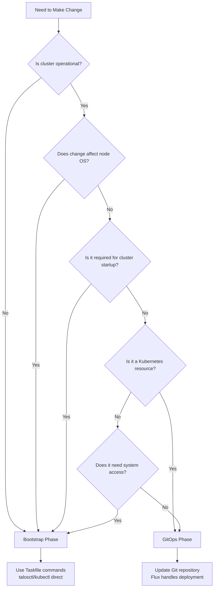

# Bootstrap vs GitOps Phases: Day-to-Day Operations Guide

## Overview

This is the **definitive operational guide** for the Bootstrap vs GitOps architectural separation in the Talos Kubernetes cluster. Use this guide for daily operations, troubleshooting, and decision-making.

## Quick Navigation

- [Bootstrap vs GitOps Phases: Day-to-Day Operations Guide](#bootstrap-vs-gitops-phases-day-to-day-operations-guide)
  - [Overview](#overview)
  - [Quick Navigation](#quick-navigation)
  - [5-Second Decision Rules](#5-second-decision-rules)
    - [When to Use Bootstrap Phase](#when-to-use-bootstrap-phase)
    - [When to Use GitOps Phase](#when-to-use-gitops-phase)
    - [Emergency Override](#emergency-override)
  - [Decision Framework](#decision-framework)
    - [Primary Decision Tree](#primary-decision-tree)
    - [Secondary Considerations](#secondary-considerations)
  - [Component Ownership Matrix](#component-ownership-matrix)
    - [Bootstrap Phase Components](#bootstrap-phase-components)
    - [GitOps Phase Components](#gitops-phase-components)
    - [Hybrid Components](#hybrid-components)
  - [Quick Reference Commands](#quick-reference-commands)
    - [Bootstrap Phase](#bootstrap-phase)
    - [GitOps Phase](#gitops-phase)
    - [Emergency Commands](#emergency-commands)
  - [Related Documentation](#related-documentation)

## 5-Second Decision Rules

### When to Use Bootstrap Phase

```text
✅ Node configuration changes     → task talos:*
✅ Cluster won't start           → task bootstrap:*
✅ Network/CNI issues            → task apps:deploy-cilium
✅ Secret management broken      → task bootstrap:1password-secrets
✅ System-level problems         → talosctl commands
```

### When to Use GitOps Phase

```text
✅ Application deployments       → Git commit to apps/
✅ Infrastructure services       → Git commit to infrastructure/
✅ Configuration updates         → Git commit + Flux reconcile
✅ Scaling operations           → Update manifests + Git commit
✅ Certificate management       → Git commit to cert-manager-issuers/
```

### Emergency Override

```text
🚨 Cluster completely broken    → Bootstrap phase only
🚨 GitOps system down          → kubectl apply directly, then fix GitOps
🚨 Network completely broken   → task talos:* and task apps:deploy-cilium
```

## Decision Framework

### Primary Decision Tree



### Secondary Considerations

**Choose Bootstrap if**:

- Component required for cluster to start
- Needs direct hardware/OS access
- Required for GitOps system to function
- Emergency situation requiring immediate action

**Choose GitOps if**:

- Kubernetes-native resource
- Benefits from version control
- Part of application or infrastructure layer
- Can be deployed after cluster is operational

## Component Ownership Matrix

### Bootstrap Phase Components

| Component                     | Files                                                                                                                                                                           | Commands                                                                      | Dependencies       | Why Bootstrap                  |
| ----------------------------- | ------------------------------------------------------------------------------------------------------------------------------------------------------------------------------- | ----------------------------------------------------------------------------- | ------------------ | ------------------------------ |
| **Talos OS Configuration**    | [`talconfig.yaml`](../../talconfig.yaml)<br/>[`talos/patches/`](../../talos/patches/)                                                                                           | `task talos:generate-config`<br/>`task talos:apply-config`                    | None               | Must exist before Kubernetes   |
| **LLDPD Stability Fix**       | [`talos/manifests/lldpd-extension-config.yaml`](../../talos/manifests/lldpd-extension-config.yaml)                                                                              | `task talos:apply-lldpd-config`                                               | Talos OS           | System-level configuration     |
| **Kubernetes Cluster**        | Generated configs                                                                                                                                                               | `task talos:bootstrap`                                                        | Talos OS           | No API exists yet              |
| **Cilium CNI Core**           | [`Taskfile.yml:410-444`](../../Taskfile.yml#L410-L444)                                                                                                                          | `task apps:deploy-cilium`                                                     | Kubernetes API     | Required for pod networking    |
| **1Password Connect**         | [`scripts/bootstrap-1password-secrets.sh`](../../scripts/bootstrap-1password-secrets.sh)<br/>[`infrastructure/onepassword-connect/`](../../infrastructure/onepassword-connect/) | `task bootstrap:1password-secrets`<br/>`task apps:deploy-onepassword-connect` | Pod networking     | Required for GitOps secrets    |
| **External Secrets Operator** | [`Taskfile.yml:446-457`](../../Taskfile.yml#L446-L457)                                                                                                                          | `task apps:deploy-external-secrets`                                           | Pod networking     | Required for secret management |
| **Flux GitOps System**        | [`Taskfile.yml:379-393`](../../Taskfile.yml#L379-L393)                                                                                                                          | `task flux:bootstrap`                                                         | Secrets management | Must exist to manage GitOps    |

### GitOps Phase Components

| Component                    | Files                                                                                                                                                                                                                   | Management        | Dependencies            | Why GitOps                 |
| ---------------------------- | ----------------------------------------------------------------------------------------------------------------------------------------------------------------------------------------------------------------------- | ----------------- | ----------------------- | -------------------------- |
| **Cilium BGP Configuration** | [`infrastructure/cilium-bgp/bgp-policy.yaml`](../../infrastructure/cilium-bgp/bgp-policy.yaml)                                                                                                                          | Git commit → Flux | Cilium CNI              | Operational configuration  |
| **Load Balancer Pools**      | [`infrastructure/cilium/loadbalancer-pool.yaml`](../../infrastructure/cilium/loadbalancer-pool.yaml)<br/>[`infrastructure/cilium/loadbalancer-pool-ipv6.yaml`](../../infrastructure/cilium/loadbalancer-pool-ipv6.yaml) | Git commit → Flux | Cilium CNI              | Network operations         |
| **Cert-Manager**             | [`infrastructure/cert-manager/helmrelease.yaml`](../../infrastructure/cert-manager/helmrelease.yaml)                                                                                                                    | Git commit → Flux | External Secrets        | TLS certificate management |
| **Ingress-Nginx**            | [`infrastructure/ingress-nginx/helmrelease.yaml`](../../infrastructure/ingress-nginx/helmrelease.yaml)                                                                                                                  | Git commit → Flux | Cert-Manager            | HTTP/HTTPS ingress         |
| **Longhorn Storage**         | [`infrastructure/longhorn/helmrelease.yaml`](../../infrastructure/longhorn/helmrelease.yaml)                                                                                                                            | Git commit → Flux | Kubernetes API          | Distributed storage        |
| **External-DNS**             | [`infrastructure/external-dns/helmrelease.yaml`](../../infrastructure/external-dns/helmrelease.yaml)                                                                                                                    | Git commit → Flux | 1Password secrets       | DNS automation             |
| **Monitoring Stack**         | [`infrastructure/monitoring/`](../../infrastructure/monitoring/)                                                                                                                                                        | Git commit → Flux | Storage, Ingress        | Observability              |
| **Applications**             | [`apps/`](../../apps/)                                                                                                                                                                                                  | Git commit → Flux | Infrastructure services | User workloads             |

### Hybrid Components

| Component             | Bootstrap Part        | GitOps Part                   | Rationale                                   |
| --------------------- | --------------------- | ----------------------------- | ------------------------------------------- |
| **Cilium**            | Core CNI installation | BGP policies, LB pools        | CNI required first, BGP is operational      |
| **Secret Management** | Initial K8s secrets   | ExternalSecrets, SecretStores | Bootstrap needs secrets, ongoing via GitOps |

## Quick Reference Commands

### Bootstrap Phase

```bash
# Cluster operations
task cluster:status
task cluster:emergency-recovery
task cluster:safe-reset

# Node operations
task talos:apply-config
task talos:apply-lldpd-config
task talos:bootstrap

# Core services
task apps:deploy-core
task apps:deploy-cilium
task bootstrap:1password-secrets
```

### GitOps Phase

```bash
# Flux operations
flux get kustomizations
flux get helmreleases
flux reconcile source git flux-system

# Monitoring
kubectl get pods --all-namespaces
kubectl get events --sort-by='.lastTimestamp'
kubectl top nodes
```

### Emergency Commands

```bash
# Immediate cluster access
task talos:recover-kubeconfig

# Force GitOps reconciliation
flux reconcile kustomization flux-system

# Check critical services
kubectl get pods -n kube-system
kubectl get pods -n flux-system
```

## Related Documentation

- [Architecture Overview](overview.md) - High-level system architecture
- [Daily Operations](../operations/daily-operations.md) - Routine operational procedures
- [Troubleshooting](../operations/troubleshooting.md) - Common issues and solutions
- [Emergency Procedures](../operations/backup-recovery.md) - Disaster recovery procedures

---

**This guide is your single source of truth for Bootstrap vs GitOps operational decisions. When in doubt, use the 5-second decision rules and decision framework to determine the correct approach.**
