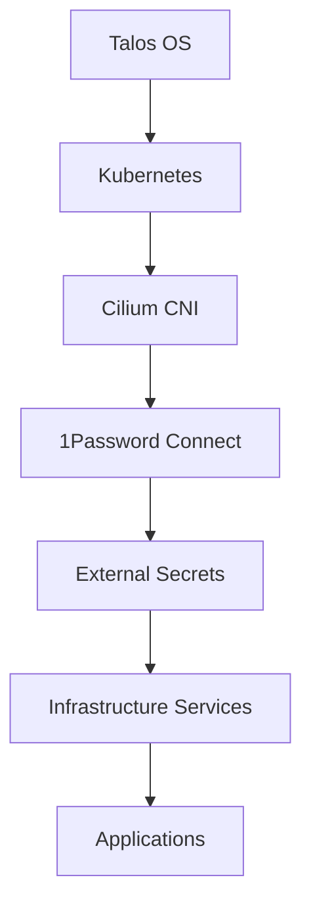

# Components

This section contains detailed documentation for all cluster components and services.

## Quick Navigation

### Authentication

- [Authentik Setup](authentication/authentik-setup.md) - Identity provider configuration
- [External Outpost](authentication/external-outpost.md) - External outpost configuration

### Networking

- [BGP LoadBalancer](networking/bgp-loadbalancer.md) - BGP load balancer configuration
- [Cilium Configuration](networking/cilium-configuration.md) - CNI setup and management
- [DNS Management](networking/dns-management.md) - DNS automation and configuration

### Storage

- [Longhorn Setup](storage/longhorn-setup.md) - Distributed storage configuration
- [USB SSD Operations](storage/usb-ssd-operations.md) - USB SSD management procedures

### Applications

- [Home Assistant](applications/home-assistant.md) - Home automation platform
- [Monitoring Stack](applications/monitoring-stack.md) - Prometheus/Grafana setup
- [Kubernetes Dashboard](applications/kubernetes-dashboard.md) - Dashboard configuration

### Infrastructure

- [Certificate Manager](infrastructure/cert-manager.md) - TLS certificate automation
- [External Secrets](infrastructure/external-secrets.md) - Secret management
- [Flux GitOps](infrastructure/flux-gitops.md) - GitOps configuration

## Component Architecture

The cluster components are organized into several layers:

1. **Foundation Layer**: Talos OS, Kubernetes, Cilium CNI
2. **Security Layer**: 1Password Connect, External Secrets, cert-manager
3. **Infrastructure Layer**: Ingress, DNS, monitoring, storage
4. **Application Layer**: User applications and services

Each component is designed to integrate seamlessly with the GitOps workflow while maintaining operational independence where necessary.

## Component Dependencies

For operational procedures, see the [Operations](../operations/) section.
